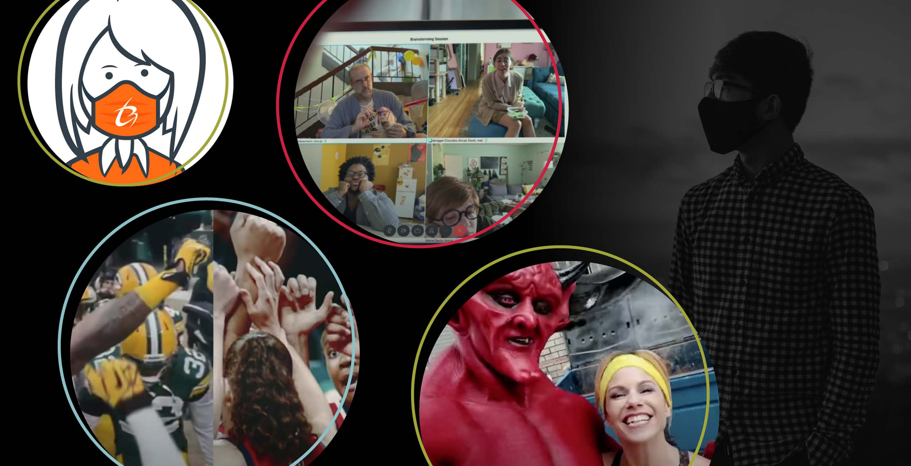
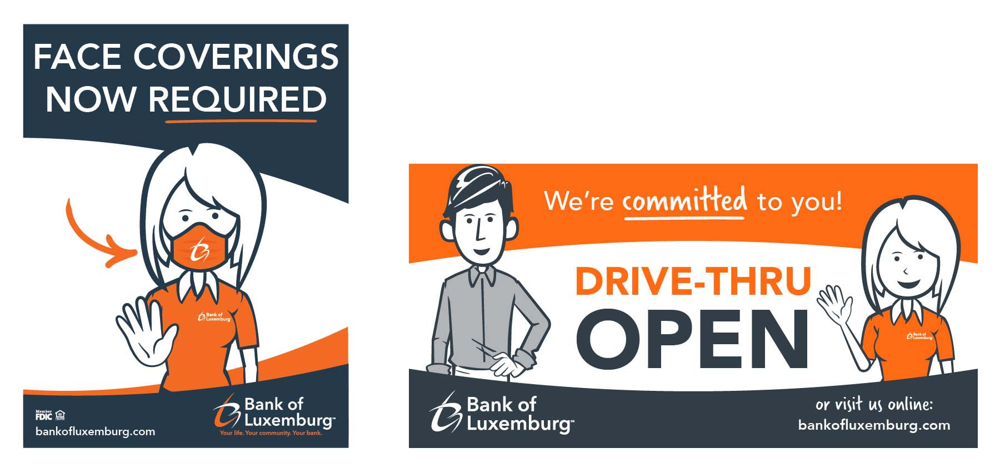
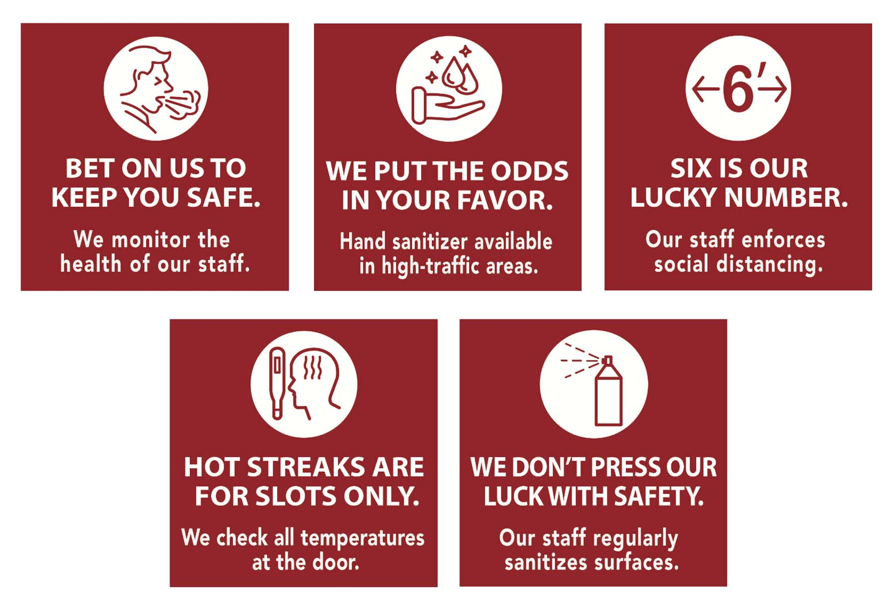

I think it goes without saying that 2020 hit us hard and upended most of what we considered “normal” pre-pandemic. It was a year where the word “unprecedented” was used so often it essentially lost all meaning. Witnessing one major historical event after another, we spent the year not knowing what’s next and wondering when this craziness will end. We’re still taking it day by day as the new year takes shape, but how did 2020 impact the way we designed and advertised in a rapidly changing world?

On both the national and local level, advertisers leaned into the events of 2020. It was nearly impossible to ignore the reality of the pandemic in ads without seeming completely tone-deaf. Many of us had to transition to working from home, sports were canceled or looked very different, masks became the norm and our social interactions were suddenly primarily virtual.

When we live through hard times, opportunities for creativity and new ideas often become even more apparent, notably with these new “shared” (and socially distant) experiences. Apple took advantage of the “Work from Home” moment to display how their products can help make working remotely easier, especially when your home life is chaotic already.



In a lighthearted response to a very dark year, other companies took a humorous approach, like Match.com employing Satan himself as a character who romantically “matched” with the year 2020.



Other advertisers used their platforms to spread messages of hope and resilience in the face of hard times. Nike masterfully edited together familiar clips of different sports moments that fit together so well, tugging at our heartstrings and making us yearn for a time when sports (and stands full of fans) are safe again.



Here at Insight, we’ve had to tackle many unconventional projects due to the pandemic. From lobby closures and new procedure notices at Bank of Luxemburg to implementing social distancing guidelines through environmental and social graphics at Ho-Chunk Gaming Nekoosa, we’ve been able to creatively and quickly respond to the changing needs of our clients throughout 2020.

This year, I’ve also had the honor and responsibility of organizing the American Advertising Awards for our local American Advertising Federation chapter, AAF Fox River, as the vice president. Aside from visually stunning work, these same themes have proven to work well on a local level: connection, humor, hope, optimism and resilience. Many strong entries aimed to reunite our communities and bring people together even when we have to stay physically apart.

Tune in to the 2021 American Advertising Awards on Friday, Feb. 19th to see and celebrate all the great work that was produced in our community during 2020. The show will be Twilight Zone themed (is there a better way to describe 2020 than stuck in the Twilight Zone?) and hosted by C.J. Guzan (with a heavy dose of humor). <a href="http://aaffoxriver.org/registration/?action=evregister&event_id=67" target="_blank">Reserve your free tickets today</a>.
