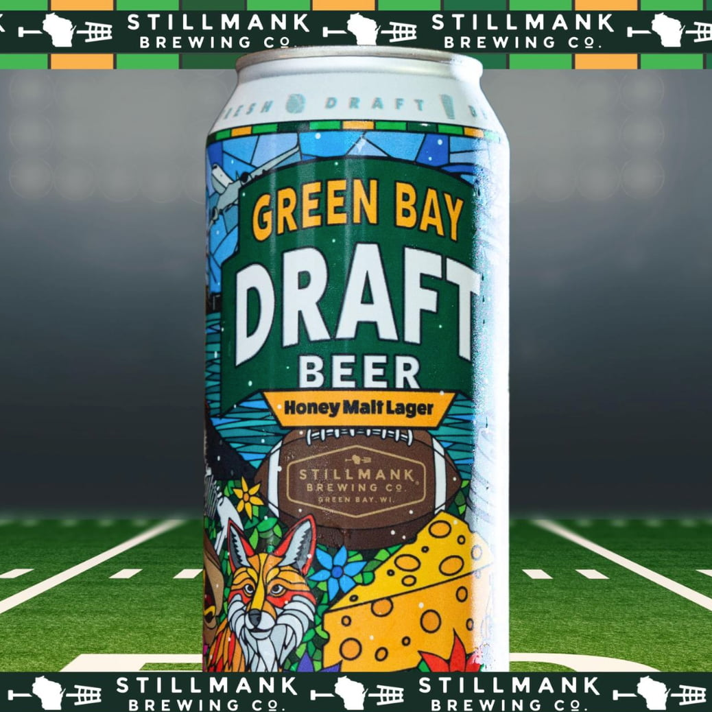

With the [2025 Draft](https://www.packers.com/draft25/) in Green Bay, Wisconsin, quickly approaching, now is the time to put together your 2025 Draft marketing plan. As a trusted Green Bay marketing agency, [Insight Creative, Inc.](/) has spent over 36 years helping local businesses achieve success. In this blog, [Brian Brost](/about/brian-brost/), shares strategies to make the most of your brand’s presence during the draft. 

## What to expect at the 2025 Draft 

The 2025 Draft promises to be a free, family-friendly weekend that celebrates the best of [Green Bay](https://greenbaywi.gov/)—a city named one of the [best places to live in the U.S. in 2024](https://realestate.usnews.com/places/rankings/best-places-to-live?src=usn_pr). The NFL estimates that 200,000 attendees will be around Lambeau Field and the Titletown district each day. 

This means we could see around 600,000 people in the Green Bay area from April 24-26, 2025, a dramatic increase from the 320,000 people who reside in the Green Bay metropolitan area. With a projected statewide economic impact of $94 million, this is an event local businesses won’t want to miss. 

“We want to help business owners take advantage of this opportunity and get visitors into their establishments,” Brian said. “Seventy percent of visitors are expected from what’s called a ‘drive market,’ meaning they live within three to four hours from Green Bay. Our strategy is not only to help businesses capture some of that immediate market but also to give people a reason to come back.”  

## How Green Bay businesses are preparing for the 2025 Draft 

Local businesses preparing for the 2025 Draft have shared several questions and concerns. 

“Depending on the location, some businesses wonder if they even need to advertise,” Brian said. “They also have staffing concerns.”  

Our recommendation is to make it easy for people to think of your business. Brian elaborated: “People attending the 2025 Draft will be trying to figure out where they should go for food, drinks, entertainment, relaxation and more. Businesses that make sure they’re top of mind will be ahead of the game.” 

## How businesses can make the most out of a 2025 Draft marketing plan 

Here are some ways your business can get in on the action during the 2025 Draft:  

### Choose messaging that’s a play on words 

Since the NFL Draft and Green Bay Packers logos are copyrighted, they can’t be used in promotions without permission. Brands need to get creative with catchy slogans that use draft and/or football terms such as “selection, score, best available, the pick is in or trading up.” This is the time to be cheesy (pun intended) and have fun with your message.  

### Create local ties to the event 

[Stillmank Brewing Co.](https://stillmankbrewing.com/) is a great example of this with their “Green Bay Draft Beer,” which includes green and gold, local icons and a clever name. If this type of branding is not feasible for your business, you can still participate by incorporating green and gold, football and/or a Green Bay theme into your brand.  

[Al’s Hamburger](https://alshamburgergb.com/), a classic burger and milkshake restaurant in downtown Green Bay since 1934, plans to change its logo to green and gold colors during the week of the 2025 Draft. 

### Focus on partnerships to get your message out 

Contact a local marketing agency that understands the community and has unique opportunities. At [Insight Creative, Inc.](/services/media/), we have experts in earned and paid media to help you find the channels that work best for your intended audience. 

We started brainstorming months ago and still have a few unique advertising spots left for the week of the 2025 Draft. “We’re coordinating a unique, local opportunity that will get your ad in front of an estimated 200,000 attendees per day,” Brian said. Not only can we help with Draft advertising, but we can also provide a wide array of year-round services. Services such as rebranding, website design, paid media and more. 

### Persuade people to come back 

The Draft is only three days, so visitors have a limited time to [explore Green Bay](https://www.greenbay.com/) and the surrounding areas. Between 43-67% of attendees will be in-state visitors, making them the perfect candidates to become repeat guests. 

Promotions should highlight reasons for people to come back in the future. Northeast Wisconsin is filled with endless things to do for people of all ages and interests, and the 2025 Draft is the perfect time to spread the word. 

There’s a lot to think about before April 2025 is here, but we can make advertising one less thing you need to worry about. At Insight Creative, we’re prepared to do the heavy lifting and help you score BIG during the 2025 Draft in Green Bay! [Contact us](/contact/) to learn about our exclusive advertising opportunity. 

<a class="btn btn-primary" href="/contact/">Contact us to start your plan</a>