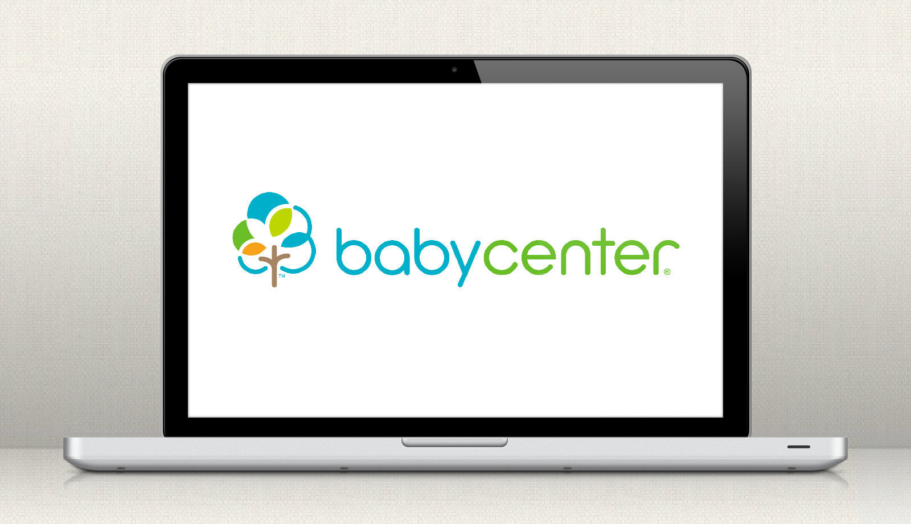

An article in a recent issue of Adweek magazine caught my eye. The headline read: <a href="http://www.adweek.com/news-gallery/technology/how-johnson-johnsons-babycenter-thinks-local-going-global-163605" target="_blank" rel="noopener noreferrer">How Johnson & Johnson’s BabyCenter Thinks Local by Going Global</a>.

Being a new mom myself, <a href="https://babycenter.com" target="_blank" rel="noopener noreferrer">BabyCenter.com</a> is a website that I visit often to connect with moms around the country who have children the same age as my son. It’s fun to compare how my little one stacks up against others or get reassurance from other moms when I’m not quite sure if what I’m doing is ok. It was also a great resource while I was pregnant to learn what to expect as the months went on.

The article talks about how BabyCenter customizes its content for moms around the world, since each country has their own nuances when it comes to pregnancy.

For example, the United States is one of the few counties that doesn’t have a maternity leave program, so content on the US site features maternity leave and childcare issues. Moms in India can listen to traditional prayers and those in Spain are given tips to quit smoking since nearly one-third of Spanish women smoke.

BabyCenter was smart to tailor content and advertising around the world with such an engaged audience.

Do you have any examples of highly targeted marketing communications that have been especially meaningful to you?
