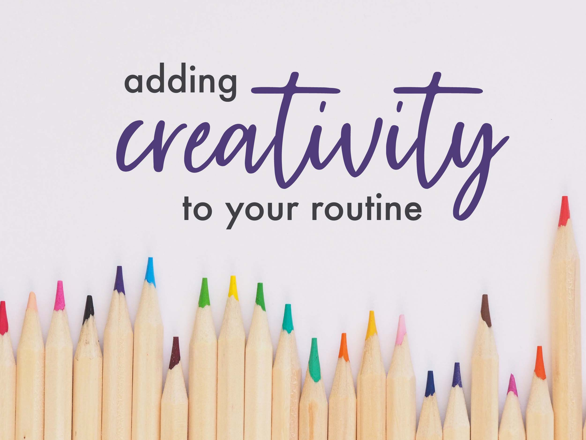
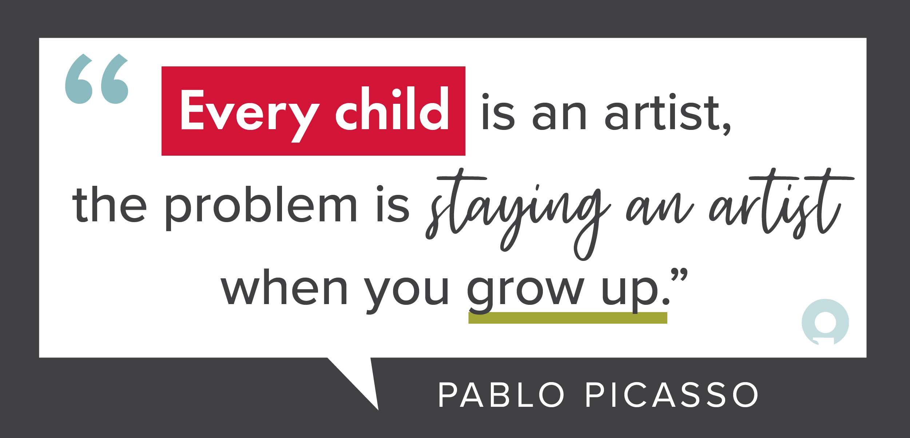

Despite being someone who is creative at/for work, it often feels challenging to incorporate creativity into my personal routine. However, finding personal creative outlets has become top of mind while spending more time at home. Being creative just for the fun of it has **many mental and physical health benefits**. Regularly blocking out 15 or 20 minutes to get your creative juices flowing results in countless benefits:

- Reduces stress and anxiety
- Increases productivity and energy
- Allows a break from the news (and the pandemic)
- Helps you become a more resourceful problem solver
- Shifts your mentality to a new perspective
- Gives you the freedom to express yourself without judgment
- Has been shown to make you feel happier overall

## What if I’m not a “creative person”?

You do not need to be a naturally creative or talented individual to enjoy the many benefits of creativity. A good idea is to start small, reserve self-judgment, and don’t be afraid to fail. Anything can be art as long as you’re trying and stretching your creative muscles! Creativity is learned with practice just like any other hobby or skill, so don’t worry if you aren’t in love with your first creations. The result of your artistic endeavor doesn’t really matter. Simply take the time to enjoy yourself and explore your imaginative side.

Small ways to introduce creativity into your routine, especially at home:

- **Doodle!** Sketch a fun little note for (or with) your significant other, coworker, kids or BFF. Safely staying at home? Snail mail is just as fun to send as it is to receive!
- **Read a book.** Expand your brain space by frequenting imaginative fiction novels and seeking out creative storytelling.
- **Learn how to use your camera.** Photoshoot anyone? (I’m looking mostly at you, family doggos and kitties!) Not motivated by your surroundings? Try using the prompts below as inspiration to capture some unique shots.
- **Add some color.** Dust off that adult coloring book your grandma got you for Christmas (no, just me?) and enjoy the zen of coloring in (or outside) the lines.
- **Put on some jams and dance!** Get your body moving and let loose. Creativity doesn’t have to start with art supplies! Plus, listening to music stimulates the part of the brain that guides motor actions, emotions and creativity.
- **Keep an art journal.** Collect small items, textures, quotes, photos, fabrics, magazine clippings or anything that inspires you and stick them into a small notebook. If you’re overwhelmed with this one, work on one page at a time. Doodle, craft, draw, tear, color, paint and enjoy!
- **Try a new recipe.** Is your meal routine getting a little stale lately? Pull up the ol’ Googler and find something new to try before you head out to the grocery store!
- **Make small DIY improvements within your home.** Home decorating and remodeling can be overwhelming, to say the least. Again, try starting small by rearranging your furniture or painting an accent wall. Small improvements and decor changes can help you feel refreshed in your home and accomplished with your ingenuity.
- **Play.** Find creatively challenging games that make you think like a kid again. Consider video games (I’ve seen some incredibly cool builds in Minecraft), interactive board games, Lego® or literally any other game that requires your imagination.

Still not sure where to start? Try using these fun prompts to take your creativity to the next level!

Ultimately, the most important thing to keep in mind when approaching creativity is to be gentle with yourself and don’t be afraid to fail. Happy creating!
