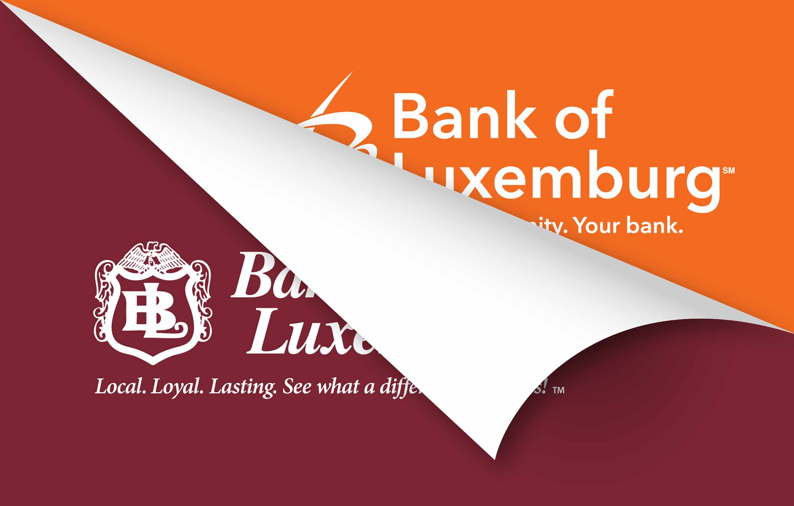

Throughout 2019, we’ve had the privilege of guiding several clients through exciting rebrand initiatives. These projects have ranged from a clean logo and website refresh for our friends at [Fox Structures](/work/fox-structures-branding/) to full-blown rebrands for [Washington Island Ferry](/work/washington-island-ferry-line-branding/) and [Bank of Luxemburg](/work/bank-of-luxemburg-branding/). In all of these cases, the existing brands were established within the early years of each business. Their logos and brands were no longer serving their purpose to accurately reflect the mission and personality of the businesses they represented.

  <figure>
    

    

  </figure>
  <input type="range" min="0" max="100" value="50" class="comparison-slider__controls" oninput="moveDivisor()">

  <figure>
    

    

  </figure>
  <input type="range" min="0" max="100" value="50" class="comparison-slider__controls" oninput="moveDivisor()">

Rebranding is a huge step for any company. When executed successfully, a rebrand can help a business grow, boost brand recognition and create enthusiasm. On average, brands change their identities every 7-10 years. However, it is important to approach this decision thoughtfully and strategically before you go ahead with it. Every brand is different and should be assessed on an individual basis. If any of the following apply to your brand, it may be time to consider a rebrand:

- Your identity looks like many other logos in your industry
- Your company has a new or larger audience
- You’re merging with or acquiring another company
- You’re changing your name
- Your logo is outdated (Bank of Luxemburg’s previous burgundy crest logo was created almost a century ago!)
- Your branding doesn’t align with your values or mission
- You’re recovering from a bad reputation
- Your brand is inconsistent or weak

If you’re nodding along with any of these points, you likely need to take the next step toward a rebrand. At Insight, we understand that a rebrand is an immense, time-consuming (and many times expensive) task, and you’ll need a trustworthy and dedicated team to execute it. Contact us today, and we can help you determine your branding needs while taking great care of both you, your customers and your brand.
