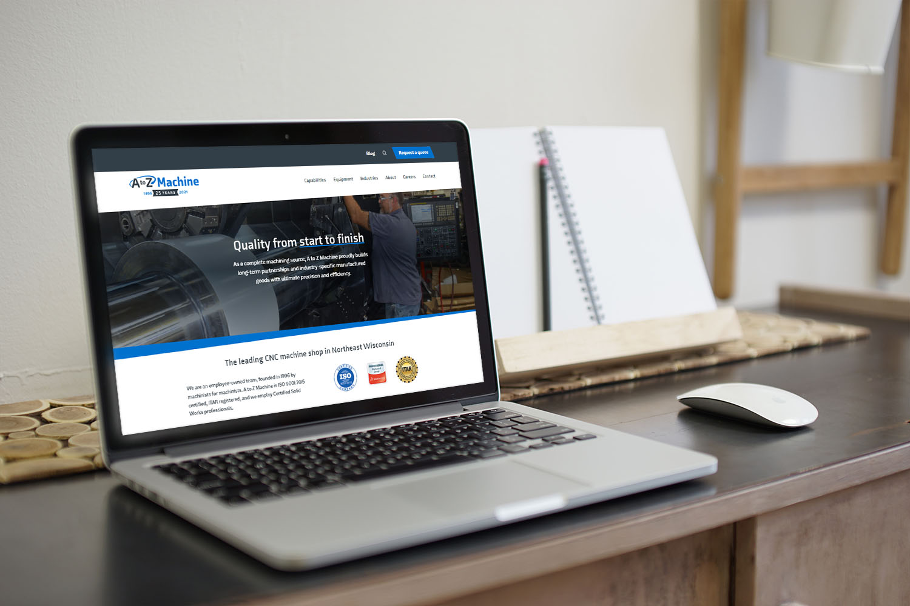
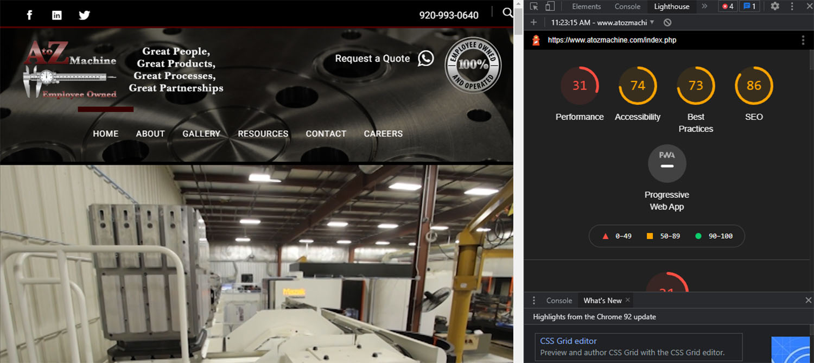
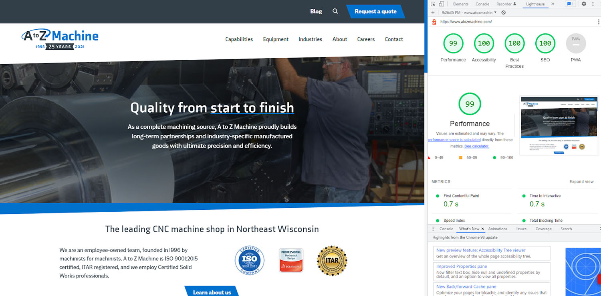

One of the last web development projects we completed in 2021 was for A to Z Machine, a <a href="https://www.atozmachine.com/" target="_blank" rel="noopener noreferrer">CNC machine and fabrication shop in Appleton, WI</a>. After a recent rebrand, A to Z Machine needed to build a website to match their new look. The project goal was to build a modern, secure and fast website that not only looks great but is informative and convenient to use for prospective customers and job candidates.

A to Z Machine came to us with an outdated website built on the Joomla Content Management System. Not only did A to Z Machine no longer like the look of their website, but their website also needed a lot of work to meet modern performance standards. Their old website was seeing Fully Loaded times in the range of 10 seconds, which is horrible for user experience. <a href="https://www.nngroup.com/articles/response-times-3-important-limits/" target="_blank" rel="noopener noreferrer">Research has shown</a> that anything over one second already starts to make people feel like they’re being slowed down.

When it comes to web development projects for us at Insight Creative, performance, accessibility and security are always top priorities. This made for an easy decision to develop a Jamstack application for a fast and secure website built with modern and progressive technologies.

## What is Jamstack and how does it benefit A to Z Machine?

[Jamstack](/blog/lost-in-the-static/) isn’t about a specific technology. Rather, it’s a modern web development architecture for building more performant and secure websites. The architecture assumes the front end or visual layer of the website should be entirely independent of the back end. This means that the front end isn’t locked into a content management system and can adapt whenever needed. This flexibility allows this particular website to be preconfigured to use both NetlifyCMS or Cloudcannon, and with a little extra work, this website could easily work with a number of other headless content management systems.

This simplified approach to web development also removes both the database and back-end server, allowing us to avoid many of the disadvantages of conventional web development where the back-end server does a lot of heavy lifting. The end results were huge improvements in website performance, accessibility, security and even SEO.

## The tech stack

### Hugo

Hugo is a modern, simple and blazing fast static site generator that allows us to build static files out of content, which can then be served extremely quickly to website visitors. Hugo comes with some amazing tools that not only make building websites fun again but also allow us to build websites much faster. Some of the features Hugo offers are its built-in image processing and its Hugo Pipes system.

#### Image compression and optimization

In modern website performance, serving a simple .jpg image is no longer performant enough. Hugo gives us a way to take a .jpg image, optimize it for better performance, and even transform that image into more modern image formats like .webp for even better performance. This step, normally reduces image sizes by 20-50%, leading to much faster load times.

#### Stylesheet handling

With Hugo Pipes, stylesheets are automatically processed, bundled, and minified so the website has a smaller footprint and can be rendered more quickly. Hugo Pipes can process SASS and SCSS, process files with PostCSS, combine multiple CSS files and more without any additional build tools.

#### JavaScript bundling

Hugo comes packaged with ESBuild which is an extremely fast JavaScript bundler. ESBuild helps us bundle and minify JavaScript files much faster than any other JavaScript build tool. It also requires no configuration, saving time so we can dive straight into projects.

#### Netlify CMS/CloudCannon

Both Netlify CMS and CloudCannon allow A to Z Machine to manage content without a server. Neither requires a database by instead working directly with files in Git. One of the advantages and main reasons we choose to work with Git-based CMS’ is it’s your content, so it shouldn’t ever be locked away in a 3rd party software. With a Git CMS, content simply lives in your source code repository, giving you complete freedom of how you interact with it.

#### Netlify

The last piece of the puzzle was Netlify, a powerful deployment tool that allows websites to be published in seconds. Netlify removes the time and headaches of managing a traditional server infrastructure by having a production-ready environment right from the start. With a few clicks, we simply connect our repository and Netlify takes care of building static pages directly from the source code and deploys the website to their global edge network.

Netlify automatically handles the whole workflow for deploying websites and continuous integration has never been simpler. Once connected to the Git repository, Netlify auto-publishes the website every time a commit is pushed. Because the website deployment is done based on Git commits and is version controlled, each commit is a new website backup and we can easily browse all prior versions and roll back to any point in time.

The overall goal and by far the biggest advantage of this technology stack is simplicity. With Hugo under the hood, we‘re able to develop a website that is simple to deploy and maintain. The end product requires far less infrastructure than typical websites, without any reduction in functionality or quality.

## The end result, fixed core web vitals, security and maintenance.

### Before

### After

### Performance

A to Z Machine’s old Joomla website scored a 31/100 in Lighthouse tests. With our Jamstack approach, all content is prebuilt into static files at build time, not when a website visitor requests it in their browser. This means the content is available immediately, drastically reducing loading times. At the time the new website launched, we achieved a Lighthouse performance score just under 100. The new website was also recording Time to Interactive performance times of around 700ms.

Improving A to Z Machine’s website performance also improves SEO. It’s simple, fast page load times attract website visitors and allow them to reach their goals, not deter them. At this time, this type of performance gives A to Z Machine an SEO advantage over their competitors as no other local competitor comes close to this.

### Accessibility

The old A to Z Machine website was flagged for a number of accessibility errors, resulting in a below-average accessibility score of 74/100. Keeping accessibility in mind from the start, we integrate build tools that prevent our websites from even being deployed without first correcting any accessibility errors. By paying close attention to best practices, we were able to eliminate all accessibility errors and achieve a perfect accessibility rating.

### Security

Website performance and accessibility were still only a part of the equation though. Distancing A to Z Machine from Joomla also meant better security for their website. By removing the database from the equation, we completely remove the layer often targeted for vulnerabilities. Statically rendered websites with no server, plugins or database are much more secure. Removing this concern for A to Z Machine saves them the headaches and expenses of worrying about security threats.

### Additional wins, no maintenance

With a simpler architecture comes less website maintenance. In this case, with no database, no plugins, not even server maintenance to worry about, there is nothing to maintain except content. This saves A to Z Machine money on website maintenance costs. Traditional CMSs like Joomla or WordPress for example often see plugin and software updates on a daily basis. This leads to a constant need to update and maintain software to avoid becoming vulnerable to security attacks.

After completing this project, we’re truly happy with the results and the fact that we’ve had a chance to help an amazing company craft a unique web experience for its audience. Are you concerned about your website performance and security? We’d love to help! [Get in touch](/contact/) and let’s talk about your next website development project.