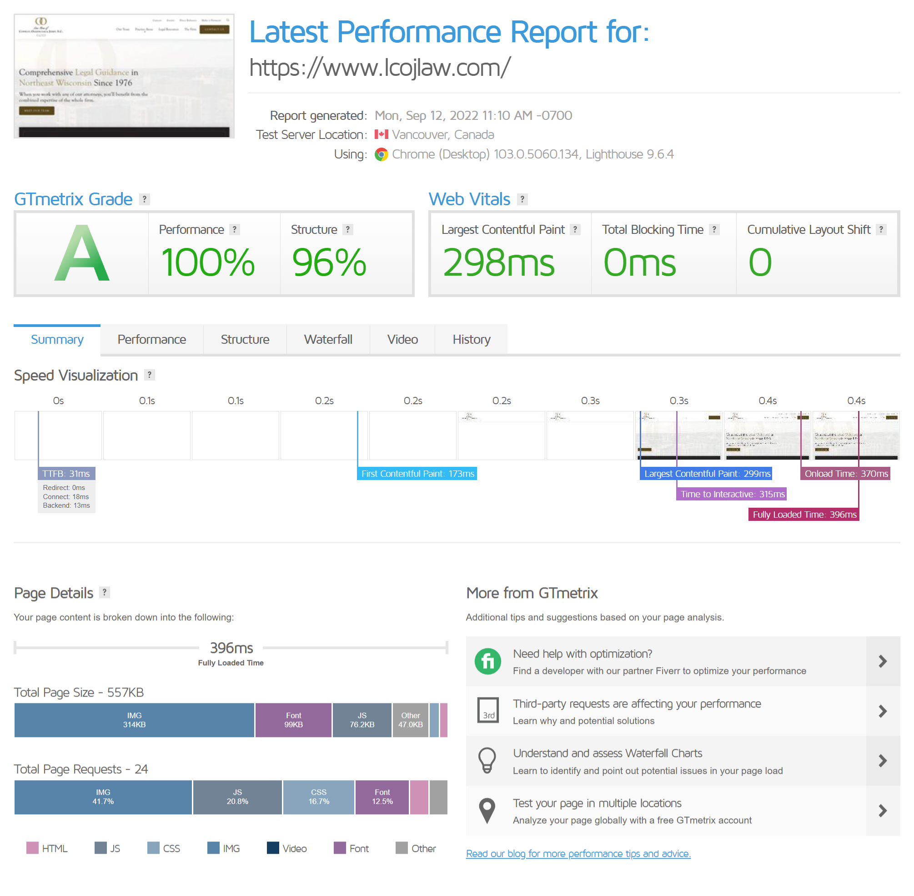
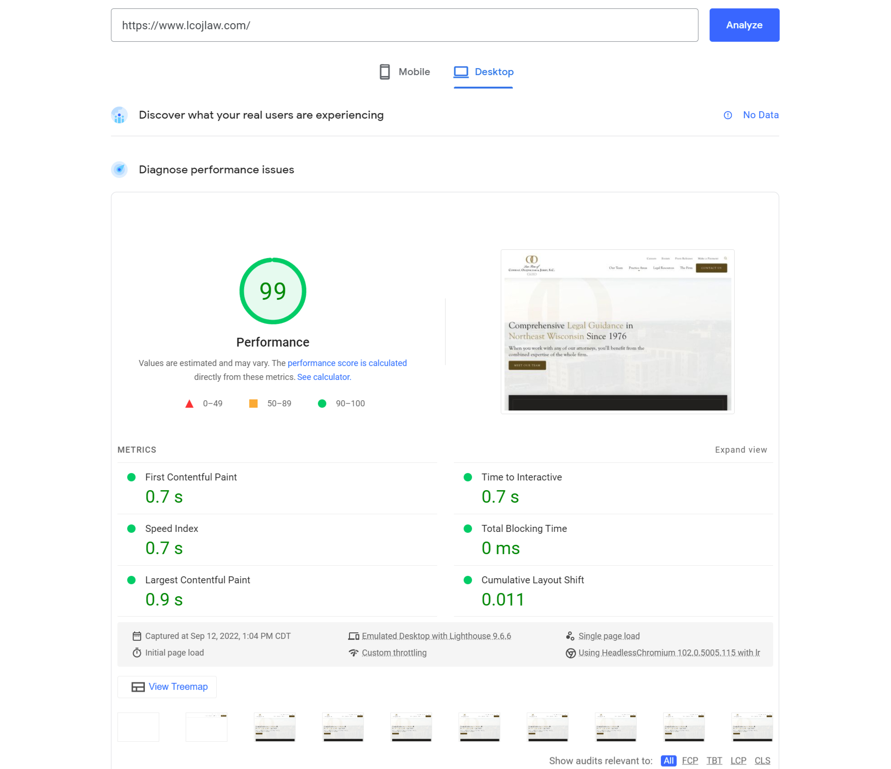

Still think WordPress is the end-all-be-all for building your new website? Business owners, marketers and developers should think again. [Jamstack](https://jamstack.org/) is even more powerful, secure and easy to use.

As the director of front-end development here at Insight Creative, I’ve spent years building powerful Jamstack websites for our clients. Read on to learn all about Jamstack’s superior benefits and debunk the common myths I hear from clients about building Jamstack websites.

## What is Jamstack?

Jamstack isn't one specific technology, but rather a modern development approach for creating more performant, secure and accessible websites. Jamstack is a simple website architecture that decouples the front-end web experience layer from data. This makes your website faster, more secure and easily scalable.

Jamstack’s core principles of pre-rendering and decoupling enable your website to be delivered with greater confidence and resilience than ever before.

### Why did we begin to move away from WordPress?

Here at Insight many of our clients were (and continue to be) very familiar and comfortable with WordPress. We are frequently asked why we began to favor Jamstack over WordPress, the content management system that has reigned supreme for so long.

The answer is simple: Jamstack is far better at addressing our clients’ top priorities. In our experience, Jamstack outperforms WordPress in accessibility, security and overall web performance.

The Jamstack architecture allows us to have full control of a site’s source code and not rely on third-party page builders and plugins that you cannot edit. We can then prioritize and accomplish these key web factors much more easily.

## Main benefits of Jamstack

Jamstack’s unique web architecture provides many benefits that our clients have been able to take advantage of with their Jamstack sites. Of these benefits, those that I believe are most important are the faster performance, security, scalability and maintenance of Jamstack sites.

### Faster performance

Jamstack static sites serve site assets over a CDN (content delivery network) rather than having to communicate with a server every time data needs to be displayed. This means your site will take less time to load, increasing the performance of your entire site. Some inital results of one of our latest Jamstack development projects for the [Law Firm of Conway, Olejniczak & Jerry S.C.](https://www.lcojlaw.com/) can be found below.

#### GTmetrix Report

#### PageSpeed Insights Report

### More secure

Jamstack websites are pre-built static HTML files and are hosted on CDNs (content delivery networks), so they don’t require the dynamic interactions with servers that put WordPress sites at risk. With a Jamstack site, you don’t need to worry about any server, database and plugin vulnerabilities.

### Scalability

When too many users navigate to a WordPress site, the server can become overwhelmed and crash the entire site. If your Jamstack website, on the other hand, suddenly goes viral and has many active users, the CDN seamlessly compensates.

### Maintenance

WordPress can be great, however, it is not free from defects, as every user will undoubtedly admit. One common oversight when building a WordPress website is that WordPress requires constant security and plugin updates. These updates are difficult to keep up with and are often buggy and can break your entire website. Websites built on a simplified Jamstack architecture remove plugins, servers and database from the equation and regular maintenance is no longer needed.

## Our successful transition to Jamstack

With the superior benefits of Jamstack, we began to officially transition away from WordPress over two years ago. The entire Insight team, along with our clients, continue to be impressed with the performance, security and simplicity of Jamstack sites.

In fact, the biggest problem we tend to run into with Jamstack sites are all the myths clients have heard about them. Many of these inquiries were simply not true or based on outdated information.

### Common myths about Jamstack

There are a lot of myths out there about building brand websites through Jamstack vs. WordPress. Let’s break down these myths and show you what Jamstack is really about, pulling from our firsthand experiences.

## Myth #1: You can’t have dynamic content on a Jamstack website.

People tend to hear [“static website”](https://cloudcannon.com/blog/what-is-a-static-website/) and automatically assume [dynamic content](https://www.spiceworks.com/marketing/content-marketing/articles/what-is-dynamic-content-definition-types-strategy-best-practices-with-examples/#:~:text=Dynamic%20content%20is%20defined%20as,audio%20or%20video%20format%20content.) like videos, sliders, testimonials and animations aren’t possible on Jamstack. In reality, Jamstack’s static format has nothing to do with a site’s front-end content.

Instead, this static structure refers to [back-end web architecture](https://www.indeed.com/career-advice/career-development/what-is-backend-web-architecture). In this case, it’s not about how the front-end content looks or functions. It’s about how the site is built _before_ being displayed to the website visitor.

### The truth: Jamstack _is_ a static website fully capable of featuring engaging, dynamic content.

Static assets don’t mean static experiences and Jamstack websites have plenty of [dynamic functionality](https://www.smashingmagazine.com/2019/12/dynamic-async-functionality-jamsstack-websites/)! Whether you want to add forms, site search, reviews, blog feeds, events, sliders, comments, animations, eCommerce listings or more to your site, it’s all possible via Jamstack.

### Why is a static website better?

Dynamic websites rely on a database for information. When someone navigates to a dynamic site, files get processed and served dynamically. This requires a complicated series of interactions between the database, back-end code, server, browser and layers of caching. Because this slows down your site and increases content load time, dynamic websites have a higher bounce rate and a stronger likelihood of performance issues.

Static websites give you the benefits of immediate file retrieval and faster-than-average load times while still being able to incorporate engaging content on your site.

## Myth #2: Jamstack websites take longer to build.

Sure, building a WordPress, Wix or Squarespace website with a pre-made theme and simple plugin additions may be easy … but the quality? It just isn’t up to the standards you’ll need for a competitive brand website.

When it comes to building a brand site, it’s essential to build a unique, custom experience for your customers. Plus, you’ll need it to be optimized for various devices, search engines and of course, customer experience. Jamstack can do all of the above, and more!

### The truth: Setting up a Jamstack website can actually be more efficient than building on other systems.

With the developer efficiencies that the Jamstack architecture brings, we actually spend less time creating sites on Jamstack than anywhere else.

The ability to develop more efficiently means we have far more time to focus on the [front-end code](https://www.freecodecamp.org/news/front-end-developer-what-is-front-end-development-explained-in-plain-english/) that truly makes your website shine. Jamstack allows us to focus on creating the best possible customer experience rather than wasting time fighting a legacy CMS like WordPress.

On top of that, Jamstack makes it easy to seamlessly integrate various other content management systems, like Netlify CMS, ButterCMS or CloudCannon, to your site. This means you won’t have to design around the widgets and plugins available to you. Instead, you’ll have access to any integration as needed.

## Myth #3: SEO is more difficult on Jamstack websites.

[Search engine optimization](https://moz.com/learn/seo/what-is-seo) (SEO) is the process of optimizing your website and content to be easily found, crawled and distributed by search engines like Google.

Because some CMSs like WordPress have SEO plugins available, some business owners think SEO is harder on Jamstack websites. This simply isn’t the case. If anything, Jamstack websites have the advantage because developers have full control and can optimize websites wherever it's needed. Poorly built and unoptimized WordPress websites will be much more difficult to optimize and plugins needed to power the website may lead to major performance issues.

### The truth: Building a Jamstack website can help you achieve higher search rankings faster.

Search engines like Google actually prefer static web pages. They’re fast, lightweight and easy to scan. Jamstack’s static architecture allows your pages to load faster and generally gives you a competitive edge and results in more [organic web traffic](/blog/increase-organic-traffic/), quality leads and sales.

Jamstack also allows complete control over your site’s content and structure. You can boost your site’s SEO and ranking performance by properly optimizing all content. Adding custom metadata like page titles, meta descriptions and alt text is simple on Jamstack and all help to boost your search ranking across various platforms.

## Myth #4: Jamstack websites are more expensive.

While this can sometimes be the case, it all comes down to the scope of the project and picking the right tools for the job. Here at Insight, we have chosen a simple and reliable technology stack that matches the needs of the projects we take on and allows us to develop more effeciently.

On top of that, what we're typically looking at is the life of your website and the long-term advantages of Jamstack websites. We invest more time into the build stages of the project to ensure that in the long run, you have less to maintain and a much more stable architecture to depend on.

### The truth: Jamstack websites are a cost-effective solution for business owners.

In the long run, choosing to build a Jamstack website is often a more cost-effective solution compared to other web builders and platforms. They are simpler and cheaper to maintain, and static file hosting is extremely low-cost.

Plus, Jamstack removes various layers of security vulnerabilities common on WordPress. No more shelling out money you don’t have to purchase additional security software or fix a hacked site.

## Myth #5: It’s impossible to edit Jamstack websites

While this may have been true five or six years ago, the Jamstack ecosystem has exploded with static site generators and an overwhelming variety of other tools that make editing static websites very easy.

### The truth: Editing Jamstack isn’t nearly as difficult as you might think.

In fact, Jamstack websites have come so far that there are now a large number of [headless content management systems that integrate seamlessly with the Jamstack architecture](https://jamstack.org/headless-cms/).

One of the tools bringing powerful editing experiences to Jamstack websites is [CloudCannon CMS](https://cloudcannon.com/). CloudCannon is a git-based CMS that blends all the performance, security and accessibility benefits of a Jamstack website with a friendly and easy-to-use editing interface.

These CMSs blend the editing experiences of software like WordPress with all the benefits of a static HTML site.

## Build your Jamstack website.

The Jamstack web architecture may _sound_ intimidating compared to sites like WordPress, but the benefits are too good to ignore. With a Jamstack architecture, your site can perform faster, rank higher on Google and provide a seamless, enjoyable experience for your customers.

Plus, you don’t have to be a tech wizard to understand! There are plenty of site templates and integrations that make it as easy to use as any other site.

Ready to learn more about Jamstack and how Insight can help build a high-performing website for your business? [Contact us today](/contact/) to tell us about your needs—we can’t wait to build your dream website.
