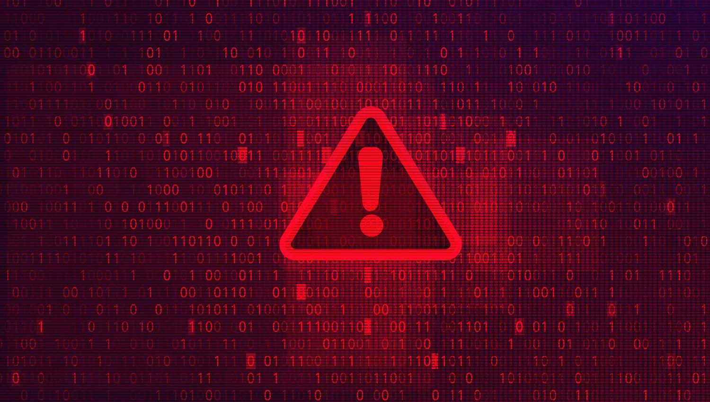

Recently, my Spotify account was hacked. Someone, many people or BOTS were logging in from all over the world. Now, I know I have some bumpin’ playlists, but what was the point? Later, it was explained to me that they were just trying to access my usernames and passwords to do further damage elsewhere. However, it left me scratching my head about current cyberattacks because they were affecting me at work too!

When we hear of cyberattacks, we don’t immediately think of media companies, but in recent months, that’s exactly who has been targeted. In September 2021, _Inside Radio_ released a statement about how Marketron (a software tool local radio stations use to implement, traffic and bill orders) was hit with a cyberattack causing nearly all its systems to go offline. Additionally, one month later, Sinclair Broadcast Group (which owns WLUK Fox 11 in the Green Bay market) also reported an incident involving their network! As a result, certain devices were encrypted with ransomware, data was confiscated, and business operations (including the running of placed TV schedules) were interrupted.

Why Marketron and Sinclair (and countless other media groups) rather than a bank or credit agency? Because hackers can basically “hold the company’s computers hostage” until A) a ransom is paid or B) the attack can be properly handled (which involves taking important systems down for lengthy and costly periods of time).

When your business is affected due to a cyberattack on your media outlet, what can you do?

1. **Show empathy**—The media company that is being affected is looking at HUGE losses of money by having to disrupt the flow of advertising schedules. Systems that were automatic are now manual. Employees have to work overtime to get schedules placed by hand. Spots are missed. Advertisers are angry. There is often no immediate resolution in sight. Make sure to realize that, yes, you are affected as an advertiser, but the media group is scrambling right now just to survive this attack and doesn’t need a verbal/email assault too.

2. **Choose a comparable alternative**—If you are buying a broadcast TV station, for example, look for another in the same market that has similar ratings for your target audience. If it’s a radio schedule, look for a station with similar format and reach to keep your schedule as consistent as possible.

3. **Have layers to your media mix**—I like to say that campaigns should always have a strong “driver” which is where the brunt of the media budget should go, but after that, if budget allows, campaigns should also have supplementary layers to them … to keep enhancing the message. If one of your “drivers” is subject to a cyberattack, hopefully you can shift your advertising dollars into the next layer without missing a beat.

4. **Stay abreast of the situation**—Keep in close contact with your media reps or agency, and lean on them for advice. Maybe you were informed of the attack, but your schedule isn’t coming up for another week or two or maybe a month. If you’re working with the right people, they won’t mind filling you in day to day on how things are progressing and will be honest with you in case you need to cancel schedules or move advertising dollars.

Cyberattacks are certainly becoming more prevalent, especially in business. The more you can educate and prepare yourself, the better. If you have questions about cyberattacks or media buying in general, [contact us](https://insightcreative.com/).
