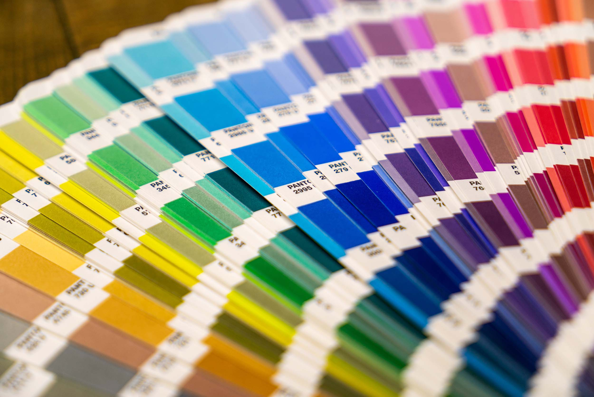

As a designer, I sometimes forget that many of the terms I use on a day-to-day basis aren’t common knowledge to most people. Since Insight hired a new team member recently, I’ve needed to take a step back and explain what I mean by many terms that we designers often have at the ready. Hopefully this list will help demystify some technical language for non-designers.

**Aspect Ratio** – Ratio of width to height of a rectangle.

**Bleed** – Intentionally extending the artwork beyond the page creates a bleed, usually about .125 or .25 inch so the printer can trim off the edges without risking cutting into the design if the paper shifts slightly.

**Body Copy** – The main bulk of text on a design, usually a paragraph or more.

**Brand Identity** – The visual aspects of a brand. Usually put in a **Brand Standards** or **Style Guide** document defining the brand’s look and feel. Brand Standards documents generally include details about logo usage, typefaces, colors, tagline, tone of voice, website, packaging and other marketing materials.

**CMYK (Cyan, Magenta, Yellow, Key (Black))** – Color mode for printed jobs, these four colors can create many colors used in print:

**Crop Marks** – Printed lines that show the edges of the page where the printer will cut off the bleed.

**DPI (Dots Per Inch)** – Unit that measures the resolution of a print piece. Higher DPI means more detail and can be printed at larger sizes. 300 dpi is the ideal resolution for print. Often used interchangeably with PPI (see below).

**F (Final)** – My label for a final file that has been proofread, approved by the client and is ready to be sent to the printer and/or client.

**FPO (For Placement Only)** – A label for a placeholder image or copy that will need to be replaced at some point before it can be finalized.

**Hex** – A six-character code made up of letters and numbers that represents a color, most often used in web design. Insight’s main color hex codes are #CD1F40 #A2A637 and #8BC0C6.

**JPEG** – The standard image format for containing lossy and compressed image data, a raster file type, jpegs can’t have transparent backgrounds.

**Kern** – Adjust the spacing between individual letters. Learn best kerning practices and test your kerning skills through a fun game called <a href="https://type.method.ac/" target="**blank" rel="noopener noreferrer">Kerntype</a>.

**Logomark** – A recognizable image or symbol that represents a brand without necessarily including the name of the company, e.g. Insight’s red circle mark or Pepsi.

**Margin** – The blank space between the edge of the page and the content.

**Mock-up** – A realistic representation of a design, often 3D, made to appear how it will look once produced.

**Mood Board** – A collection of visual references and inspiration for a new project consisting of photos, type, colors, fonts, etc. to set the aesthetic and feel of the concept.

**Palette** – Color swatches that are specifically chosen for a brand or concept.

**Pantone (PMS)** – Pantone Matching System, a standardized color system that matches exactly when printed professionally with special ink. Each color has its own number for a perfect color match every time.

**Placeholder Text** – Filler text temporarily used when the actual copy isn’t available to insert into the design yet. Often made up of meaningless Greek/Latin called Lorem Ipsum.

**PNG (Portable Graphics Format)** – An uncompressed raster image file format that can have a transparent background.

**PPI (Pixels Per Inch)** – Unit that measures the resolution of a digital image. 72 ppi is the standard resolution for web images. Often used interchangeably with DPI.

**Raster** – A graphic that loses resolution when scaled to a larger size. Can appear blurry/low quality when used at the wrong size. Opposite of a vector graphic (see below).

**RGB (Red Green Blue)** – The preferred color format for web/digital jobs. Red, green and blue can combine to make a large spectrum of colors using light (often through TV, computer or mobile screens).

**Sans Serif** – Fonts without serifs on the end of letters. Easier to read and comprehend on screens, especially with longer bodies of text.

**Serif** – A small line that appears on the ends of letters in some fonts. Serif fonts are easier to read and comprehend in print.

**V1, V2** – Version 1, version 2, etc. My labeling system to differentiate stages of drafts, documenting proofing and client changes before a project is finalized.

**Vector** – A scalable graphic that doesn’t lose resolution or quality when scaled to any size. Never gets blurry. Opposite of a raster image.

**Wordmark or Logotype** – A logo that only has stylized text-based elements or the type-based part of the logo. E.g., FedEx or Coca-Cola.

I hope having some of these terms in your back pocket proves helpful wherever you are in your marketing journey. Knowing more design vernacular can streamline discussions of your design needs, ensuring we’re on the same page and **communicating with substance!**
