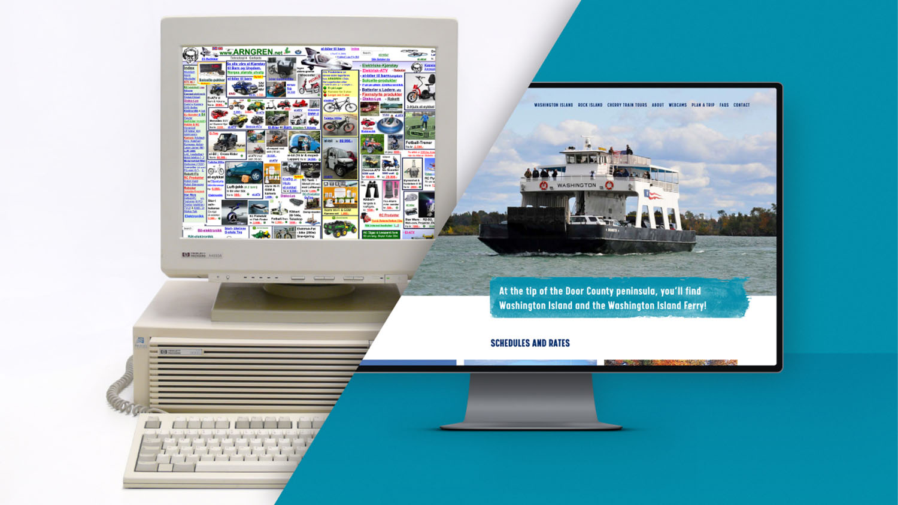
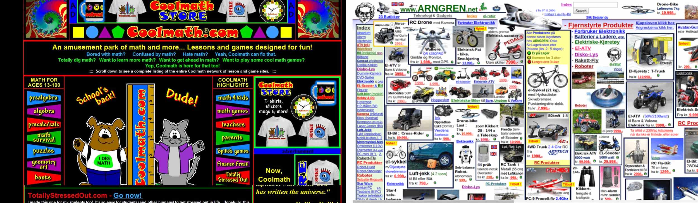
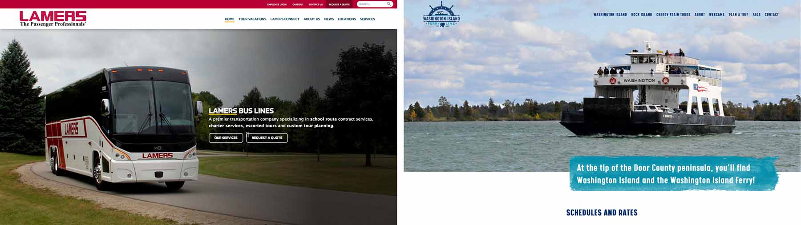
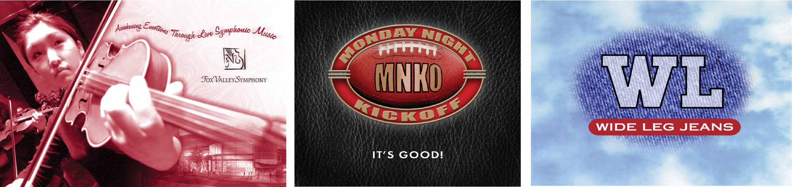
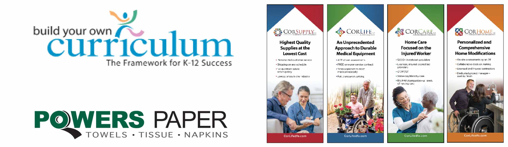
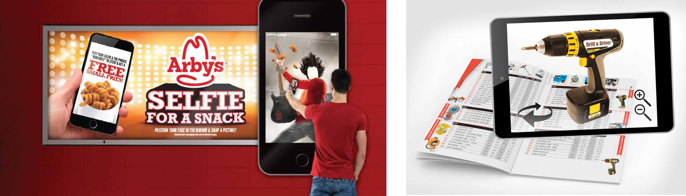

## What I’ve witnessed in 20+ years of design and where I think we’re headed.

I started designing professionally in 1992 and have witnessed a great deal of change in the industry over the years. First off, there was no internet and that certainly changed things.

When it comes to initial web design back in the ‘90s, people would pack everything they could into a website, as you can see in examples below. Cardinal rules were to put everything above the fold, pack everything on to one page and avoid making visitors scroll if possible. Yikes! It makes my head hurt.

Thankfully, a lot has changed since then. Now you want people to get the information but with a nice clean flow from top to bottom. The logo generally goes on the top left, and contact info goes on the top right. You want a strong visual to draw the viewer in and then lead them to the information they want within one or two clicks. You’ll see this shown below in a couple sites that Insight recently developed.

Wow, what a difference when you look at web design from then to now. As to where it’s heading, I believe it will be more mobile focused and more “app like.” Sites are going to adapt to whatever device the user is surfing on, so the experience is smooth and clean much like an app on your phone. I think analytics will play a major roll as well. Now that we have access to so much data and how people are using sites, I can see how sites could adapt as more people use them and create better experiences for future users.

Graphic design has followed a similar trend. Designs are cleaner, more organized and allow viewers to get information quickly and easily. Years ago pieces tended to be over designed by showing off cool techniques or styles, where now graphics are more polished and flattened out, so they are easy to read. I’ve noticed that in my own design over the years. Below are some older examples of that.

Design trends I currently see and use are all about making the complex simple. We see it in websites, graphics, charts and product design. Today’s designs feature flatter graphics, not as much dimension, less texture and more white space. They have a strong main visual or photo and use bold color and minimal copy. People want creative that’s easy to digest among all the stuff that is out there. Below are some examples of that cleaner look in logos and in print.

It’s hard to imagine this trend going away anytime soon. I think technology will continue to intersect with graphic design offering more interactive elements or virtual reality components that go along with the design piece. There is some of this now, but I imagine your smart device will open up even more interactively with video and 3D that can be generated from the design piece with augmented reality as shown below. I’m very excited to explore and implement all of what technology can offer in the future and to see where design takes us from here.

