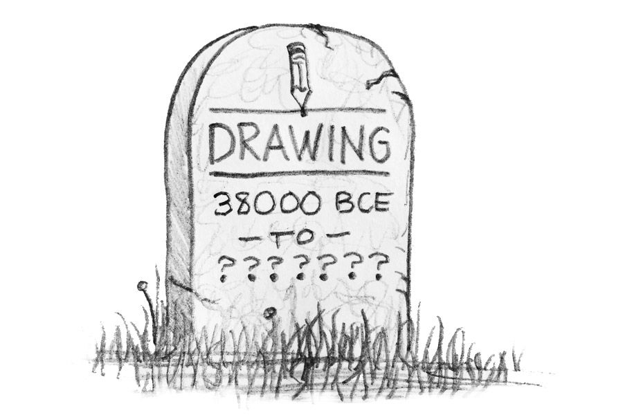
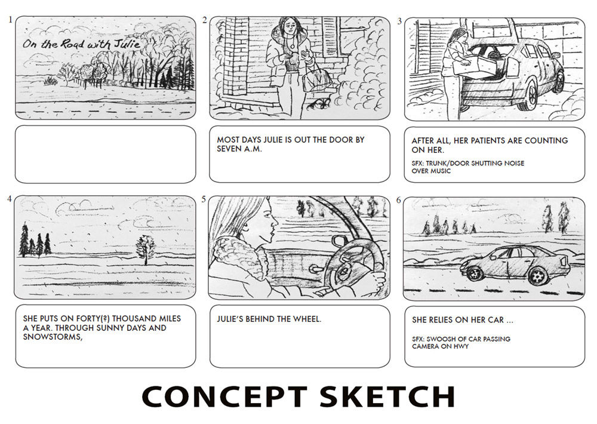
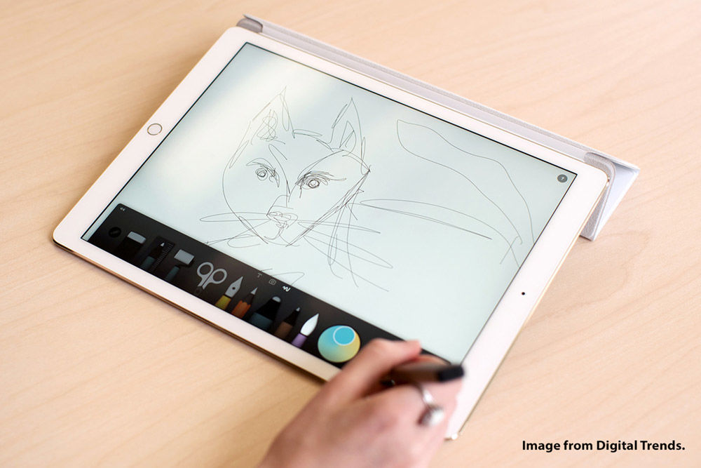

In this digital world the art of drawing is still useful to present ideas to clients. Drawing is a useful tool for a number of reasons. With a drawing, your client will focus more on the idea than the color, the look of a particular stock photo, or the gender or clothes of the people in the concept.

With a sketch, it's easier to play with numerous layouts and different compositions as opposed to doing "tight" layouts right away. There is also a freedom of creativity that I experience when sketching out ideas. Things just seem to flow better for me. Also, I think most clients like seeing sketches because it makes them feel more a part of the overall creative process.

Now you can even sketch with a digital tablet like the iPad Pro. It's not the same as a pencil, but it still gives you the freedom, flexibility and appearance of a sketch even though it's a digital medium. Using the pressure-sensitive stylist from Apple, it even feels a lot like a pencil.

So, drawing has been around for over 38,000 years, and I don't see it going away anytime soon. It's still a great way to show your thought process and ideas to people. So keep practicing those drawing skills because they will still come in handy for showing off your ideas.

