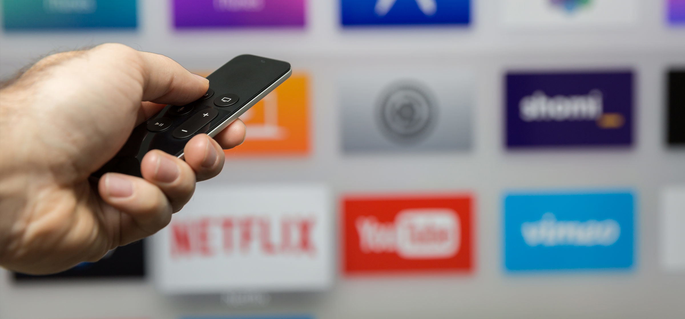

The number of television viewers cancelling their cable subscriptions, commonly referred to as 'cord cutters', continues to grow. TV viewers who are fed up with the cost of cable and satellite TV are opting for over-the-top (OTT) services.

OTT refers to TV content streamed over the internet to a connected device, eliminating the need for a traditional cable or satellite subscription. These devices include Apple TV, Chromecast, Roku, computers, smartphones and tablets.

With consumers shifting how and where they view TV programs, advertisers need to find a way to reach that audience. Millennials are the most active users of OTT technology, but the trend is growing among all demographics, especially younger ones.

Cable companies haven't ignored the trend of streaming content. Viewers who pay for cable often stream shows online or from apps on their phone. Advertisers have the option to target an engaged audience wherever and whenever they watch their favorite programming.

**What does this mean for marketers?**

It means a change in strategy and media allocations. You shouldn't abandon traditional TV advertising, but perhaps look at OTT devices as an opportunity to reach customers in a new way. Many OTT providers now allow for video ads to run in the middle of streaming content, just like commercial breaks on TV.

Most 'cord-cutters' share a desire to consume content where, when and how they want. Sitting down to watch a favorite show every Tuesday at 8:00 p.m. may not work with someone's schedule, but watching it the next day on Hulu or using a network's app on their phone while they're at the gym does. To reach this audience, it's important to be on all screens they’re using to access content.

Delivering ads to consumers who view content using OTT platforms is just one example of how the advertising landscape is constantly changing. This is something that isn't going to go away anytime soon so, if you're a traditional TV advertiser, it would be beneficial to add OTT advertising to the mix. There's a good chance you'll reach current customers as well as a new audience.
