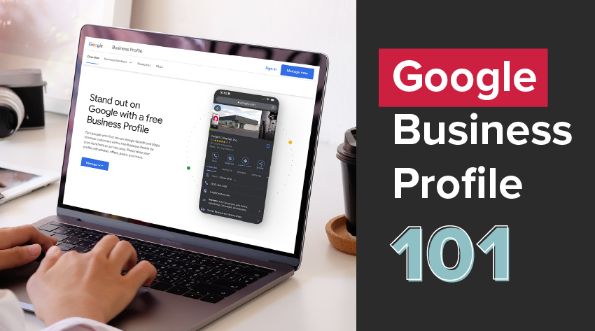
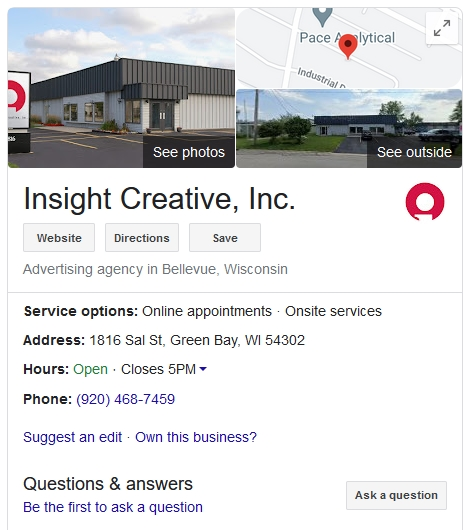

[Google Business](https://www.google.com/business/) is a free, Google-run marketing tool that helps businesses share information, build an online presence and gather testimonials. If you own a business and have yet to create and optimize your Google Business Profile, *now* is the time!

You’re missing out on loads of potential customers if you don’t take advantage of this powerful tool. Here’s the good news: Google Business is free to use, easy to set up and requires very basic upkeep to provide results.

In this guide, we’re covering everything you need to know about Google Business. What it is, how it works and why it’s an essential tool for businesses like yours.

## What is Google Business and how does it work?

Even if you don’t have a Google Business Profile, chances are you’ve seen one before.

Any time you search for a business on Google, the box that pops up on the right-hand side of the screen is known as a Google Business Profile. You can see what our Google Business Profile looks like in the photo below.

The profile features key information about the business, including what type of business it is, interior and exterior photos, location address, hours and business updates. It also provides a convenient place for your customers to leave and read reviews of your business.

### How does Google Business Work?

Google doesn’t automatically pull this information and set up a business profile on its own. To get listed and appear in search results, you’ll need to create a Google Business account and set up your Business Profile.

Once you’ve input all your business information, your profile will go live. When people search for your business, or for relevant keywords you’ve included, your Google Business Profile should appear to the right of the screen in the search results.

### What if you have multiple business locations?

You should have a separate Google Business Profile for each of your business locations. This way, when someone searches for your business in a particular city, they will be able to find that location’s information.

## Why is it necessary to have a Google Business Profile?

Owning a business and managing your marketing can be a daunting task, but Google Business makes it easy to get in front of potential customers and showcase your business to as many relevant shoppers as possible.

**4 reasons your business needs a Google Business Profile:**

### 1. Provide easy access to your business information.

Consumers don’t want to put in a lot of effort searching around for your business website, location or hours. Google Business makes it easy for your customers to find all the information they need on your business.

Since a majority of consumers now search for a business online before making a purchase, having this information easily accessible is essential.

### 2. Save time answering commonly asked questions.

The FAQ section is an insanely useful feature of Google Business that you can include in your profile. You will be able to input frequently asked questions and provide answers directly on your profile.

This way, you can save yourself (or your admin staff) a great deal of time that you would have to spend answering these questions via email or over the phone.

### 3. Target keywords and increase your organic website traffic.

With a Google Business Profile, you can target quality leads and attract more traffic to your website, all without paying a dime.

By optimizing your profile with target keywords, you’ll increase the chances of potential customers finding your business when searching for the services or products you sell in the area.

### 4. Build social proof for your business.

Now more than ever, consumers want proof that a business is reputable before making a purchase. Social proof is the evidence your potential customers will look for from other shoppers to ensure your brand is one they want to shop from.

One of the easiest ways to build social proof is through testimonials and reviews. With a Google Business Profile, you can easily capture a business rating and Google Reviews, which potential customers will use to decide whether to shop with you.

## Improve your business with a Google Business Profile

Attract quality leads, increase your organic traffic and boost your sales and online presence with a Google Business Profile today. Not sure how to properly set up or optimize your profile? We can help!

As a full-service marketing and advertising agency, Insight Creative, Inc. has helped our clients optimize their Google Business Profiles for the best results, and we can help you, too!

We offer Google Business Profile optimization, management and review-capturing campaign services to help you get your business found.

[Contact us](https://insightcreative.com/contact/) today to get started!