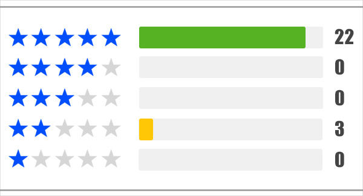

As I put a "spending freeze" on my wallet following the busy, holiday-shopping season, I like to look back on the many things I bought in December and I can say I am very happy with my purchases. I often feel buyer’s remorse whenever I buy something so it takes me a while to pull the check-out trigger. Therefore, I like to—no, need to&mdash;read ALL of the reviews. I must have read hundreds of online reviews in December to purchase appliances, furniture, toys and baby products. It's no surprise to me that even though Google reviews (and the impact on SEO) was at the top of our “marketing trends to watch” last year, it remains on our radar again in 2017.

### Why are reviews important for business?

Forbes’ top prediction for new social media habits in 2017 is "ratings will be everywhere." If that's true, then it's time to look to the stars to learn about your customers and their experiences because potential customers definitely care about reviews. According to a consumer review survey by Bright Local, 84% of people trust online reviews as much as personal recommendations, and 74% of consumers say that positive reviews make them trust a local business more.

### So how do you get more reviews, specifically positive ones?

It is our experience working with business owners that reviews are scary. (What if they're negative? Should I respond? What should I say and not say?) While uncertainty may tempt you to ignore reviews all together, fight that urge. You actually want to use review responses to get more positive conversations about your business rather than reacting only when there is an issue to address. Below are three simple steps to create an online review management plan with a goal of increasing positive reviews.

### Monitor

If ratings truly will be everywhere in 2017, it is important to familiarize yourself now with where they are located for your business. Reviews aren’t just for restaurants on Yelp anymore. Many niche review sites exist, and it is your job to find them. Without purchasing software, following online review platforms can be a manual mess so set some time aside to look up your business on common sites like Google, Yelp, Trip Advisor, Angie’s List, Facebook and the Better Business Bureau. Next, search for more specific review sites tailored to your industry like Houzz for home builders, G2 Crowd (and others alike) for technology companies, Health Grades for medical professionals or Glass Door for human resource information. Bookmark these sites so you can return and monitor regularly.

### Engage

Not only is it important for readers to see what your customers say about you, hearing from you shows the human side of your business as well. People appreciate reaching a real person that cares about each customer experience&mdash;good or bad&mdash;So it is important to respond to every review if you can. My opinion is that if a customer took the time out of their day to write a review, the least you can do is take a few minutes to acknowledge their feedback and thank them for their time.

If it's a negative review, treat it the same as you would if this customer were standing in front of you with a complaint. First, pause to collect your thoughts and listen to the customer. Thank them for taking the time to bring this to your attention. Second, inquire internally with the staff involved to understand the whole picture. Lastly, respond with empathy (“We regret that you had a negative experience…", "I understand the situation now and how frustrating that is…",) and an action item ("Let us make this right…", "Please message us your contact info so we may follow up with you” or "Please call and ask for Bob directly to address this"). If you are able to speak with the customer again, follow through on a solution to mend the relationship and ask them if they would consider updating their review if their opinion has changed.

### Ask for more

According to Bright Local, 7 out of 10 consumers will leave a review for a business if they’re asked. An extra incentive for you to ask for reviews is to keep them current because 73% of consumers think that reviews older than 3 months are no longer relevant. This is why online review management plans are ongoing. There are many ways to remind customers to submit reviews including personal requests, links on your website, emails, in-store signage or verbiage on receipts/invoices.

How do you handle online reviews for your business? Have you developed a system to generate more conversations? Share your tips and tricks via our contact form or on Facebook and Twitter!
