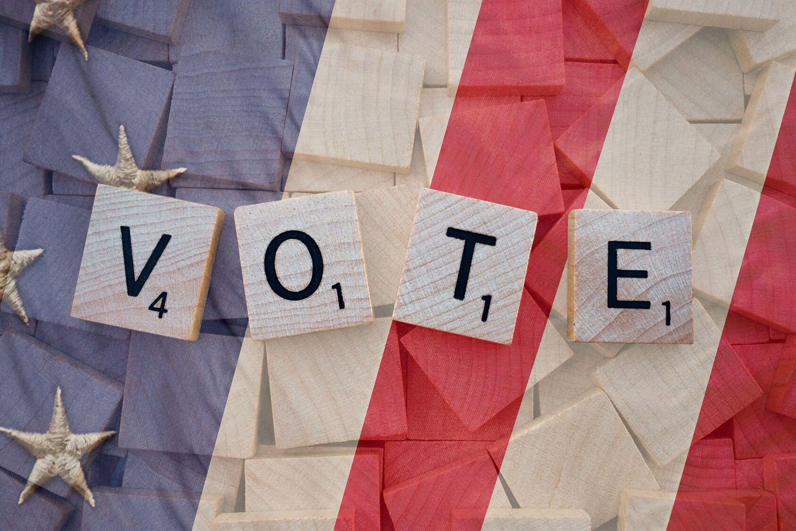
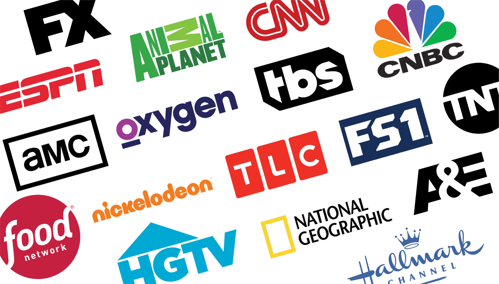

If you’re a media buyer, “preempt” is most likely top on your list of curse words. For those who may not deal with booking media schedules, preempt means to replace with something considered to be of greater value or priority. In the media world, it means that well-placed, previously booked spots are preempted due to another company wanting those timeslots and paying more money to get them. As you can imagine, it is a particularly frustrating problem during political years when politicians are willing to pay any price to get their spot on the air. A friend at a local TV station recently said that a certain political group was spending $50,000 per spot during Packers games this year. Normally you could get an ad in a game for $8,000 - $10,000 for comparison.

## Tips on TV Advertising During a Political Year

### 1. Book schedules early

One thing that really helps is to book schedules as early as possible. The longer an ad has been in place, the less likely it is to be pulled out. While clients that book annual schedules aren’t always completely safe from preemption, they are at least in a better position than clients who just booked something last week.

Another idea, if you are sitting on a schedule waiting for client approval to pull the trigger, go ahead and book it and pull spots out later if need be. Most TV stations won’t penalize you for cancelling when inventory is so sparse anyway, and those spaces will certainly get filled.

### 2. Use bookended spots

There are a limited number of thirty-second spots that can run in commercial breaks, and there always seem to be openings for fifteen-second spots compared to thirties. Bookend fifteens are two fifteen-second spots—one that airs at the beginning of a commercial break and one that airs at the end of a commercial break. It’s easier to place these spots, and they are less likely to get preempted than a coveted thirty-second spot.

### 3. Know your media reps and use them as a resource

Your trusted vendors can be your best bet to get through a political year. They can advise you when political money starts to roll in and make suggestions about when/how to book. Even if they can’t completely protect your buys from being preempted, they can help you find reasonable makegoods when the preempts occur. One vendor I work with, who goes above and beyond, took a spot that was preempted in TV news and added a makegood in _The Bachelor_. Understandably, some reps are not able to offer that level of makegood, but hang on to the ones that are!

### 4. Consider alternatives to a traditional TV schedule

Cable TV isn’t preempted nearly as much as broadcast TV, so it’s a great alternative if a spot is preempted, and you can’t agree upon a satisfactory makegood.

Additionally, advertising dollars that were meant for TV may have to be shifted into different media, such as online advertising. If the TV ad is already created, preroll is a great alternative! (Preroll ads are ads that run before a story/video online and are considered a form of online advertising, even though you are airing an ad initially made for TV.)

If your client insists on being in broadcast TV programming, and you have a sneaking suspicion that you are going to be preempted, consider buying five-second Station IDs or seven-second TV news/weather billboards which sound something like this, “XYZ News, Weather, and Sports brought to you by Matthews Tire. We keep you rolling during Michelin Month.” This provides exposure on TV—and those popular news audiences—while avoiding preempts altogether.

While you’re never going to love the puzzling task of how to best reconcile preempted spots, you can be better prepared by devising a game plan and learning what works best for you as your experience in this area continues to grow. And just think, after you get through the current political season, you’ll REALLY get to test out your skills in two years during another presidential election.
