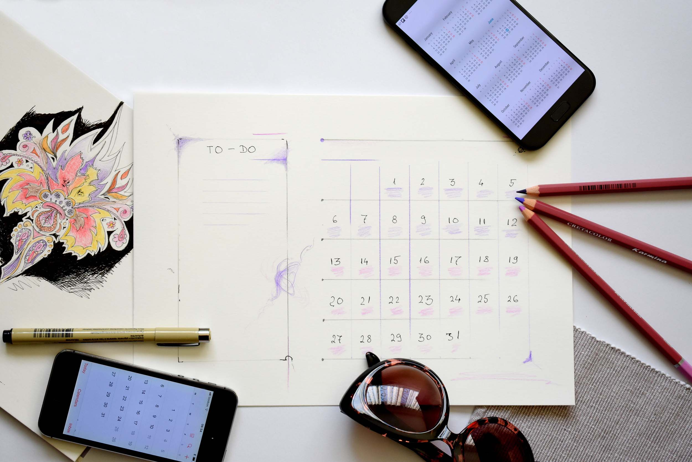

In today’s on-the-go world, how do you remain organized both personally and professionally? Wanna know what an (undiagnosed) obsessive-compulsive Insightian does to make the day run more smoothly? Here you go …

### Realize the Importance of Making Lists

I’m a big list maker. Everywhere I am—whether at home or at work—I have pads of paper (big and small) available to me. On my fridge you’ll see a grocery list, a list of meal ideas, a list of errands that I need to run and a wish list of items for my household. I keep similar lists on my phone … books I’d like to read, dates of last haircuts, a cleaning schedule, gift ideas and movies I’d like to see. I even keep a pad of paper in the bathroom. If a thought pops into my head in the shower, I can jot it down immediately after, so I don’t forget and kick myself later. And of course at work and home, I have my daily to-do list which helps keep me organized. Urgent matters come first and then other work, arranged by due date. Whatever I don’t finish gets carried over into the next day’s list. And the cycle continues.

### Use a Calendar

What did families do before online calendars?! Everyone probably knows about Google calendar, but I happen to like a free calendar app by Readdle. Everyone in my family is assigned a different color, and I create events for them all while enjoying a rainbow of organization. Birthdays are automatically imported, recurring events can be set and reminders help keep me on track all day … including when my bills are due (which show up in red for urgency)! At work, especially in the age of COVID, a calendar is your best friend. You know exactly what everyone in your office is doing at any given time which can make your day run more efficiently.

### Become an Expert at Prioritizing

Everyone has those projects or assignments that they just keep putting off. When things are urgent, it’s easy to decide—whether I like it or not—this has to be done RIGHT NOW. Other tasks have due dates that are further into the future. Those can be the hardest to start. Obviously get your urgent projects done first, move on to the tasks you like best and don’t be afraid to jump on a job with a later due date. You will look like a hero when you complete it ahead of schedule. Underpromise and overdeliver, I always say! (Besides, you never know how busy you’ll be the week before they are finally due.)

### Know When to Ask for Help

People often ask if they can help you—which is a wonderful thing—but often it is like a toddler asking if they can help you make cookies. Are they really “helping?” Also, when you are a control freak, it can be difficult to relinquish control of your project to someone else and watch them do it “the wrong way.” My suggestion is to be honest about the help you need. For example, if you are moving and people offer to help, maybe instead of them packing boxes and potentially messing up your system, be honest and say, “I don’t need help with packing, but I would love it if you could watch my kids, so I can pack in peace.” Being honest about what you really need will help you both feel good.

### Don’t Forget to Take Care of Yourself

Everyone is capable of being more organized and productive when they are well taken care of themselves. This means getting enough sleep, participating in purposeful exercise (not just mowing the lawn or walking up stairs … sorry) and eating a healthy diet. That’s the first thing you hear people say when they start to lose weight or get in better shape, “Oh I have so much more ENERGY!” That newfound energy could make the difference between having a good or bad day. Even the most organized people still need lots of energy!

Remember: you don’t have to wait until January 1 to start a new habit. Make a conscious choice today to become more organized tomorrow.
