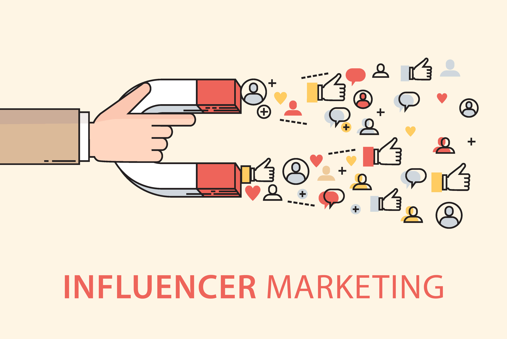

If you work in advertising or PR, you've probably heard the phrase "influencer marketing" a lot lately. If you're a high-profile consumer brand, you're probably already doing it or have been for some time. It's a term that has spread like wildfire and has extended outside the world of professional communicators and into mainstream media with stories of epic failures (<a href="https://www.inc.com/shane-barker/the-fyre-festival-marketing-disaster-2-important-i.html" target="_blank" rel="noopener noreferrer">like the infamous celebrity-stacked Fyre Festival</a>) or major successes (such as the sky-rocketing love for <a href="http://www.vogue.com/article/rose-trend-tipping-point" target="_blank" rel="noopener noreferrer">rosé wine with hashtag #RoseAllDay</a>). <a href="https://www.forbes.com/sites/ajagrawal/2016/12/27/why-influencer-marketing-will-explode-in-2017/#26af3fd420a9" target="_blank" rel="noopener noreferrer">According to Forbes</a>, a recent survey revealed 84% of marketers plan on executing at least one influencer marketing campaign this year.

You may hear it often, but what exactly is "influencer marketing"? Is it best applied to large national brands and A-list celebrities? What type of businesses can benefit most from influencer marketing? Can this approach be replicated for small business? These are the questions I ask myself on behalf of our clients when a "new" marketing trend rises to the social surface. Here’s my breakdown of influencer marketing, plus the risks and rewards associated with the social media trend.

## Intro to Influencer Marketing

It's difficult to pin-point a simple definition of influencer marketing. Instead, here's a list of what it is and what it most certainly is not.

### Influencer Marketing Is ...

- **a partnership.** A business or organization collaborates on social media with a well-known personality or "influencer" to promote a cause, product, event, brand, mission, etc. that aligns with the influencer's passion or expertise.
- **mutually beneficial.** Both the marketer and the influencer should see benefits from the campaign. A brand gains access to a large network of loyal trusting followers and the influencer benefits from being the first to share information about new, exciting or valuable products.
- **an on-going effort.** While some influencers carry more star power than others, it still takes time for them to build genuine interest with their audience about a certain project or product. Much like other organic social efforts, successful influencer marketing campaigns require an investment of time.

### Influencer Marketing Is Not ...

- **appointing a spokesperson.** Social influencers are not always A-list celebrities. Usually they are the most passionate and most credible people in the industry. They also promote products solely on social, not traditional media.
- **over-promotional.** The best influencers seamlessly integrate messages and photos of a product or brand right into their regular content without appearing salesy.
- **fake.** To be successful, the influencer must have a genuine interest in the product, cause or project. Their followers are looking to them for advice, recommendations or expertise only on certain topics. The product and the audience must align.

### Weighing Risks and Rewards of Influencer Marketing …

- **Risk:** Influencers can be unpredictable. They could go off-script with your product, inadvertently make false claims or post something that affects the reputation of your product.

- **Reward:** Your product or cause could be instantly catapulted into the social spotlight as a "trendy" item, depending on your influencer's passion and popularity.

- **Risk:** Your product could have the potential to harm the influencer's reputation. If your product is recalled, or your company experiences a failure, the addition of several active social followers could amplify your PR problem.

- **Reward:** You can gain access to millions of followers on social media without employing paid media.

- **Risk:** Influencers are human. Therefore, tragedy, death or unexpected circumstances can always derail a campaign—even with the most reliable influencers.

- **Reward:** Your brand will earn instant credibility with an audience that already has trust established with the influencer.

When you weigh the risks and rewards of influencer marketing, you may also consider your target audience. If you're marketing to heavy users of social media (teens, moms, and other active online groups), it truly may be the best way to reach your target market. In that case, the rewards outweigh the risks. Have plenty ideas for attainable influencers? Even better! Just make sure to properly vet influencers, create a campaign plan that both parties can agree upon, and keep it real!

Have more questions about influencer marketing? <a href="mailto:media@insightcreative.com">Contact our team today.</a>
