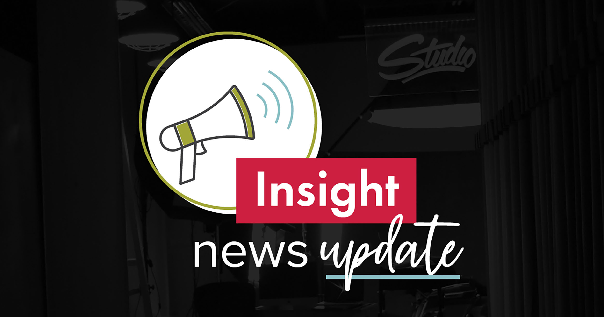

Insight Creative, Inc. recently expanded its content creation team with two new team members. [**Theresa Tebon**](/about/theresa-tebon/) was hired as social media specialist and [**Jordan Leon**](/about/jordan-leon/) was hired as digital copywriter.

As social media specialist, **Tebon** manages all social media efforts for Insight’s diverse client base. She previously gained versatile experience—in social media, writing, design and digital strategy—as the content marketing coordinator for a local homebuilder. She holds a bachelor’s degree in graphic design from UW-Green Bay.

As a digital copywriter, **Leon** writes branded SEO-driven content for Insight’s rapidly growing digital projects. Before joining the Insight team, Jordan ran her own small business as a freelance writer specializing in web content. She holds a bachelor's degree in English with an emphasis in creative writing from UW-Green Bay.

Since 1988, Insight Creative has delivered **_Communication with substance_** to consumer, business and industrial brands. For ultimate efficiency, Insight Creative houses all services—including web, creative, digital, media, PR and a full-service video/photo studio—under one roof in Green Bay, Wisconsin. [Learn more about Insight](/about/).
