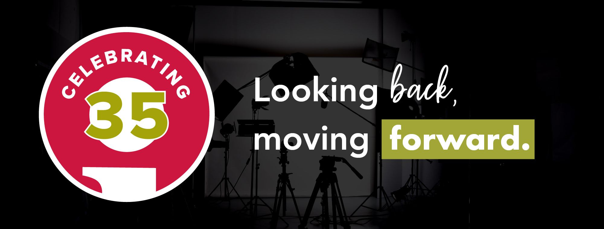

In 1988, our founder and president Jim von Hoff saw an opportunity to create a marketing agency with an integrated approach. 

“The agencies in our community did a lot of outsourcing,” Jim recalled. “My idea was to eliminate steps and offer a faster turnaround time to clients at a reduced cost. I started Insight Creative to bring everything—which at the time included copywriting, graphic design, photography, video and media—together under one roof.”

Jim had seen similar setups in places like Los Angeles, Chicago and New York City, but nothing like it in Northeast Wisconsin. He said, "We were really the first agency to do that in this part of Wisconsin."

## Our business evolution

Thirty-five years later, we're still doing everything from one place, right here in Green Bay, Wisconsin, on 1816 Sal St. The services we offer have evolved. Jim remembers the darkroom we used to have to process film. 

“One particularly long night in the darkroom, I remember thinking how nice it would be to have digital photography,” he laughed.

Since then, we’ve added things like [social media](/services/copywriting-services/) and [website development](/services/web-design-development-services/) to help our clients achieve their goals. Today, [our staff of 12](/about/) works with numerous businesses and nonprofits, including those in healthcare, finance, retail, manufacturing and more. Every day is different, and that's what makes it fun. 

“We love helping businesses grow and succeed,” said Insight Vice President [Niki Petit](/about/niki-petit/). “And we're lucky to have a team that's passionate and down-to-earth, just like Jim.”

## The role of technology in marketing

When given the chance to **invest in new technology**, Jim usually considers it. In 1987, he paid $12,500 for our first Mac computer, a printer and very basic software. “There were several agencies who told me, ‘We’re never going to design on a computer; you can’t do design on a computer.’ We saw it as a great tool to use. We were told by the Mac sales reps that we were one of the first in the area to take the leap.”

While Jim admits the tools and technology available in marketing have drastically changed, some things have stayed the same. 

He explained: “**The core of Insight has always been the idea**, and the people behind the idea. Our experience is what makes humanity special. We just use different platforms to get that idea out into the marketplace.”

## Looking back, moving forward

Our journey at Insight has been filled with creativity, growth and success for businesses and nonprofits alike. We’re grateful for the incredible clients who have placed their trust in us for their marketing strategies; some of them have remained with us for over three decades. 

“It’s heartwarming to still work with some of the same clients after 35 years,” Jim said. “There’s so much change in the world. It’s nice to know **some things, like strong relationships, never change**. They only get better, and you appreciate those people even more.”

Seeing our clients succeed and knowing we were a part of it “is what it’s all about,” Jim exclaimed. “I like to ask myself, ‘Have you brought value into the marketplace? **Have you brought value to your clients?** Are your clients’ organizations better because they chose to work with you?’ Yes. That’s why we exist.”

As we look back and celebrate, we're also looking forward to what the future holds. With our mix of innovative ideas and new technology, there's no doubt we'll continue supporting the region’s marketing efforts for many years to come.

## Insight Creative, Inc. in the news

A heartfelt thank you to these local organizations who helped share our 35th anniversary story.

- **The Business News**: [Reflecting on the past, while planning for the future](https://thebusinessnews.com/article/reflecting-on-the-past-while-planning-for-the-future)

- **Press Times**: [Green Bay Company Evolves With Technology In The Advertising World](https://gopresstimes.com/2023/07/12/green-bay-company-evolves-with-technology-in-the-advertising-world/)

- **Insight Magazine**: [Insight Creative, Inc. celebrates 35 years](https://www.insightonbusiness.com/special/anniversaries/insight-creative-inc-celebrates-35-years/article_066ce9e6-9e7a-11ed-addf-1391e2914877.html) 

## Work with Insight

Ready to bring substance to your brand? [Contact us today](/contact/).
