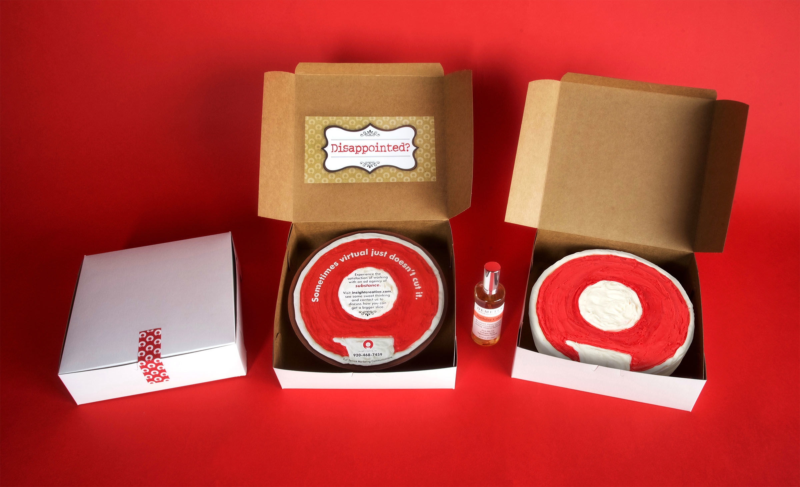

Insight Creative received an “Award of Distinction” from the 24th Annual Communicator Awards hosted by the Academy of Interactive and Visual Arts. The “New Business Cake” direct mail piece was recognized in the collateral self-promotion category. With entries from across the U.S. and around the world, the Communicator Awards is the largest and most competitive awards program honoring creative excellence for communications professionals.

“This always felt like a special promotional piece to me—especially after we added the cake scent to it,” said Jay Bauer, creative director with Insight Creative. “I am happy to see the judges at the Communicator Awards agreed.”

The “New Business Cake” was designed specifically to open the door to new potential clients. The direct mail piece used a cardboard cake to emphasize—when it comes to both cake _and_ advertising—there’s no cheap easy substitute for the real thing. An actual Insight-branded cake was delivered as a follow-up to a meeting request.

Founded by passionate communications professionals over two decades ago, The Communicator Awards are judged and overseen by the Academy of Interactive and Visual Arts (AIVA), a 600+ member organization of leading professionals from various disciplines of the visual arts dedicated to embracing progress and the evolving nature of traditional and interactive media. Current AIVA membership represents acclaimed media, advertising, and marketing firms including: PureMatter, Condè Nast, Disney, Republica, Sesame Workshop, MTV, Starbucks, Time Inc., Tribal DDB, Yahoo!, and many others. Visit <a href='https://www.communicatorawards.com/awards/' target='_blank' rel='noopener noreferrer'>communicatorawards.com</a> for more information.

Insight Creative, Inc.—serving clients since 1988—is a Green Bay-based advertising agency offering complete in-house creative and strategic marketing communications and branding expertise for consumer, business and industrial clients.
