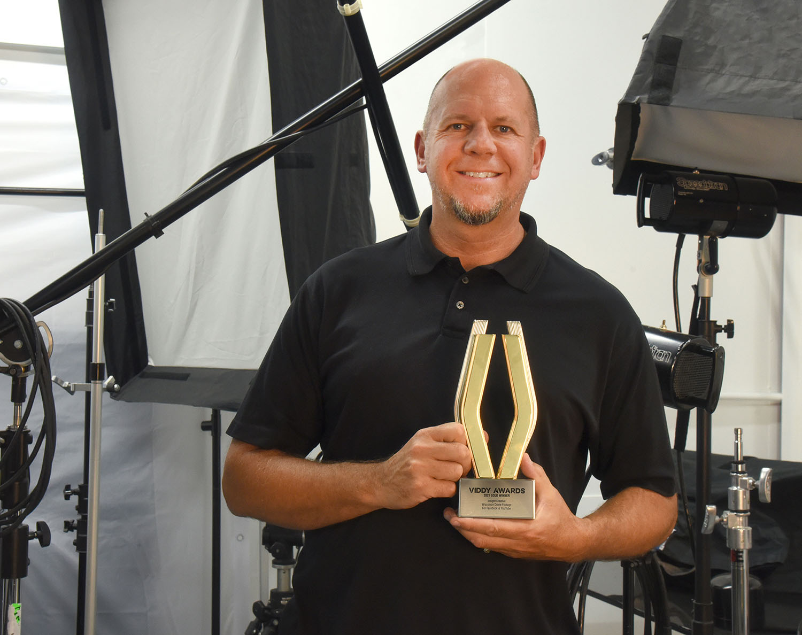

Insight Creative, Inc. earned a 2021 Viddy Gold Award for their Wisconsin Drone Footage on Facebook and YouTube. The footage, filmed by Insight’s Creative Director Jay Bauer, showcases aerial views of Wisconsin’s agricultural landscape.

&nbsp;

The Viddy Awards are administered by the Association of Marketing and Communication Professionals (AMCP) and is an international competition honoring video excellence in a digital world. Over 2,500 entries were submitted from video production companies, cable/broadcast television operations, advertising, design, digital and public relations firms, corporate communication departments, individuals and other creative companies around the world. Judges are industry professionals who look for talent exceeding a high standard of excellence and whose work serves as a benchmark for the industry.

About AMCP: As part of its mission, AMCP fosters and supports the efforts of creative professionals who contribute their unique talents to public service and charitable organizations. AMCP does not charge entrants for work they produced pro bono for nonprofits, and in recent years has given out over $250,000 in grants to support philanthropic endeavors. To learn more, and for a full list of Viddy winners, visit <a href="https://viddyawards.com" target="_blank" rel="noopener noreferrer">viddyawards.com</a>.
