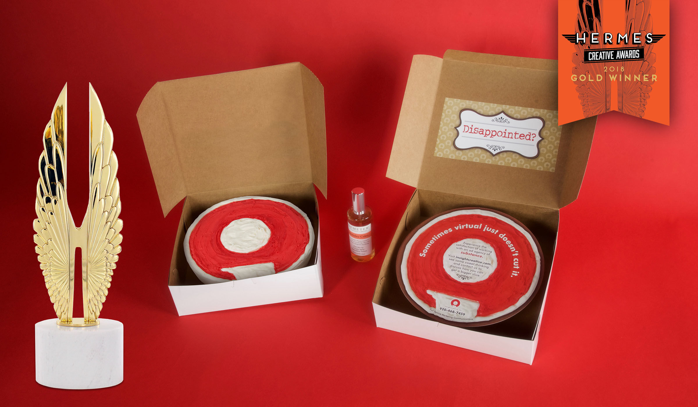

Insight Creative, Inc. was named a Gold Winner by the 2018 Hermes Creative Awards, an international awards competition for creative professionals involved in the concept, writing and design of traditional and emerging media. This is the second international award Insight Creative has received in 2018 for their “New Business Cake Mailer.”

There were over 6,500 entries from the United States, Canada and dozens of other countries. Work was submitted by corporate marketing and communication departments, advertising agencies, PR firms, design shops, production companies and freelancers. Hermes Creative Awards is administered by the Association of Marketing and Communication Professionals (AMCP) and consists of several thousand marketing, communication, advertising, public relations, media production and free-lance professionals.

As part of its mission, AMCP supports the efforts of creative professionals who contribute their talents to public service and charitable organizations. Hermes entrants are not charged entry fees for work they produced pro bona. In addition, the efforts of generous marketing and communication professionals are acknowledged through grants and special recognition.

AMCP judges are industry professionals who look for companies and individuals whose talent exceeds a high standard of excellence and whose work serves as a benchmark for the industry. Winners were selected from 195 categories grouped under advertising, publications, marketing/branding, integrated marketing, public relations/communications, electronic media and pro bon. A list of Platinum and Gold Winners can be found on the Hermes Creative Awards website at <a href="http://hermesawards.com/" target="_blank" rel="noopener">hermesawards.com</a>.

Insight Creative, Inc.—serving clients since 1988—is a Green Bay-based advertising agency offering complete in-house creative and strategic marketing communications and branding expertise for consumer, business and industrial clients.
