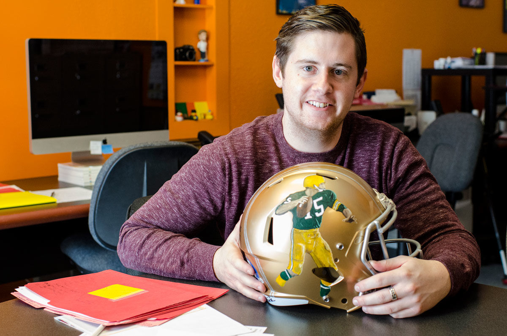

Insight Creative’s very own Zane Statz is becoming somewhat of an “unofficial artist for the Green Bay Packers,” as reported by the Green Bay Press Gazette. Statz, who currently wields his digital talents at Insight by day, is increasingly wielding a paintbrush by night. [After completing two 70-foot fence murals near Lambeau field for the 2015 football season](/blog/insight-designer-zane-statz-paints-new-packers-fence.html), Statz was recently selected to take on his most challenging and important Packers project yet. In celebration of the NFL’s 50th Super Bowl, CBS has developed a program paying tribute to all 32 NFL cities by selecting a local artist to paint a golden helmet representative of their team. Statz was selected by local CBS affiliate WFRV Channel 5 to paint Green Bay’s golden helmet just in time for this Sunday’s Super Bowl.

The premise of Statz’s design is a salute to the “glory years” of Packers legend Bart Starr. "One (portrait) is an action shot of (Starr) passing, a full side-body profile," he told a reporter for the Green Bay Press Gazette in a recent interview. "The other is more of a formal bust of his face and upper chest,” he explained.

Read more about Statz’s inspiration for the helmet, his creative process and how proceeds from the helmet will benefit Starr’s prized cause, New London’s Rawhide Boys Ranch, in a feature story with the [Green Bay Press Gazette](http://www.greenbaypressgazette.com/story/news/local/door-co/sports/2016/02/02/artists-brush-super-bowl/79705838/).
