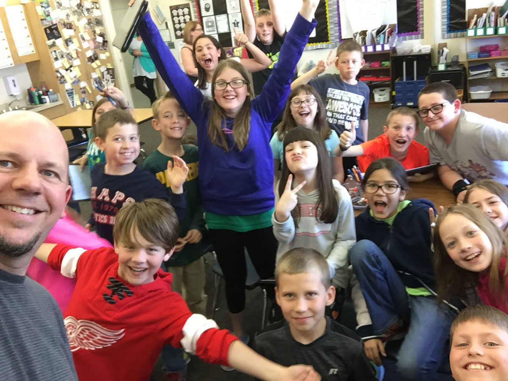
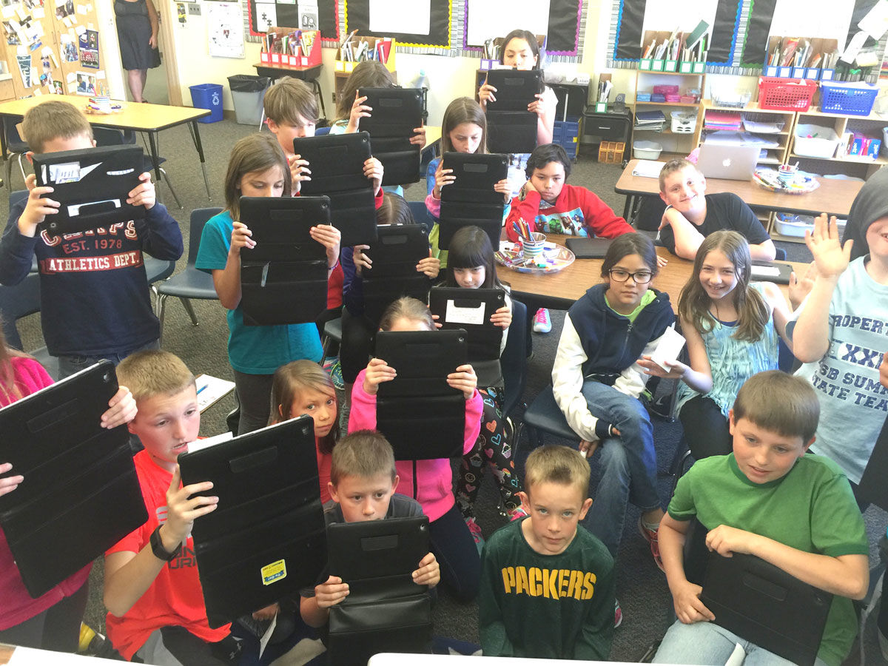
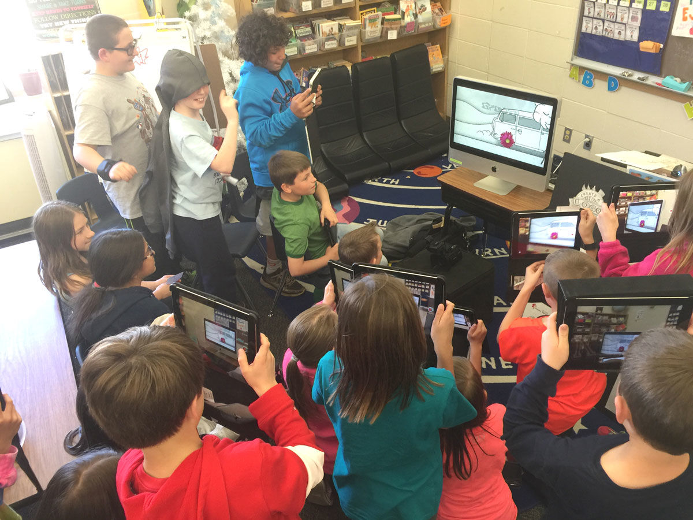

I always enjoy inspiring kids and showing them that they can have a career in Graphic Arts and/or Marketing Communications. It’s great to see the look on a kid’s face when they realize for the first time that they can do something they love.

Recently, I had the privilege of speaking to the fourth grade class at Forest Glen Elementary in Howard-Suamico on career day. Their enthusiasm was infectious and the technology they had was great; I wish I had a handheld computer when I was in 4th grade!

Their questions&mdash;and my answers&mdash;do a good job of explaining what we do and how we do it:

What education/training is needed for your job?

- Bachelor of Arts degree in Marketing or Graphic Design is preferred.

How are math/reading/science important in your job?

- It’s important to be well-rounded and have a better understanding of all these subjects—math for calculating dimensions, reading for effective communication and science for discussing theories and understanding how things work in the world.

What does a typical day in your job look like?

- I showed them a <a href="https://www.youtube.com/watch?v=9bKPUmY8_eY&feature=youtu.be" target="_blank" rel="noopener noreferrer">video</a> of our space that talked about what a fun, typical day is like at our agency.

What tools/technology are used in your job?

- (I brought in an iMac and they all thought it was a giant iPad!) We also use pencils, paper and iPad pros, with pressure sensitive stylists, to draw concepts and share ideas.

How do you use communication/collaboration, problem solving and/or creativity at work?

- We often have brainstorming sessions where we get together to come up with ideas and solve problems using research, strategy and creativity. I showed a visual example of how we solved a real-world challenge with <a href="https://www.youtube.com/watch?v=FZgdQvtaN_c&feature=youtu.be" target="_blank" rel="noopener noreferrer">Matthew’s Tire</a>. They loved it and all recorded videos of it as it played!

In the end, I think they were inspired and some of them are seriously considering a career in this field. (Well, as seriously as you can be in the 4th grade.) Thanks again Forest Glen Elementary for having me and thanks to the students for making it a fun and rewarding experience.
