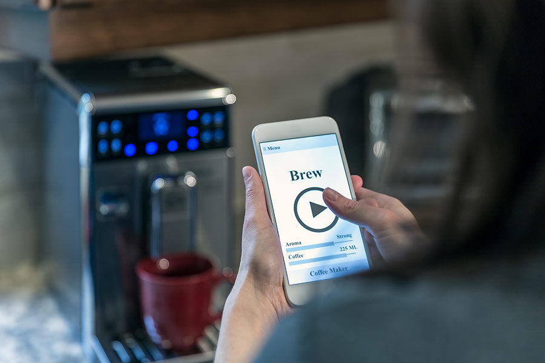
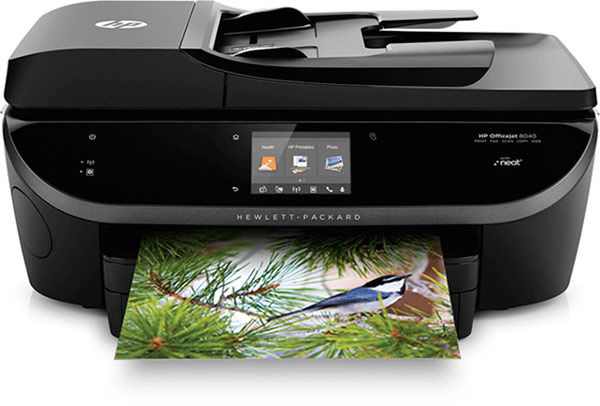
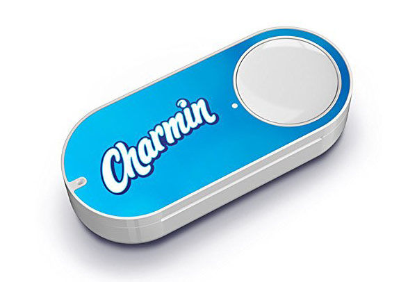

Have you been hearing about the Internet of Things (IoT)? Like me, have you wondered what it means? It’s a somewhat generic sounding term that packs a ton of meaning for our future as a society, as marketers and as salespeople. What exactly is IoT? In short, it’s the interconnectedness of objects: your phone talking to your car’s radio, setting your home DVR from your office, or your Fitbit posting your workout results directly on social media. (By the way, on behalf of all your social contacts, if you’re doing this please stop). Make no mistake, this is a BIG thing. Qualcomm Technologies analysts estimate that IoT applications could have a total economic impact of up to 11 trillion dollars annually by 2025.

According to SmartInsight.com, it is expected there will be 75 billion connected devices worldwide by 2020. That means there will be ten times as many devices able to talk to one another as people on Earth. It only makes sense that these devices start taking over some of our annoying daily tasks and interactions.

Personally, IoT has alleviated one of my small but bothersome life tasks—ordering printer ink. For the past twenty years my husband and I have battled over replacing our printer ink. Stressful late night presentation deadlines were frequently exacerbated by running out of ink. Keeping a back-up supply on hand was expensive, required us to actually locate that supply at 1:30 a.m. and—when we did remember to purchase replacement cartridges—we’d fight about replacing only the black, which had run out, or (foolishly, ahem) replacing all the color cartridges at the same time in the name of convenience. Now, since we enrolled in <a href="http://www8.hp.com/us/en/instant-ink/overview.html" target="_blank" rel="noopener noreferrer">HP Instant Ink</a>, our internet-enabled printer monitors our usage as well as its own ink levels, then orders replacement ink when levels get low. And best of all, we’re not even aware it’s happening until the ink shows up in the mailbox. If only all marriage issues could be easily solved with a recurring monthly charge of $2.99 on my credit card!

Products that market and actually purchase more of themselves are one of the most significant ways IoT can impact brands. Just like my experience with HP Instant Ink, <a href="https://www.amazon.com/s/ref=sr_pg_1?rh=i%3Aaps%2Ck%3Adash+button&keywords=dash+button&ie=UTF8&qid=1505229711" target="\_blank" rel="noopener noreferrer">Amazon’s Dash Buttons</a> are making life easier for consumers and brands every day. These handy little buttons can be affixed all over our house and allow you to reorder products with the press of a button. Grabbing the last roll of toilet paper? No problem if you have a Charmin Dash Button in the bathroom cabinet. Just give it a press and you’ve reordered TP from Amazon. (Then, if you have Amazon Prime, it will be delivered to your home for free in two days. Try explaining that to your grandmother!)

Clearly, the world is becoming more interconnected. And this interconnectedness provides some exciting opportunities for brands and their marketing partners.
