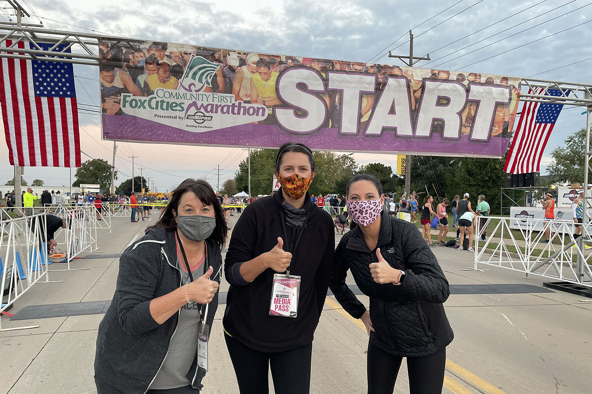
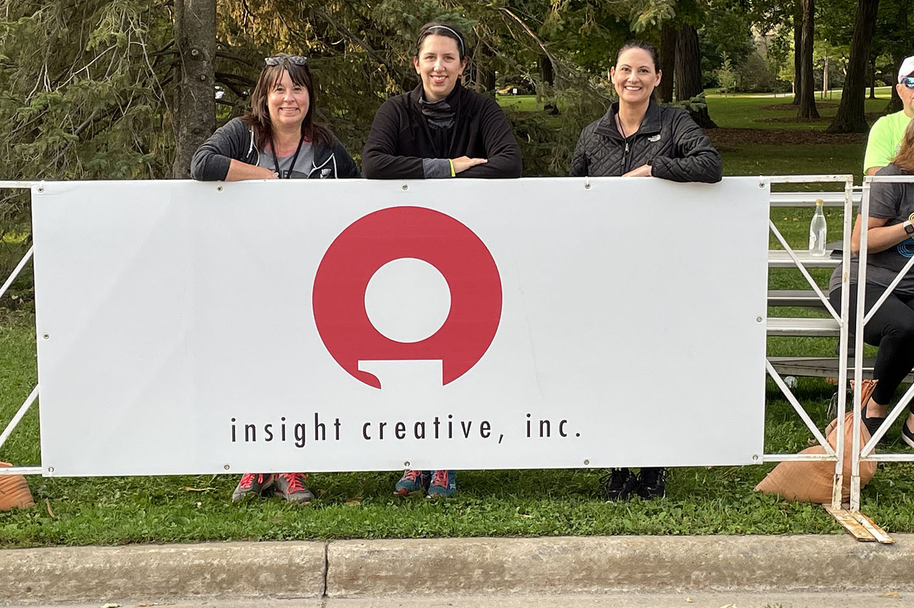
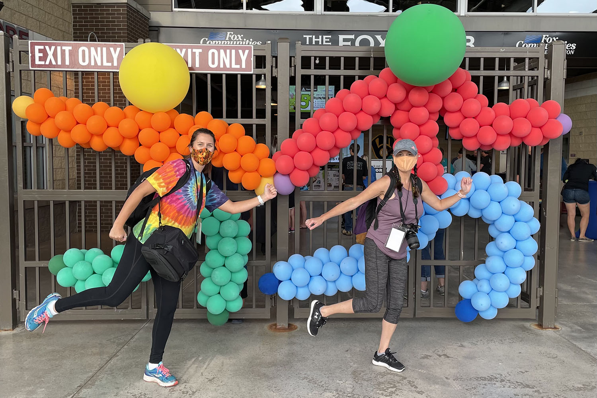

Whether you’re planning a birthday party for 10 or a tradeshow for 10,000, event planning can feel like you’re running a marathon. Last fall marked the 30th running of the Community First Fox Cities Marathon and the 10th year that Insight Creative provided social media services for the organizer. We think back fondly on that first year where our one-person social media team operated out of the VIP food tent with a laptop and digital camera. Now, a decade later, our well-oiled event team can tackle almost any live event our clients present to us.

Is your company hosting or attending an industry event this year? Here’s how to hit the ground running with your marketing team:

## Create your training plan.

Similar to the runners, our full-service team “trained” all year long following a strategic marketing plan. We executed registration ads and media buys, planned photography shot lists and prepared posts to engage and inspire the Northeast Wisconsin running community.

## Organize and mobilize your people.

You are only as strong as your team. Create a master schedule months in advance so your team can prepare. Assign shifts and provide regular updates to answer any questions. Having an organized plan alleviates stress and creates positive energy and excitement for the big day.

## Prepare your toolkit.

We suggest collecting your supplies in a tote so you’re prepared for anything. Think tape, scissors, extra chargers, extra cameras, extension cords, etc. And don’t forget about layering your clothing to adapt to swift Wisconsin weather changes if your event is outdoors.

## Anticipate and automate.

After a decade of live social media coverage, we can anticipate certain milestone moments that need attention. It’s important to visualize how event day will unfold. Review the schedule and talk it through out loud with your team. You will notice that there are special features throughout the day that stand out like doors open, guest speaker begins, first runner crosses the finish line, etc. Plot these important moments out in your social media calendar and write what you can beforehand.

## Expect the unexpected.

Whether it’s cancellations due to weather or COVID-19, we know firsthand that event plans change on a dime. Brainstorming alternate plans beforehand is good practice. Our flexible and fast-moving team stays calm under pressure in these scenarios by identifying appointed spokespeople and crafting a speech or social posts ready to go in case of emergency.

## Have fun.

Event planning is stressful! So when the day starts and the crowds roll in, try to be present and post your social media content from the eyes of the attendees. Stop to look around and capture the small details (people hugging or shaking hands, the carefully planned food menu, the sunrise as guests arrive, etc.) that paint the full picture of why you’re all gathered that day.

There’s no one-size-fits-all approach when it comes to event marketing but our hope is that with these strategic planning tips, you’ll be well-prepared for any event. If you need help planning or executing an industry event this year, please reach out to the [full-service staff at Insight Creative](/contact/).
