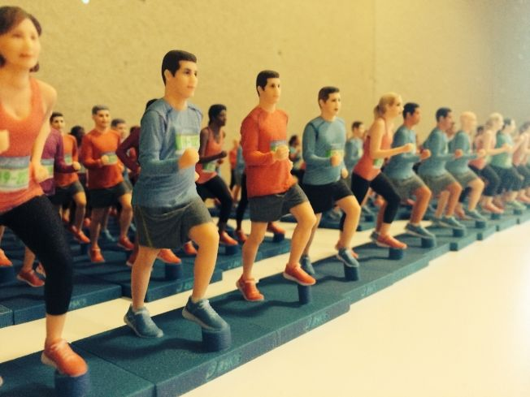

People run marathons for various reasons such as, to achieve a PR (personal record), lose weight or earn a finisher medal, t-shirt, or in one case, a Tiffany & Co. necklace (Nike Women’s Half Marathon, San Francisco). With the running industry boom, there are 28,200 running events every year, growing at about 2,000 new events per year. That tallies to just over 19 million participants! If you’re sponsoring one of these popular events, your race needs to offer something unique, even if it’s the largest and most popular event in the world.

This point is best illustrated by the TCS New York City Marathon. One of their major sponsors, Asics, honored runners with a gift that was not only an outside-the-box idea, but effortlessly utilized social media spawning major viral benefits as well. For the 2014 race that took place Nov 2, Asics asked participants to supply 2-D front and profile headshots during registration. Then they hired a team of artists to turn the 2-D images into printable 3-D files, creating mini, life-like statues of each runner (capped at the first 500). Though this already is something no race has ever offered, Asics took it one step further.

It’s common for races to offer runner tracking services that will send text, email or social media updates for participants along the course, with their time, pace and finish line ETA. Vitro, the ad agency facilitating this for Asics, took three landmark pictures along the marathon course and imposed the mini statue. The digital team then linked these photos with each participant’s Facebook page. When the runner passed those landmarks in real time, the update was then posted on their social media pages for family and friends. Because this functionality was limited (doing this for 50,000 participants may prove to be too much), Asics took it to Twitter for a virtual marathon. Any runner in the real race could enter and for each tweet made on their behalf, they would be moved along a virtual marathon course. The first 50 runners to “finish” would get statues as well.

This promotion smoothly provided consistency to various facets of the event from the promotional gift, social media updates and runner tracking. It allowed Asics to capitalize on real-time updates, which offered targeted, time-sensitive information during the most relevant times, versus blanketed awareness ads over a longer duration. This added value not only elevated the race experience of the participant, but also received notoriety from family and friends both in attendance and cheering from afar, creating relationships, feedback and viral online conversations.

As someone who has ran a few races, photos of virtual runners are MUCH more flattering than the real race photos ... am I right?
