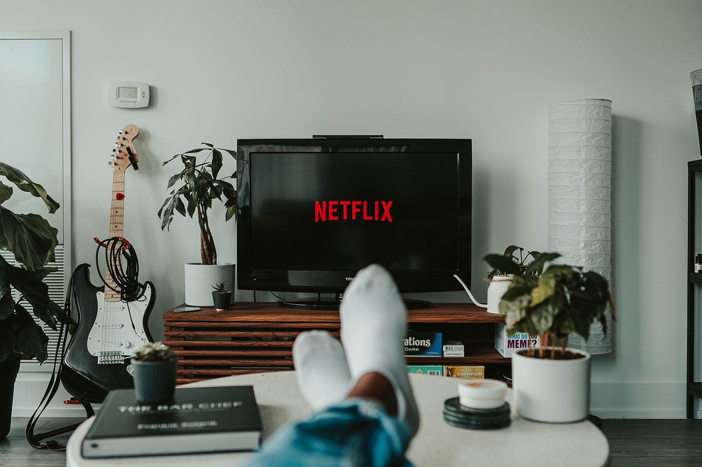
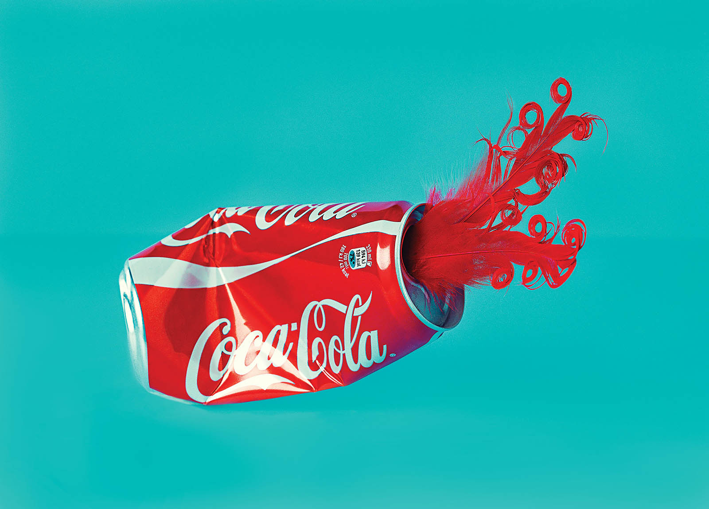

_Are we in an economic downturn? How will consumer shopping habits change in a recession? How can businesses prepare?_

With talk of an impending 2022 recession—that <a href="https://www.bloomberg.com/news/articles/2022-07-06/are-we-already-in-a-recession-2022-businesses-and-workers-say-yes" target="_blank" rel="noopener noreferrer">many US consumers believe is already happening</a>—many businesses are worried about how they’ll fare. Here’s the good news: you don’t have to let a recession put you out of business. With the proper understanding of consumer shopping habits in a recession, you can be prepared to not only survive the recession but thrive!

Not sure what a recession means for business? Read our full [marketing in a recession guide](/blog/marketing-during-recession).

Our marketing experts at Insight Creative are breaking down everything you need to know about consumer behavior during a recession. Plus, we’ll share advice on how to respond strategically to these changes. With this knowledge, you can set yourself apart from the competition, rise above the negativity and be prepared to respond quickly to the changing market.

## 5 ways consumers change their shopping habits during a recession:

## 1. Tighten their budgets and cut out unnecessary spending.

Inflation, <a href="https://www.pbs.org/newshour/economy/federal-reserve-signals-further-hikes-in-interest-rates-to-restrictive-levels" target="_blank" rel="noopener noreferrer">rising interest rates</a> and a lack of job security that tend to come with recessions put a strain on consumer budgets. It’s no surprise that consumers then cut back on frivolous spending when faced with this economic challenge.

Even <a href="https://www.cnbc.com/2022/04/08/as-inflation-bites-higher-income-consumers-are-cutting-back-too.html" target="_blank" rel="noopener noreferrer">consumers in higher earning brackets feel the economic pressure of a recession</a>. No matter who your target audience is, it’s best to assume that they will be tightening their budgets.

Consequently, your potential customers will need clear, strategic messaging to show them why they should be spending their money on your products/services.

### How businesses can respond to tightening budgets

Focus on value-driven marketing. You can’t put more money into your customers’ pockets, but you can give them the confidence they need to make a purchase.

Do this by using your marketing campaigns and tactics to show the value of your products and services. If you can prove why your offerings are worth buying, even in a recession, you can still secure sales when consumer budgets are tight.

## 2. Spend more on at-home goods and entertainment.

COVID-19 showed us just how important at-home entertainment can be for consumers. Over the pandemic shutdowns and the 2020 recession, <a href="https://www.nerdwallet.com/article/small-business/businesses-thriving-during-the-pandemic" target="_blank" rel="noopener noreferrer">many products and industries thrived</a> as consumers were stuck at home.

Streaming, gaming, playing instruments and crafting all increased in popularity. Consumers were also spending more to improve their at-home experience overall. Bedding, higher-end toiletries and cooking supplies were popular purchases.

While a 2022 recession won’t leave consumers stuck at home again, it will put a strain on their entertainment budgets. Many will cut back on eating and drinking out, going to movies and other away-from-home entertainment. Consumers will look for cheaper entertainment alternatives and will likely want their home to be as relaxing and enjoyable as possible.

### How businesses can respond to an increase in at-home entertainment

Get into the mindset that your potential customers will be spending more time at home, or at the very least, looking for cheaper entertainment. Show them how your products and services can improve their at-home experience and keep them relaxed, happy, productive and/or engaged from the comfort of home, without breaking the bank.

## 3. Chase the best deals, especially online.

In good economic conditions, consumers have the luxury of being picky when it comes to where they buy their products. A brand’s sustainability, mission, values and <a href="https://www.forbes.com/sites/forbesbusinesscouncil/2019/11/21/consumers-are-hungry-for-an-experience-based-connection-with-your-brand/" target="_blank" rel="noopener noreferrer">customer experience</a> all factor into buying decisions.

Consumer spending habits in a recession, however, show that product pricing becomes the biggest buying factor. Consumers will be more likely to <a href="https://www.mckinsey.com/industries/consumer-packaged-goods/our-insights/how-the-recession-has-changed-us-consumer-behavior" target="_blank" rel="noopener noreferrer">ditch top and mid-tier brands in exchange for bargain brands</a> and big-box stores. They will also be on the hunt for the best deals on specific products, especially online.

Once a shopper knows what product they want to buy, search engines and eCommerce platforms make it easier than ever to find and compare listings for that product. So, even if a consumer falls in love with your products, they may opt to buy with another brand at a better deal.

### How businesses can respond to consumers searching for deals online

Consider running more frequent sales and discounts on your products and be sure to promote them online. Share special deals on your social media, newsletter, online store and anywhere else you have an online presence. This will help win over customers looking for the best deals.

## 4. Stay with the brands they trust.

Consumer confidence is perhaps the one thing more important than pricing when it comes to consumer shopping habits in a recession. Consumers need to know that they are purchasing quality products that will serve them well.

The most common-sense way for consumers to do this is by <a href="https://www.marketingweek.com/brands-must-be-beacons-of-trust-to-beat-recession/" target="_blank" rel="noopener noreferrer">sticking with the brands they trust</a>. You don’t need to immediately fear that you’ll lose your loyal customer base in a recession.

### How businesses can respond to an increased demand for trustworthy brands

Adjust your positioning and messaging to inspire consumer confidence. Using the value-driven marketing strategy we mentioned earlier, be clear and confident in your marketing.

Stand out from potentially less-expensive brands by highlighting the key benefits of shopping with your brand. Show what makes your products better than bargain offerings.

Most importantly, don’t forget about the loyal customers sticking it out with your brand. Sending a discount code to your newsletter subscribers, for example, is a great way to show your customers their support is needed and appreciated.

## 5. Search for positive messaging.

<a href="https://www.ncbi.nlm.nih.gov/pmc/articles/PMC4844458/" target="_blank" rel="noopener noreferrer">Recessions are stressful</a>, and the nation tends to focus on the failures of the economy during this time. That means consumers are likely being inundated with even more negative news and messages than normal, both in-person and online, during a recession.

In this trying time, consumers will be burnt out from all the negativity. Taking a positive approach can be a refreshing change of pace and help brands stand out from the negative chatter.

### How businesses can respond to negativity fatigue

Take a positive, confident approach in your communications and marketing. Show your audience soon-to-come deals and any brand changes you’ll be making to mitigate the challenges caused by the recession.

Lead with the belief and confidence that your products are still worth buying, even in the recession, and back up your claims with solid marketing and reasoning.

## Your business can thrive, even in a recession.

Now that you know how consumer shopping habits change in a recession, you’ll be steps ahead of the competition! Prepare your recession messaging now, so that your brand and sales can thrive later.

Ready to create a recession-proof marketing strategy? The experts at Insight Creative can help to create a strategic, effective plan to ensure your brand will thrive. [Contact us today](/contact/) for a free marketing audit and consultation!
