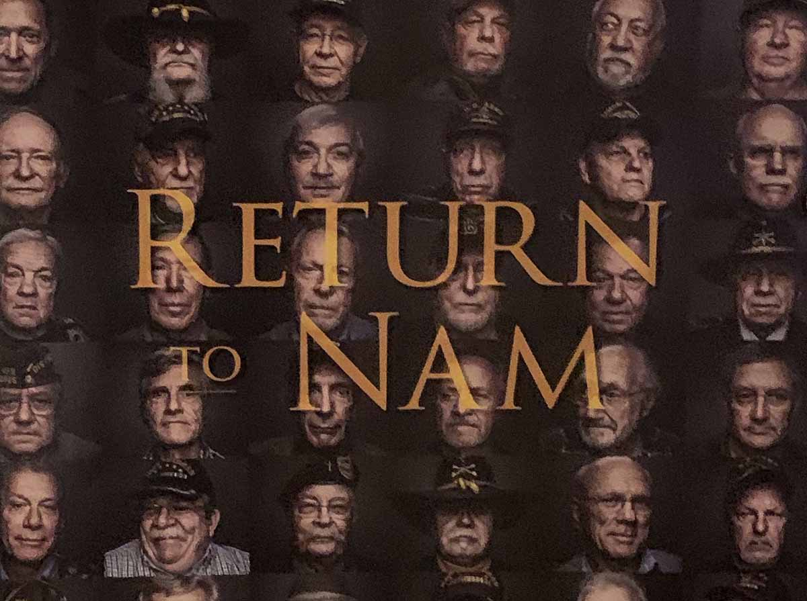
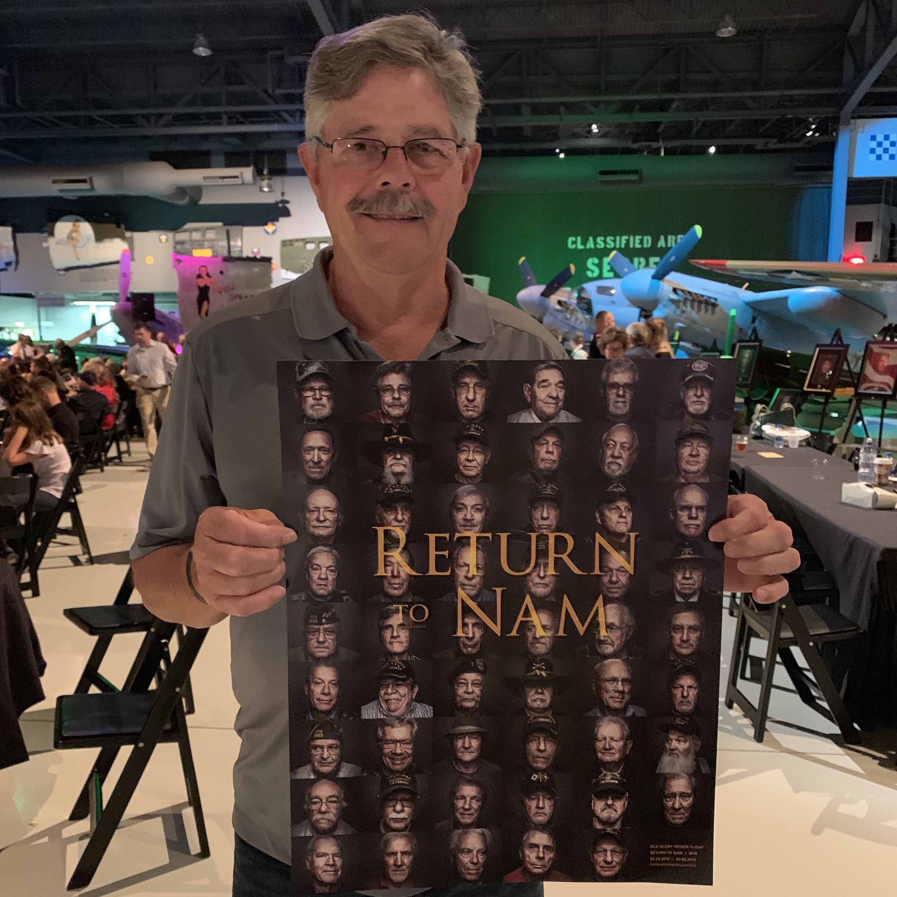

When I started my career at Insight Creative, Inc. I envisioned the opportunity to update or develop new brands, work on media campaigns and perhaps help the occasional non-profit. Never did I think I’d have the chance to rewrite history. That changed when a marketing colleague asked me to help Honor Flight’s Return to Nam Project.

The Northeast Wisconsin Chapter of Honor Flight selected 53 Vietnam Veterans and flew them to Vietnam for a two-week trip of healing. One of their missions was to facilitate a positive "welcome home experience." This was lacking on their original return. Back then the internet, computers and cell phones didn’t exist. Since information was not readily accessible, the men didn’t realize the negative reaction to the war back home. They were not greeted with enthusiasm upon their return but instead were met with aggression and disdain. This left them confused and isolated. It remains a big stain on our nation’s history.

This project was a chance to rewrite that history—a chance to right some wrongs. By educating the public and encouraging them to attend a Welcome Home Event, we were able to let these men feel the gratitude of our nation. It allowed healing.

This was a big undertaking. Many individuals and companies donated goods and services. Insight took on the public relations portion of this project. While we couldn’t fix the past, we could work on the future. So, we spoke with our media partners who agreed to post "Welcome Home" billboards in 13 locations around the city. These messages were seen by the men upon their return.

In addition, we managed press releases, story pitches, news coverage, print features and more. Insight’s efforts resulted in over 275 publications featuring the story locally and nationwide.

This culminated in a Welcome Home Party showcasing a book with each man’s personal experiences. I had the pleasure of meeting many of these men in person, and it was a true honor to learn their stories, hear how they struggled over the years and how this trip and the journey back home healed them. It is a career highlight and something I will always be proud of.

Marketers, I encourage you to reach beyond your office walls. Where can you apply your talents and passions to help those around you?
