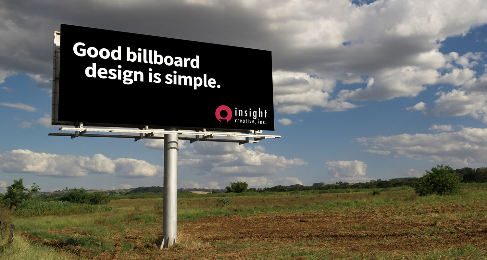

When you decide to spend marketing dollars on a billboard, make sure it follows these simple guidelines for maximum effectiveness. Creating a poorly designed billboard is like throwing money away. You want your message to be read and then acted upon.



## Mind the 5-second rule

Drivers have a maximum viewing time of five seconds when driving by a billboard. Sometimes it’s even less than that.
So make sure your message can be digested and read within five seconds or less when designing a board.

## Keep it readable

Make sure you choose fonts that are easy to read and are large enough for people to read from a distance. I test this by
actually backing up from my computer and seeing if I can read the billboard artwork from 15-20 feet away.

## Strive for contrast

Make sure your billboard has good contrast and doesn’t use colors on top of colors that are hard to read. Also make sure
the background color of the billboard stands out from the sky. You don’t want to use sky-colored billboards.

## Minimize the message

This is not a print ad, so don’t put everything you can think of into your billboard. Keep it short and sweet. I would say no more than 10-12-words if possible.

## Focus on one picture

Use big, bold, readable pictures that make sense. Ideally one picture and the company logo should be all you need.
Or just the company logo and a simple message that communicates your message.

## Ditch the phone number

There is also no need for phone numbers or websites on billboards. People are not going to stop and write that stuff
down. They will just remember the business and Google it once they are stopped. That’s the goal anyway

## Location, location, location

Be sure to consider the location of your board. If it’s in the city near an intersection, people will have a longer time
to view it because they will either be stopped or driving at a slower speed. If it’s located on the highway, they will be driving much faster and have much less time to view the board. Consider the 5-second rule as mentioned earlier if you’re on the highway.

The billboards pictured above are examples that meet these guidelines.

Now that you know what to look for, drive around and evaluate the billboards you see. You may be surprised to find that many violate these simple rules and are difficult to read! If you need to design clear, effective billboards for your brand, reach out to the communication professionals at Insight today!
