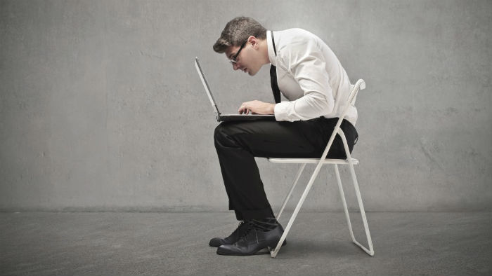

I look forward to coming to work each day; I have hilarious co-workers that make it an awesome environment. Unfortunately there is a hidden terror; a silent tormentor that is slowly wrapping its twisted fingers around me ... it's my posture. So many of us spend a majority of our waking hours at work—and for me that means sitting at a desk. What does that mean for our muscular system? Well, repetitive movements and posture (the way you sit or stand) are second and third causes for workplace injury, behind falls. Although it doesn't seem like these small adjustments mean anything, it can make a difference for your daily and long-term health.

Focusing and correcting your posture can initiate the following:

- Reduce headaches and eye strain
- Reduce neck and back pain
- Prevent bursitis or tendon problems from repetitive tasks
- Create more energy

So now what? Read these workplace remedies to ensure your environment is ergonomically friendly.

## Ergonomics 101

**Chair**: Feet should be resting comfortably on the floor, with your thighs parallel to the ground, knees in line with the hips. This means that the bend in your knee and the bend in your hip should be at a 90-degree angle. If your chair is too high for your feet to rest comfortably on the ground, use a stool or some sort of footrest to alleviate the stress that this causes on your low back.

Many office chairs lack the appropriate lumbar (low back) support. Place a pillow there for extra support and promotion of the natural curvature of the spine, rather than the rounded low back hunched shoulders that many of us resort to as the day goes on.

The edge of your seat should not touch the back of your knees and should be soft. Armrests should be at a comfortable position so that your shoulders aren’t slouching (positioned too low) or hunching (positioned to high).
For those that stand for an extended period of time, bring one foot up to a short step stool to change your position.

**Computer Monitor**: Monitor placement is also very important. If it is too far away, you may reach your head and shoulders towards it. The screen should be at an arm’s length away, with the top of the screen just below eye level. To alleviate eyestrain, position your monitor so that the biggest light source (window, lights, etc.) is at your side, although windows should not be directly next to (or behind) the monitor.

**Desk Size**: Your desk should be high enough that your knees and thighs fit comfortably underneath. The workspace size should be able to house all of the items you use regularly should be within reach. You shouldn’t have to constantly turn, twist or extend to reach for items. If there is something not within immediate reach, stand up to retrieve, rather than stretching or extending for it. If you do have to turn for an item, turn the whole body rather than twisting just your upper body.

**Keyboard & Mouse**: Those that use a trackball or touchpad mouse reduce the symptoms that people get from repetitive motions of a standard mouse. The keyboard and mouse should be placed close together and not too far away from you; you should not have to reach for either item. Keyboard should be 1-2 inches above your thighs, this means that a pull out keyboard tray may be in order. You also do not want to use the kickstand provided on standard keyboards. That creates an unnatural position for your wrist. The keyboard and mouse should be as flat as possible.

**Other Ideas to Keep in Mind**

- Use a document holder so that papers are at eye level as opposed to having to look down to reference. If that’s not available, bring the reading material up to your face rather than leaning over the desk.
- Take breaks or stretch every 20-40 minutes.
- Set an alarm every so often to stop and check your posture. Analyze what improvements to make and adjust accordingly.
