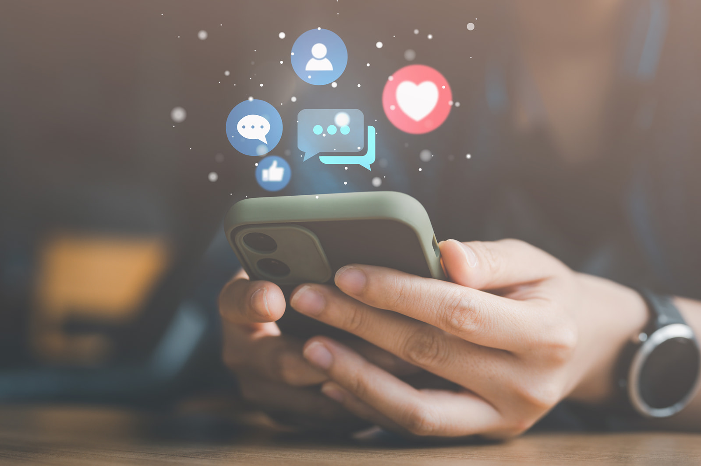
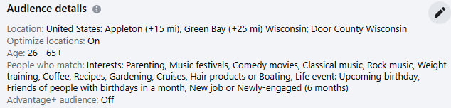
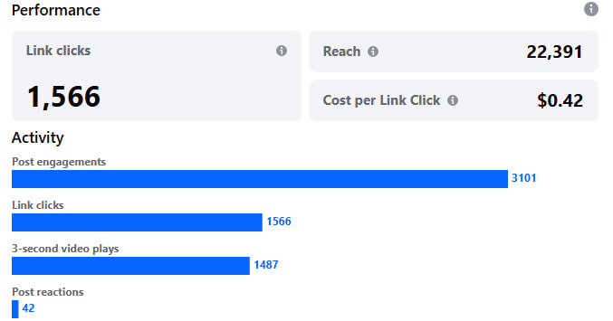

If you’re a business owner, you’re probably utilizing some form of social media (or you should be). Maybe it’s Facebook, Instagram or even TikTok. Social media is an excellent free tool that businesses can leverage to interact with consumers, showcase products and strengthen their brand.  

While you may be a pro at organic social content—including posts, stories, videos and more—there’s another side to social media that is less familiar: **paid social**. This feature on all social media platforms allows you to set a budget and allocate dollars to paid social ads that appear to more than just your followers. Paid social is a great tool for businesses that want to grow their following, promote something specific or increase brand awareness.  

Here are five reasons you may want to consider putting dollars behind your organic content. 

## 1. You can reach exactly who you want. 

Specific targeting is one of the most significant benefits of paid social. Your *organic content* is served to everyone who follows your page. They most likely sought you out and have a vested interest in what you offer. **_Paid social_** allows you to send your message out to more than just the people already familiar with your brand. With paid social, you can utilize geographical, demographic and behavioral targeting. It can also find **Lookalike** audiences, which means you can target people whose profiles have multiple similarities to the people who already follow you, giving you a better chance at landing in front of a potential customer. You can get extra detailed with social targeting because people’s profiles give a wealth of information. For example, on Facebook, you can specifically target life events, like upcoming birthdays, new jobs or relationship status. **This precise targeting allows you to get your ad in front of the people most likely to click.** 

## 2. Paid social drives traffic to your website. 

With all paid social, you have the ability to link directly to your own website within the post. Whether it’s an offer or a sign-up page, consumers who are interested can go directly to your site to find out more about your business. This is great for increasing web traffic, which is important in the world of Google rankings. With organic social, you often can’t embed a link into a post, especially on Instagram. Followers have to go to your profile and find a link in your bio if they’re interested in the offer. Because your paid ads will appear within the organic feed, paid social simplifies that process, allowing people to click directly on the post and reach your website much quicker. This makes paid social a worthwhile tactic for promoting sign-ups for events, new product launches or new business updates. 

## 3. You can measure what’s working. 

Because you’ve linked directly to your website, you can set up conversion tracking and see exactly how people are responding to your ad. It’s an effective way to test creative and content to see what’s resonating with your audience. All social platforms include a dashboard that allows you to track how many people are clicking and interacting with your content. Combined with your **GA4 metrics**, you can get a clear picture of what people are doing on your website once they arrive. It’s a satisfying feeling to see your ROI in real time. 

## 4. You don’t have to start from scratch. 

With paid social media, you can put money into already existing posts. If your organic post on Instagram is getting lots of likes and interest, it’s the perfect time to add some dollars and get that high-performing post out to a wider audience. You don’t have to deliberate over creative concepts or pay to make new graphics; your existing social content will do the work for you.  

## 5. You can be flexible and adapt. 

A lot of other paid media tactics involve a big commitment. You may spend a lot of money on a billboard contract that you’re locked into for a year. With paid social, you have the flexibility to pivot if something isn’t working. If you spend $500 on a boosted Facebook post that you realize isn’t getting much traction, there’s no contract that you’re locked into. You can simply pause the ad and put the money elsewhere. Paid social allows you to look at conversions in real time and make any necessary adjustments to benefit your brand.  

The world of social media is an ever-evolving landscape, complicated by trends, new platforms and paid elements. Adding money to organic content can create a well-rounded, efficient campaign that increases your brand awareness and brings in new customers. At Insight Creative, we can help with the strategy, management and implementation of both organic and paid social to make sure your brand stands out and stays relevant.

<a class="btn btn-primary" href="/contact/">Contact us to learn more</a>