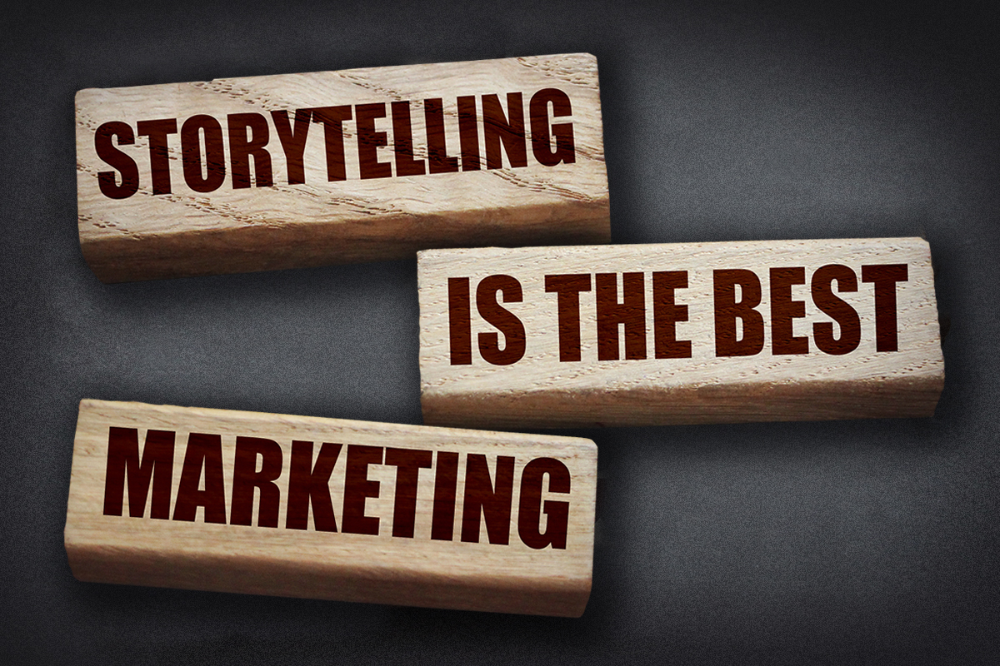

If you’re a business owner, you’d likely love more ways to connect to your potential customers genuinely—no small feat in today’s saturated market. Hello, storytelling. What was once pigment drawn by hand on cave walls has evolved into endless technologies of written and digital storytelling.

Let’s look at **five storytelling techniques** taught at college-level creative writing programs to see how easily you can harness your customers' imaginations.

## 1. Images

Creative writing relies on images or mental pictures that create a movie in the reader’s mind. How can your marketing communications **activate the five senses**? Will the project have sound, dialogue, visuals, textures, (and less likely) tastes and/or smells?

Some companies take sensory marketing beyond written or digital communication and create customer experiences. Harvard Business Review shared we’re likely in an age when many more consumer products companies will take advantage of [sense-based marketing](https://hbr.org/2015/03/the-science-of-sensory-marketing).

### How to appeal to the senses with your marketing strategies 

* Be descriptive
* Use lighting to convey tone in your photographs
* Try to activate one of the five senses
* Use music to set the mood at events
* Give away free samples of food or beverage products

## 2. Energy

Hey! Hi. Hello …

The greetings above may all share the same definition, but each option carries a different tone and implication. What’s the difference? Their *energy*.

Energy is a concept in creative writing that helps to convey meaning and tone. You can use energy to your advantage when writing marketing content to appeal to your target audience and keep them interested from beginning to end.

### How to increase the energy in your marketing content

* Use sharp, concrete nouns and action verbs
* Include small details
* Vary your word choice and the length of your sentences

## 3. Pattern

You probably already know the importance of *frequency* for your marketing messages, but have you considered the importance of pattern?

**Pattern is a way to be intentional and artful** when sharing your company’s messages across multiple platforms. Purposeful repetition helps focus a reader’s attention.

When a customer visits your website, building, or social media, will your brand identity's pattern—the colors, words, logos, photography, etc.—be consistent?

### How to use patterns to improve your marketing content

* Stay consistent with your brand patterns (brand colors, fonts, graphics, etc.)
* Use word repetition
* For written work, consider the literal pattern created on the page or screen by your sentences and paragraphs
* Develop a strong tagline to include in all content

## 4. Show and tell

Your customers don’t just want to know about your brand—they want to know how your products and/or services will change and improve their lives. That’s why it’s essential to not only tell them what they can expect from your brand, but show them, too.

Subverting the beloved creative writing rule of “show, don’t tell,” here we build a bridge between a client’s first impression—who you are and how you can help—and the benefits of your brand, product and services **through story**.

### How to use showing and telling in your marketing content 

* Tell who you are, what you do, where you do it, and why and how you do what you do
* Showcase real-life examples of your products or services
* Promote testimonials from your happy customers
* Write case studies to showcase your best projects and demonstrate how your brand can help your target audience succeed

## 5. Insight

Layering insight into writing isn’t just for novels. As the owner of your brand, you’ve got the best insight there is into what makes your business, products and services special. However, that doesn’t mean your audience does. Remember to showcase what makes your brand unique and feature the reasons your products are essential.

If you need more insight for your communications strategies, partnering with a team of marketing professionals can help you center which messages are the most exciting and valuable to your potential customers. And that kind of insight? Well, we love it so much that it just happens to be in our company name!

### How to use insight to improve your marketing communications

* Share information on your product’s unique features
* Post throwback content that shares insights about your brand
* Share behind-the-scenes content
* Incorporate your brand story into your marketing content

## Enrich your marketing content and tell your brand’s story

Are you ready to use storytelling techniques in your marketing communications? **You don’t have to become an expert storyteller on your own.**

At Insight Creative, Inc., our team of writers, designers, developers and creative thinkers is here to help you enrich your marketing content and create brand stories that connect with your audience. [View our services](https://insightcreative.com/services/) to learn how our full-service agency can help!