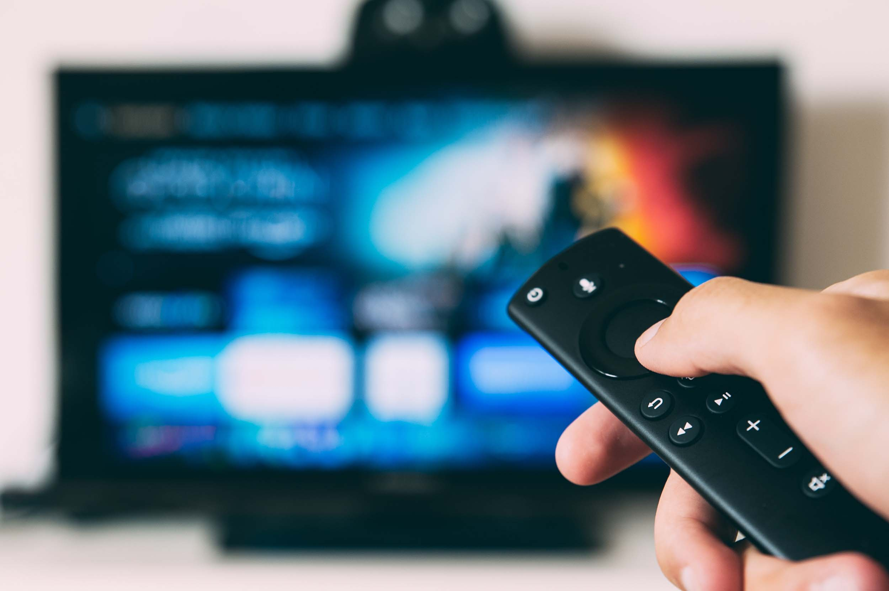

Streaming TV has been around for awhile, and if you haven’t already included it in your media plan, you may be missing the boat. People were already streaming their favorite shows before COVID kept them chained to their homes. However, after the pandemic those numbers certainly increased, as more people were in front of devices than ever, and these audiences continue to rise!

## _Let’s get started!_

There are various ways that audiences stream programs, in case you need a refresher …

First, you need a fast (-ish) internet connection depending on whether you are streaming in standard definition (SD), high definition (HD) or high dynamic range (HDR). Second, you need a streaming device, smart TV or gaming console.

Examples include:

- Amazon Fire TV Cube/Stick
- Chromecast with Google TV
- Xbox & PlayStation
- Roku Streaming Stick
- TiVo Stream
- Kindle Fire
- Apple TV
- Smart TV

## _Find your favorite shows!_

Next, consumers choose their favorite streaming app. There are two main kinds available: LIVE and ON DEMAND.

LIVE—These are cable channels available for download (likely still something you pay for, individually per channel) without paying the full cost of a cable subscription.

ON DEMAND—Like Hulu, Netflix, Amazon Prime, Disney+, YouTube TV, Sling, HBO Max and a whole host of others that keep appearing every day. Some are paid; some are free. These typically carry no live content and tend to be more popular for streaming.

## _Time to advertise on those streaming networks!_

Finally, here are some things to keep in mind when placing ads on streaming networks …

1. Make sure the network is **brand safe**. You don’t want your TV commercials running in any inappropriate content.
2. Rather than buying individual streaming channels or platforms, it might be better to partner with a trusted advertiser and buy them as a package. This helps you get a good mix at a better price, and you don’t have to familiarize yourself with every streaming channel out there (Which ones reach which audiences? What are their purchasing minimums? What is this channel’s buying processes versus others?) It is ever-changing.
3. Targeting should mimic any other online campaigns you may be running. You can adjust the geography, demographics and behaviors that best suit your target audience. This allows for the best use of your advertising dollars and results in less wasted impressions.
4. Great news for advertisers—these ads are non-skippable! Therefore, streaming TV ads have a high completion rate. The only way to miss the ad you place is for audiences to either turn off the show entirely or leave the room … and who is going to do that during a cliffhanger moment?!

## _Final Takeaways._

So how do streaming TV ads figure into an advertiser’s overall budget?

It depends. Streaming TV ads aren’t necessarily cheap. They can cost around $50 CPM (cost per thousand) when advanced targeting is applied. (It varies with all streaming networks, of course, and pricing remains fluid.) How many impressions should you buy? That really depends on whether you are the big fish or the small fish. A small, local company could benefit from 50,000 impressions per month yet not make a dent for the larger ones, who may want to consider buying as many as six times that amount to build the best frequency. Rest assured though, video completion rate is high as noted earlier because these folks can’t skip your ad like they can in other situations.

As always, if you need help with your media buying decisions, think of the professional advertising team at Insight Creative, Inc.
