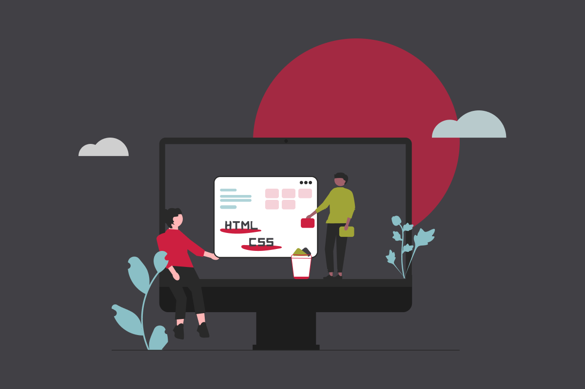

In today's digital age, sustainability is not limited to our daily lifestyle choices, it extends to the digital world as well. Have you ever thought about how websites impact the environment? Are you already aware and looking to make your website more sustainable?

According to [Sustainable Web Manifesto](https://www.sustainablewebmanifesto.com/), if the Internet were a country, it would be the 4th largest polluter. Choosing sustainable websites is important for our digital landscape and benefits both the environment and your business. **Lean and well-optimized websites** pave the way for a greener internet by reducing carbon emissions through lightweight technology stacks, smart design and development choices, progressive image optimization and reduced video sizes.

When done right, you can build performant and sustainable websites with most technology stacks. At Insight Creative, Inc., our path to a [lean web](https://leanweb.dev/) and our preferred stack is a [Jamstack](https://jamstack.org/what-is-jamstack/).

**Here at Insight, we firmly believe in simplicity and strive for that in our technology stack.** This is why we've carefully considered a simpler approach to web development and build with Hugo, CloudCannon and version control with Github. You won’t find bloated front-end JS frameworks, needlessly complex build tools or overweight content management systems.

Discover how you can make a positive impact on the environment while creating high-performing websites—all without compromising on performance and user experience.

## How can you make a website more sustainable?

**A [slow-loading website](https://www.websitecarbon.com/website/foxstructures-com/) consumes more energy and produces more emissions than an [optimized website](https://www.websitecarbon.com/website/stadiumbike-com/).** Sending and receiving data is energy-intensive, especially when loading assets like auto-playing background videos. While video can be appealing, large assets like video require a lot of processing power every time a visitor comes to your website. This puts a physical strain on both your server and your visitors’ devices and consumes more energy.

Sustainable websites are highly optimized to prioritize energy efficiency and make conscious design and development choices that have a positive impact on the planet. Here are some key ways to ensure that your website is more sustainable:

### SEO and copywriting

When thinking about making a website more sustainable, SEO and copywriting may not immediately come to mind. However, the goal of both is to help people find the information they want quickly and easily.

**We want to avoid wasting people’s time** on pages that aren’t related to their searches. And we don’t want to make people read through content that leaves them confused or doesn’t answer their questions and solve their problems.

When both SEO and copywriting are successful, it results in people spending less time browsing the web looking for information and visiting pages that don’t meet their needs. This means that less energy is consumed, and the energy that is consumed is delivering real value to your website visitors.

### Focus on fast loading times

**Every millisecond counts when it comes to page load times**—for website visitors and the planet, too. Faster loading times mean better user experience and less power consumption, creating a lean and clean web. Optimize assets, remove unnecessary scripts, reduce or avoid plugins and use efficient coding practices. Faster-loading websites can also enhance search engine rankings, leading to greater visibility and increased customer engagement.

**At Insight, we put a tremendous emphasis on website performance and see it as a significant metric relating to your website's success.** Faster loading times not only help the environment but also can reduce bounce rates and encourage increased engagement with the site. Ideally, your website should load in under one second to meet modern performance standards. For all our Jamstack development projects at Insight, we achieve an average load time of under 700ms.

### Reduce page weight

Page weight refers to the size of a web page in terms of data and files that need to load. There are over 1.13 billion websites online, and that number is constantly growing. The data transmitted between your website and the user’s device requires energy. In 2022, web pages averaged over 2MB in page weight and required an average of 70 HTTP requests. As a result, there's a large amount of data transmission happening all the time. Here are some ways you can reduce page weight:

* Carefully consider all elements on your page, especially heavy-weight elements like animations or media like images and video. Analyze all these elements and ensure they actually need to be there. If not, get rid of them and go with a more minimal design.

* Reduce HTTP requests. An HTTP request is a browser request for the data that it needs for the page to load. Every HTTP request your website makes uses up energy, so it’s best to keep them to a minimum. 

* For all elements that you keep, ensure that you are optimizing images and video files to reduce each file size as best you can. Avoid full-resolution images and videos at all costs as these will quickly bloat your page weight.

Our most recent Jamstack development projects at Insight have an average page weight of 850KB and require an average of 30 HTTP requests, over 50% less than the 2022 industry average.

### Reduce images

On most websites, images are the largest contributors to page weight and load times. The more images you use and the larger those image files, the more data needs to be transferred and the more energy is used. Always choose carefully when using images and ask yourself some of the following questions:

* Does the image add value to the surrounding content?
  
* Does it communicate useful information?
  
* Could the same impact be achieved if the image was smaller?
  
* Could the same effect be achieved with a vector graphic instead of a photo?

Asking these questions can help you make smarter image choices and will help keep energy consumption down.

### Optimize images

One essential way to improve performance is through progressive image optimization. There are a few key considerations to ensure the best image performance:

* Load properly sized images. Be sure to resize all images to the size that they are displayed at as this will prevent loading images that are too large.

* Compress images to lower quality and never upload full-resolution images. Whenever possible, try to keep images around 100 KB in size.

* Transform images to modern image formats like WebP and AVIF instead of JPG or PNG.

These practices will minimize bandwidth usage and reduce data transmission and energy consumption. For our Jamstack development projects at Insight, we integrate image transformation tools such as [Cloudinary](https://cloudinary.com/) or [Imgix](https://imgix.com/) to do this more efficiently.

### Optimize videos

There’s only one thing worse than images when it comes to compromising the performance and efficiency of a website, and that’s videos. Videos can be an effective way of engaging your customers, but they significantly increase the size of a website and its carbon footprint. **It's important to be strategic and decide if a video is really needed for your website.**

If so, compress the video file as much as possible to ensure it doesn't bloat your website. The better approach would be to use external hosting or streaming services such as [Wistia](https://wistia.com/) or [YouTube](https://www.youtube.com/). Dedicated video hosting services are highly optimized for video delivery, providing better video performance than self-hosting videos.

By employing these optimization strategies, you can drastically improve loading times, decrease data usage, minimize energy consumption and uplevel the user experience of your website. This is an important consideration for website visitors that may be on slower internet connections or limited data plans. Asset optimization benefits the environment and enriches user experience with faster page load times, smooth navigation and reduced server load.

### Delete unused assets

Like spring cleaning around your house, you should make it a practice to clean your website and delete everything that is no longer in use. Set some time aside quarterly or yearly to purge unused assets. Anytime you are updating an image, don't just add a new image, delete the old one, too.

Remove unused plugins or any other third-party software that you may no longer be using. Deleting unused assets will help keep your website lean and prevent it from bloating with unused resources that are taking up storage space. This will help keep your website as lean as possible and **running at peak performance**.

### Build static web pages

Traditional dynamic architectures often require dynamic server processing and database queries, resulting in elevated energy usage. Unlike traditional architecture, Jamstack workflows utilize [pre-built static files](/blog/lost-in-the-static/) built with static site generators like [Hugo](https://gohugo.io/), [Eleventy](https://www.11ty.dev/) or [Next.js](https://nextjs.org/), often served directly from a Content Delivery Network (CDN).

When using a static site generator, HTML files are generated in advance, eliminating the need for dynamic server processing. This leads to faster loading times, better scalability and a smaller carbon footprint. Plus, when paired with a CMS like CloudCannon, you get the best of both worlds: great performance and a great content editing experience.

### Improve accessibility and user experience

Prioritizing a lean web approach contributes to a more inclusive and accessible online experience. **When [planning a smart website design](/blog/website-redesign/), you should ensure that information is easy to find and also accessible to everyone.** Accessibility can create a greener website but also a better user experience.

It all starts with how simple it is to navigate your website. This reduces the time people spend clicking through your website, searching for the information they need. A complicated navigation will leave visitors confused, resulting in more time spent on your website. The longer visitors use your website, the more energy it will consume.

Setting up a clear navigation and website structure will help your customers find answers to their questions. You can solve their problems faster and reduce the amount of time they need to spend on your website. Not only does this create a smoother experience for visitors, but it also contributes to better search engine rankings, ultimately boosting website visibility and organic traffic.

### Reduce ongoing website maintenance

By building a lean and sustainable website, you can also reduce the need for regular ongoing maintenance of your website, which **saves time, money and energy in the long run.** This is another reason why we've transitioned away from monolithic technology stacks.

Content management systems like WordPress require constant maintenance, but with static websites, there’s no underlying software to maintain and no dependency on themes and plugins. With a static website, once your website is built and deployed, you don’t have to spend time running regular updates.

## Conclusion

Building a lean web has numerous benefits that can revolutionize your website's performance, help the environment and benefit your business. **From faster loading times and improved user experience to better conversion rates and enhanced SEO, the advantages are undeniable.** If we embrace sustainability on the web and employ these practices, we can create a web that is good for people and the planet.

* Interested in seeing the impact that your website has on the environment? [Run a scan of your website here](https://www.websitecarbon.com/).

**Want to learn more about how we help clients build simpler and more sustainable web experiences?** Read about [how we helped A to Z Machine simplify their website experience](/blog/building-a-well-oiled-marketing-machine-for-a-to-z-machine/) or [**contact us**](/contact/) to learn more!