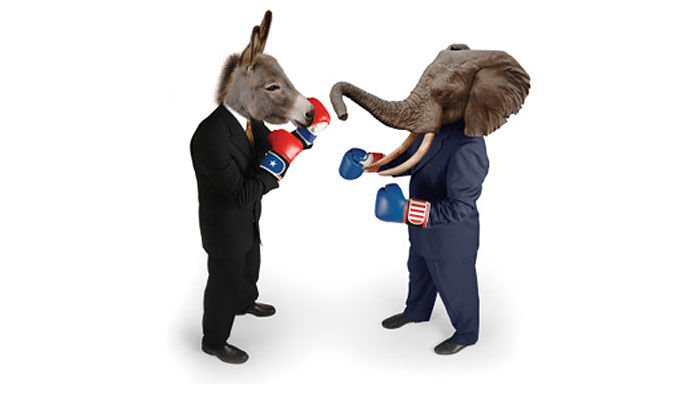

History demonstrates that the months leading up to a presidential election affect consumer confidence. We all know that uncertainty causes decision-makers to tighten the purse strings, but are retailers prepared for a drastic spending reduction this fall?

Every candidate is spewing scary, economic rhetoric and while it might win them electoral votes, it won’t win them over with most retailers. The presidential uncertainty brings unprecedented consumer hesitation and until November 2, businesses should prepare for flat, or negative, sales. Why is this?

- A change in presidency—whether perceived as positive or negative—distracts citizens which can lead to economic downturn.
- The presidential candidates represent a major change to our current leadership. Hillary Clinton, Bernie Sanders and Donald Trump promise big change and change scares people.
- Part of the electoral process is for candidates to point out what is wrong with our current economic situation and how they will fix it—constant negativity shines a light on problems which exacerbates the situation.
- Consumers like to sit on the fence until they know the outcome of the election. Surprisingly, results do not need to be to their liking. Once the decision is made, they will likely revert back to their regular spending habits.

Until November 2 retailers need to prepare for a spending downturn. They should tighten the proverbial belt, delay new hires and hold off on other large expenses until consumer confidence has a chance to rebound—and trust us, it will.
