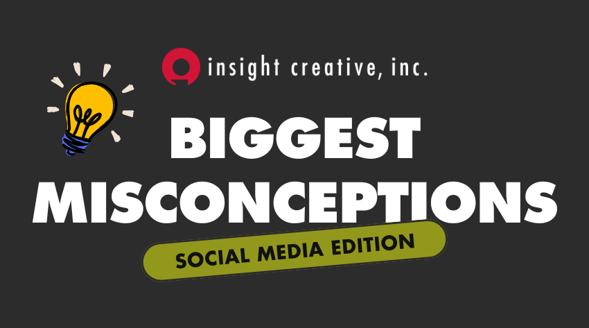

Social media moves fast, and for busy teams, it can feel impossible to keep up. Between shifting algorithms, new trends and the pressure to consistently create engaging content, many businesses find themselves asking the same important questions before investing in support from a marketing agency. _What platforms matter most? Is paid advertising worth it? How involved will we be? Can’t I just use AI to write my social media for me?_ If you’ve been wondering the same things, you’re in the right place. 

We've spent years evolving our social media approach to stay ahead of industry trends. By blending our expertise with the right tools and technology, we’re able to create campaigns that perform well and help you get the most value for your budget.

Below, we’re answering the top five questions clients ask us so you can feel confident, informed and ready to elevate your social media presence:

## What are the benefits of hiring an agency to manage your social?
We know everyone is short on time, especially in-house marketing professionals. We act like an extension of your company by getting to know your goals and creating engaging content for your social media pages that meet brand standards and capture your followers’ attention. Our copywriting, design and media departments team together to create a strategy each month that is relevant and timely, and our clients are always welcome to give us feedback. 

## What does the social media process look like?
We start the month by creating a strategy, which includes products/services to feature, national holidays, special promotions, etc. We then send to our copywriting and graphic design teams to create the captions and corresponding graphics and/or videos. Once the calendar is complete for the upcoming month, we send it to the client for approval and make requested edits, if any. The last step is scheduling the posts for the month, and monitoring feeds from there.

## What social media platforms do you recommend?
We see the best results on the big three: Instagram, Facebook and LinkedIn. There are effective and highly targeted options for paid promotions in these platforms, too. 

## What is the difference between organic and paid social media?
**Organic social media** refers to the free content you post on your platforms, and your followers see it in their feeds. The algorithm may show it to more people if engagement is high, but this is not guaranteed. **Paid social media** involves paying platforms to promote content through ads or “sponsored” posts. We can often set the geography, budget, audience and personality characteristics to target a specific group of people. Successful brands combine organic and paid posts to build trust and drive conversions. 

## Do we give up full control of our social media pages?
Absolutely not! We want to make sure your social media pages meet your standards, so we ask for feedback before final approval. You oversee the vision and the execution; we do the work! On average, most businesses spend only 15-30 minutes on the approval process per month. 

We also make sure our clients still have full access to their pages to post themselves, but we do recommend that they follow the brand style guide. We also ask for client input like sending photos of new products or employees attending events. 

Now let’s clear up some of the biggest social media misconceptions we see and set the record straight.

**Misconception:** Post as much as you can!

**Reality:** We believe in quality over quantity. The key word is consistency. You should be posting timely content that connects with your target audience. Not only does this avoid flooding your followers’ feed with content, but it also gives you time to strategize strong messaging and calls to action.

**Misconception:** If we grow our follower count, sales will automatically increase.

**Reality:** A small, engaged audience that fits your ideal customer profile is far more valuable than a large, disengaged one. Engagement, conversions and revenue matter more than vanity metrics.

**Misconception:** Our competitors are everywhere, so we should be, too.

**Reality:** Different platforms serve different audiences. A B2B company might thrive on LinkedIn, while a visual brand may perform better on Instagram.

**Misconception:** If we just get one viral post, our business will explode.

**Reality:** Virality is unpredictable and often attracts the wrong audience. Sustainable growth comes from consistency, clarity and targeted messaging—not one-off spikes.

**Misconception:** If we don’t see direct sales quickly, it’s not working.

**Reality:** Social media often plays a role in:
* Brand awareness
* Trust building
* Nurturing leads
* Community development
It’s part of a **longer customer journey**, not always a direct-response channel.

**Misconception:** Our intern or receptionist can just handle it on the side.

**Reality:** Effective social media requires skills in:
* Copywriting
* Visual design
* Data analysis
* Consumer psychology
* Platform trends
* Strategic media buying
This is why it’s so beneficial to hire a marketing agency like Insight Creative. We have many team members who specialize in copywriting, design, strategy, analytics and more!

**Misconception:** If we create good content, people will naturally find it.

**Reality:** Social media platforms are a business. Algorithms limit organic reach by design. Distribution strategy and paid promotion are often necessary for meaningful visibility. That’s why we work closely with the media team to build effective paid social media campaigns to boost reach. 

Doing well on social media doesn’t mean posting nonstop or following every trend. It means having a clear strategy and sticking to it. Insight Creative helps by bringing knowledge of the platforms, the numbers and your brand’s bigger goals.

By using both organic posts and paid ads, social media can help you build brand awareness and trust — two vital components to grow your business.