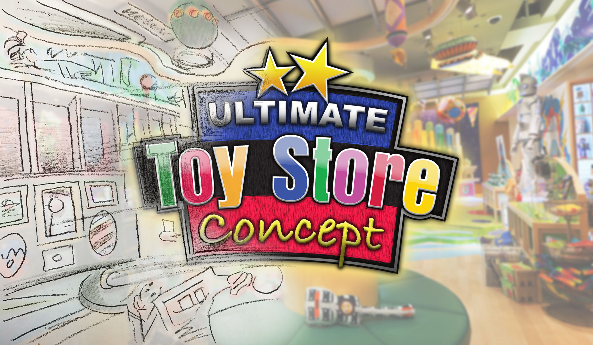

Now that Toys"R"Us is facing extinction, I realize that the big fun toy store could die if something isn’t done to save it. I am a big kid at heart and I do not want the toy store to go away. When I was younger, I fondly remember begging my mom to stop at the toy store so I could look around and possibly convince her to buy me a toy. I think that, with some creative thinking and great marketing, it doesn’t have to have the same fate as many other retailers.

There are many ways to reinvent the toy store starting with the **experience.**

## 1. Make it a destination that kids will love!

Turn it into the Scheels or Cabela’s of toys with fun and interactive exhibits that feature the newest toys.
Allow kids to play with and interact with the coolest toys, something Amazon and other online retailers can’t offer.
For example: Scheels has a shooting range and a ball toss (see below).

The possibilities are endless with what you could offer for interactive exhibits in a toy store:

- Consider a Nerf shooting range featuring the latest Nerf guns. You could even have prizes for the best score of the day with a reward of in-store credit to promote more shopping within the store.
- Create a Lego building area where kids can build with a massive supply of Legos.
  Include a Lego City to inspire imagination like the one I built in my house (see below).

- Have a Barbie dress up zone where kids can see and try the latest Barbie clothes and accessories.
- PS4, Xbox or Nintendo Switch zone for playing the latest video games. They have this now so you need to make it more interesting with surround sound, big sponsored graphic backgrounds that the various video game brands could supply and maybe pods you climb into with fake rocks and landscaping all around to make it extra cool and enticing.
- Create a train land where kids can change the switches and lights on a massive train layout.
- Remote control car land. Have an area where kids can drive and test certain RC cars.
- Have a giant doll house that kids can walk into and play with.
- Put in a mini bowling alley and use the same balls and pins that are sold at the store.

## 2. Host cool toy opening events and tie them in with social media.

Unveiling the latest toys at your stores first could be another great way to bring people into the stores. We’ve all heard of the frenzy on YouTube where these young kids unbox new toys and give their opinions on those toys and these videos receive millions of views. You could have social influencers partner with the store to help host these events and they, in turn, would bring in a large social following. Get someone like Ryan ToysReview or RadioJH (shown above) and show it live on YouTube, Twitter or Facebook.

## 3. Create a great rewards program.

A great rewards program can bring customers back again and again. But this rewards program must be next level. Sure, do stuff where you get store credit (like Kohl’s cash). My wife loves that stuff! But also tie it in with fitness or a charity. You could partner with the NFL and their Play 60 program. The NFL could come into the store and run a Play 60 event outside and they will donate to a local charity and customers could receive store credit or discounts on select items. It would be even better if the local pro football team could send some players to the event as well (#greenbaypackers). You could work with the local elementary school and even come up with an incentive program. It could be focused on fitness or reading to motivate them to receive store credit or rewards.

## 4. Make sure to market and promote it well.

Start with a strong logo, tagline or slogan that will be remembered and represents your brand. Promote all these concepts with a strong digital campaign that could include Facebook, YouTube and in-app ads that reach kids and parents where they consume content. You could launch the idea with a great television ad on network TV,
Hulu or Netflix. Consider guerilla marketing like having a cool new mascot or creature that shows up around town promoting the new toy store with coupons and incentives. A great social buzz could also be created if done correctly.

So get creative! There are many ideas that could save the toy store and these are just a few. Hopefully someone will make a difference and that way our kids, and our kids’ kids will still be able to enjoy the magic of the toy store in the future. As always, we can help your business get creative with your unique marketing challenges.
