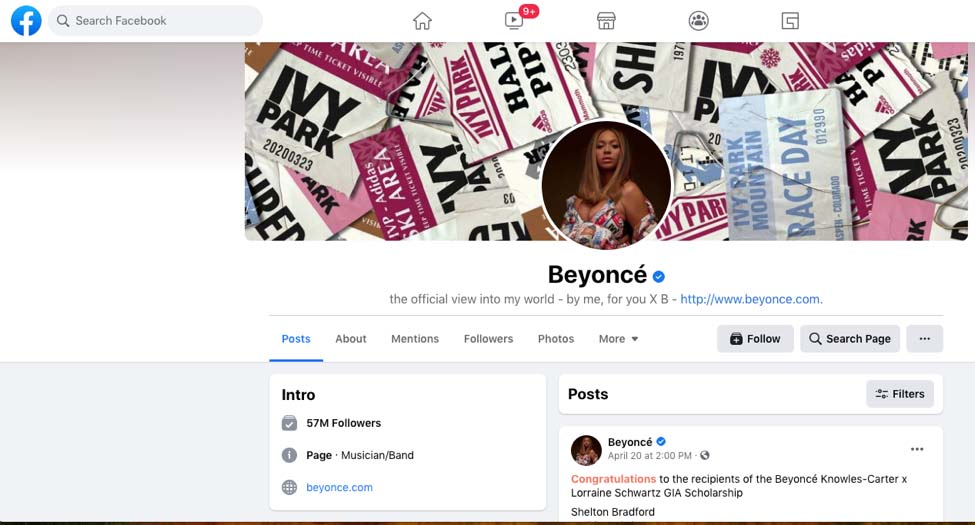

As a social media specialist, rolling with software changes and profile updates is part of my daily routine. Even if you don’t actively manage a profile, if you’ve ever had to post to Facebook (whether for business or personal) you have likely noticed that it’s constantly evolving. It seems like just when you become comfortable with something, it changes the next time you use the app. Am I right?

This summer, Facebook will <a href="https://about.fb.com/news/2021/01/introducing-the-new-page-experience/" target="_blank" rel="noopener noreferrer">roll-out design changes to Facebook pages</a> that will make it easier for marketers and page admins to engage with audiences. As with all Facebook changes, public figures and big brands are first to receive the updates. We will continue to monitor for when the changes reach local business pages. The most notable change is the removal of the like button.

Right now, Facebook business pages display the number of likes AND number of followers. This can be confusing and is now simplified to only one audience metric … followers. This more accurately reflects the number of people opting in to receive your content. It eliminates the ability for someone to “like” your page and unfollow your updates, thus streamlining and creating a stronger representation of your engaged audience.

Another change to improve dialogue and engaging content for businesses is an easy-to-find newsfeed section dedicated to your pages. The new design incorporates buttons on your home screen to seamlessly toggle between personal and business page. This is a benefit to page admins because inspiration for content can come from anywhere anytime. With this advanced newsfeed feature, you can easily share more targeted and personal communication when a topic is trending.

Lastly, keep an eye out for a new Q&A post format to quickly poll your audience. You could use this type of post to gain inspiration for content themes or simply get a discussion started about an industry topic. This is just another Facebook tool equipping page managers to quickly and easily talk with followers and discover what’s important or most interesting to them.

All of these changes are aligned with what we already know … that quality over quantity is key to providing engaging content. Through these changes, Facebook is de-emphasizing the number of likes as a metric and refocusing on giving page admins tools to create meaningful dialogue. After reviewing these updates, I am reminded that change is a good thing (even if it’s frustrating at first to find a button removed or in a new spot). It’s reassuring that the designers at Facebook have our (social media specialists and page managers) best interests in mind to help us navigate the ever-changing world of social media content creation.
