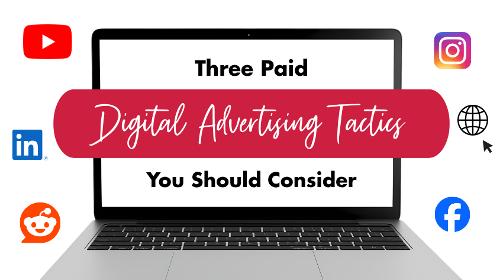
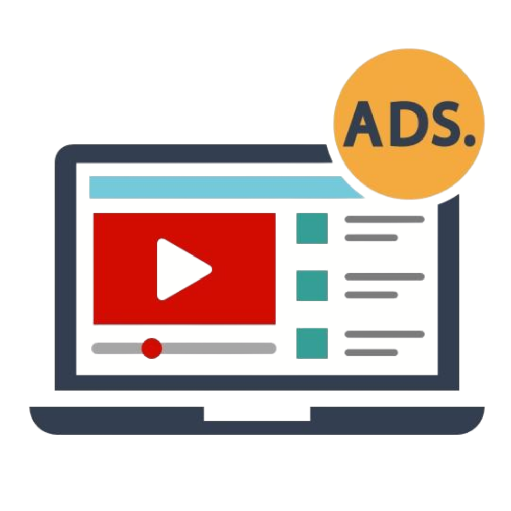
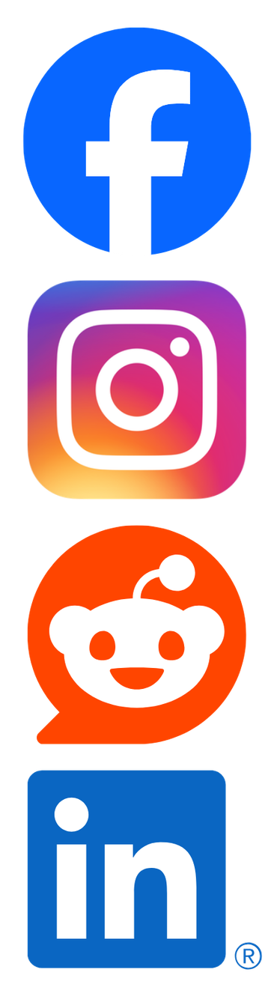
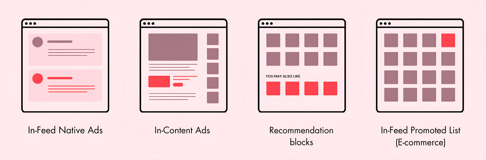

At Insight Creative, we're constantly evaluating new platforms and ad formats. While digital marketing continues to evolve, a few tactics consistently deliver strong results for our clients across industries.

Whether the goal is increasing brand awareness, driving website traffic, generating leads or growing market share, read on as **[Olivia Biskobing](/about/olivia-biskobing/), our media buyer**, walks us through the three paid digital tactics our media team comes back to time and time again.

## 1. YouTube Advertising: The Reach Most Businesses Are Missing

 When people think about digital advertising, they often focus on Google Search or social media. But YouTube has quietly become one of the most powerful advertising platforms available.

As the **second-largest search engine behind Google**, YouTube isn't just a place people go to be entertained. It's where they research products, compare services, learn new skills and make purchasing decisions.

It's also the #1 streaming platform, reaching audiences across TVs, computers, tablets and smartphones. That means your message can follow consumers wherever they choose to watch.

One reason our media team loves YouTube advertising is the variety of formats available. Depending on campaign goals, we can utilize:

- YouTube Shorts ads
- In-feed video ads
- Skippable in-stream ads
- Non-skippable bumper ads
- Connected TV placements

From brand storytelling to product promotion, there's a format designed to meet almost any objective.

Another major advantage is **efficiency**. In many cases, advertisers only pay when users engage with the ad—such as watching at least 30 seconds of a video (or the entire ad if it's shorter), viewing an autoplaying in-feed ad for at least 10 seconds or clicking a call-to-action. “That means you can get thousands of **additional impressions for free!**” Olivia explains.

For businesses looking to expand their reach while maintaining budget efficiency, YouTube remains one of the most underrated opportunities in digital advertising.

## 2. Boosted Social: Reaching People Where They're Already Spending Time

 Social media platforms continue to dominate consumers' daily attention, making boosted social campaigns one of the most effective ways to connect with highly targeted audiences.

The beauty of boosted social is simple: it allows brands to meet people where they already are.

Rather than waiting for potential customers to search for your business, social advertising puts your message directly into their feeds while they're consuming content and engaging with friends.

What makes these campaigns especially effective is the **precision of audience targeting**. “We can build audiences based on demographics, interests, behaviors, geographic location and even previous interactions with your business,” says Olivia.

That level of targeting helps ensure advertising dollars are spent reaching the people most likely to engage.

We also love boosted social because it doesn't always require creating content from scratch. Many businesses already have organic social posts that can be repurposed into effective paid campaigns.

Depending on your goals, boosted social can help:

- Increase brand awareness
- Grow followers and engagement
- Drive website traffic
- Generate leads
- Promote events and special offers

With strong click-through rates and flexible campaign objectives, it's easy to see why [social advertising](/blog/social-boost/) remains a staple in nearly every media plan we build.

## 3. Native Display: Advertising That Doesn't Feel Like Advertising

Consumers have become incredibly good at ignoring traditional banner ads. That's one reason native display advertising has become such an important part of modern media strategies.

Unlike traditional display ads, native placements are designed to match the appearance and experience of the content surrounding them. They feel less intrusive and more like a natural extension of the websites that consumers are already engaging with.

Native advertising also benefits from contextual relevance. Ads are often served alongside content that aligns with a user's interests, helping create a more seamless and engaging experience.

The result is often stronger performance. Native ads typically generate higher click-through rates than traditional static display ads because users view them as part of the content experience rather than an interruption.

An added benefit is that native placements can often avoid some of the visibility challenges associated with traditional banner advertising and ad-blocking technologies.

For businesses looking to increase awareness and drive qualified traffic in a more natural way, native display remains one of our favorite tools.

## Why We Keep Coming Back to These Three Tactics

Every client, audience and campaign is different. There is no one-size-fits-all solution in [digital marketing](/services/digital-marketing-services/). According to Olivia, “These tactics, while great on their own, work best in a larger, more robust media plan with both digital and traditional layers, like billboards, TV and print.”

That said, YouTube, boosted social and native display consistently prove their value because they combine reach, targeting, engagement and flexibility in ways that few other channels can.

When strategically combined, these three tactics can help businesses build awareness, stay top-of-mind, drive website traffic, and ultimately generate more leads and sales.

If you're looking to make your advertising budget work harder, we can help. [Reach out to our team](/contact/) at Insight Creative today!

<a class="btn btn-primary" href="/contact/">Contact us to start your plan</a>