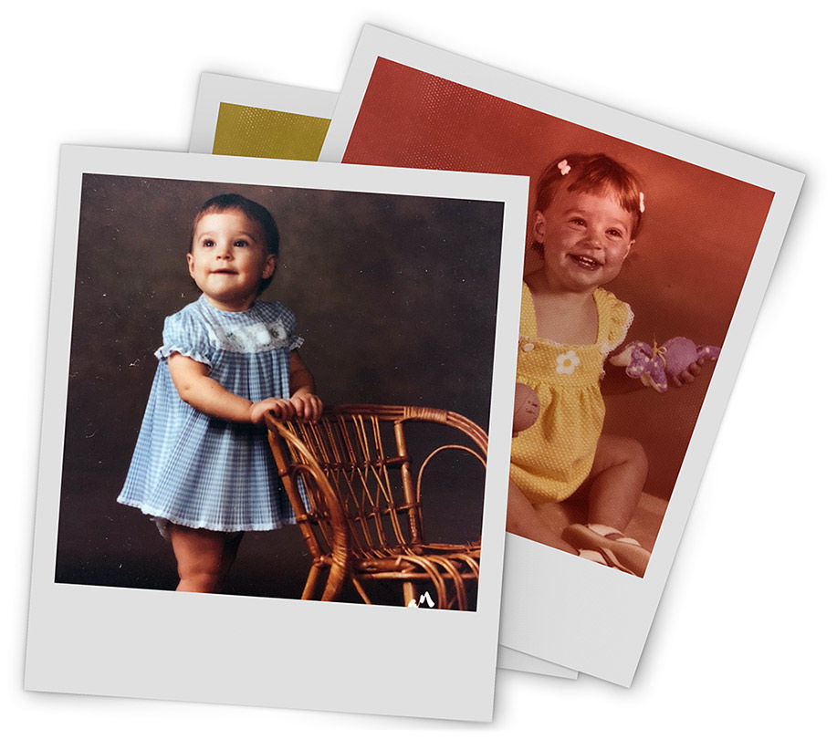

I have a milestone birthday coming up—40! Do I want it acknowledged? No! Do I want a party and big celebration? Absolutely not! Do I want to use it to my advantage in the form of a blog topic? You bet.

## National Brands

A milestone in my life has me thinking—what brands have used interesting celebration campaigns?

### Case 1—Starbucks:

I'm a coffee drinker and a big fan of Starbucks, so of course I had to start with them. Starbucks started as a single Seattle-based coffee shop and grew to an impressive 17,000 stores in 55 countries in 2011. When Starbucks turned forty in March of that year they unveiled a new logo as well as added a limited-edition coffee called Tribute and several new sweet treats to their menu to celebrate the occasion.

### Case 2—Oreo:

And what goes better with coffee than a cookie? When Oreo celebrated its 100-year anniversary in 2012, they launched the "Daily Twist" ad campaign. The goal was to show the iconic cookie in daily current events. Oreo featured a rainbow filling for Gay Pride Month, a "bitten" version appeared for Shark Week and many other real-time events were celebrated in 2012.

_Trivia: Can you guess ten companies that have been around for one hundred years or more (and have participated in their fair share of anniversary campaigns)? BTW: Now I’m not feeling quite so old!_

- The Quaker Oats Company: 140 years old
- General Electric: 125 years old
- Coca Cola: 125 years old
- The J.M. Smucker Company: 120 years old
- Target: 115 years old
- JC Penney: 115 years old
- UPS: 110 years old
- Neiman Marcus: 110 years old
- Boeing: 101 years old
- Nikon: 100 years old
- Arri (motion picture equipment manufacturer): 100 years old

## Local Brands

Two of Insight's clients have recently celebrated milestone anniversaries with commemorative campaigns as well.

### Case 3—River Valley Bank:

This fun, modern, bank celebrated 50 years—and its bean farming roots—with a ["What Can You Build from a Bean?" campaign](https://insightcreative.com/work/river-valley-bank-50th-anniversary.html) with positive results.

### Case 4—Washington Island Ferry Line:

This vessel that provides passage from popular Mainland Door County to the area's well-known Washington Island, commemorated 75 years through a [successful public relations campaign](https://insightcreative.com/work/bringing-pr-to-port-for-the-washington-island-ferry.html).

Insight Creative, Inc. is also celebrating a milestone anniversary this year ... 30 years in business. We've been doing a lot of things right over the years, so I'm anxious to see us launch a unique and innovative campaign that gets people talking. Maybe I should take note from Insight (and all the others) and learn to embrace my birthday, rather than fight it. And if there's anything I've learned from Insight, it's that there's always a reason to eat cake.

