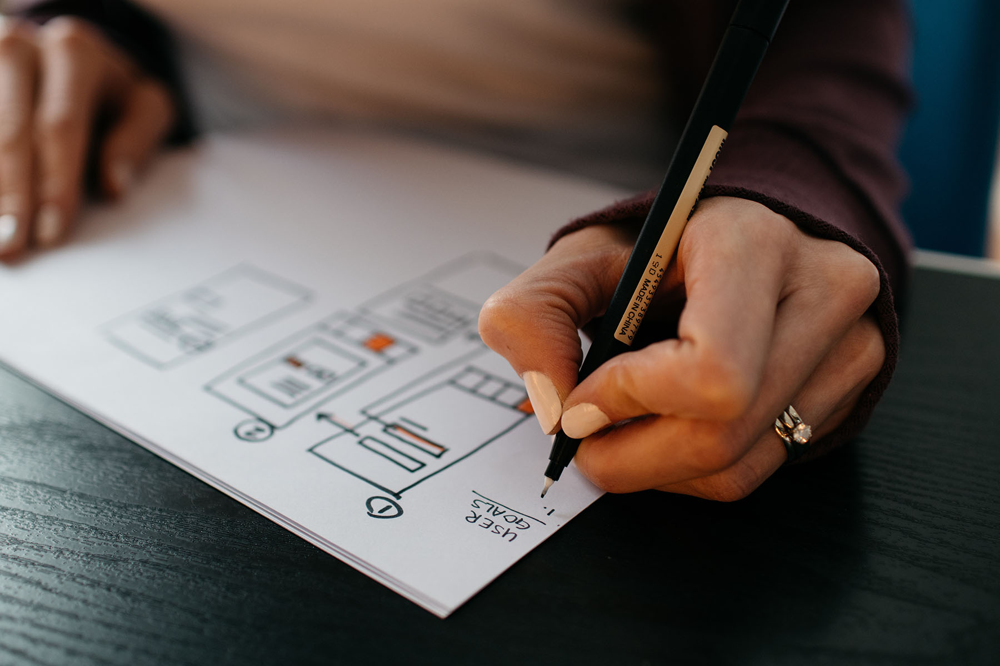

Is your current website too slow? Is the content outdated or improperly formatted? Have you recently gone through a rebrand that your current site doesn’t yet reflect? Implementing a website redesign may be just what your business needs.

A new website can do great things for your business, from improving your reputation to increasing organic web traffic and sales. A full website redesign is a large-scale project that can be quite an overwhelming undertaking, but Insight Creative is here to help!

To ensure a stress-free project, we have you covered with the top web redesign tips from our expert team.

## How much time does it take to redesign a website?

Websites are extensive projects to get up and running. Though it might seem like less work from the outside, a website redesign is no different.

In fact, redesigning your existing website may take more time. You’ll have to review and edit all your existing web content and make updates as necessary. This is an extensive process that will require a thought-out plan.

**To determine how long it will take to complete your website redesign, account for these factors:**

- The size of your current website
- The number of web pages you will have to update
- The amount of new content you will have to write/design and upload
- The specific goals you are hoping to achieve with your new website

Once you’ve done some preliminary research, make an estimate of how long your website redesign will take. This ensures you budget the correct amount of time and resources before you begin your project. It will also help you stay on track throughout the redesign.

## How to prepare to redesign your website

Now that you have an estimate for your website redesign, it’s time to prepare to begin your project. The following tips will give you the tools to fully prepare for a successful website redesign and launch.

**9 tips to prepare for your website redesign:**

### 1. Ask (and answer) these vital questions

A website redesign will require a lot of information about your business and brand. This information, such as the main goal of your website, will determine every decision made throughout the project. As such, you will need to have answers to these vital questions before you begin your website redesign.

Whether you work with a web redesign service or edit your website yourself, answer these questions before you begin:

- What are your long-term business goals?
- What service(s) do you offer?
- What are your unique competitive advantages?
- Who is your target audience?
- What’s the most important action your website visitors can take?

Create a document and write down your answers to these and any other important
goals you have for your website.

### 2. Conduct a competitor review

How are your direct competitors’ websites performing? What are they doing that seems to be working? It can be extremely useful to see which content and website styles are working for, or hindering, your competition.

Before you plan out your full website redesign, browse your competitors’ websites for inspiration. Take note of the specific designs, functional elements, pages and content that you like or dislike. You can use this as inspiration for your own site redesign.

Just keep in mind that it’s never a good idea to directly copy an existing website. Your site should provide a reflection of your unique brand.

### 3. Gather your brand assets

Brand assets are important identifiers that help customers recognize your brand. Assets commonly featured on websites include logos, core values and mission statements, customer testimonials, images, videos and graphics.

Before you begin your website redesign, make sure your brand assets are compiled and easily accessible. Cloud storage solutions like <a href="https://www.dropbox.com/" target="_blank" rel="noopener">Dropbox</a> or <a href="https://drive.google.com/" target="_blank" rel="noopener">Google Drive</a> allow you to easily upload and share assets from anywhere. This will ensure no one has to waste time hunting down this information.

**Pro tip:**
If you are working with a web redesign service, verify which file format your designer prefers. At Insight Creative, for example, .svg files are used for icons, illustrations and logos. This ensures they can size up or down without losing quality. Determine which file formats you will need ahead of time so you don’t waste resources fixing this later.

### 4. Determine the content you’ll need for your website

Content is the most important aspect of your website. It’s what potential customers
came for after all. As a result, it dictates everything from the architecture and design of your website.

Before you begin your redesign project, run a full content audit on your existing brand website. Review your current content on all pages, blog posts, case studies, testimonials and videos.

Is your current content accurate? Is it helpful to your target audience? Does it meet your current business goals?

Reviewing your current content now can help save time during this process once the project starts. If you aren’t quite sure how to complete a site audit, [our team of experts](/about/) is here to help!

### 5. Organize your passwords

Passwords to third-party software can often be a major hang-up for web redesign projects. You don’t want to waste time hunting down login information when you are already in the middle of your project.

Take time now to organize all the passwords you’ll need to share for your site. A password manager like <a href="https://lastpass.com" target="_blank" rel="noopener">LastPass</a> makes this incredibly easy. This is a great way to share your sensitive login information without the risk of a security breach.

### 6. Gather links to your social media accounts

Embedding your social media account links within your website creates brand cohesion and helps you further connect with your customers. If your organization has accounts on Facebook, Instagram, Twitter, LinkedIn or TikTok, include the links on your website.

Make this integration process easy for yourself or your website designer by documenting a list of your social media accounts. Send this list to the team working on your new website early in the process. This ensures your social accounts can be built directly into your site’s design.

### 7. Install Google Analytics

If you aren’t already using a website analytics tool such as <a href="https://analytics.google.com/" target="_blank" rel="noopener">Google Analytics</a>, now is the perfect time. Analytics tools help uncover vital data while in the planning process of your website redesign.

You can learn how people are using your site, how long they stay on each page and which pages get the most traffic. This process typically surprises many of the clients we work with. It’s common to find your web visitors are using your site in ways you didn’t expect.

You may find that a page you thought was unimportant actually brings a lot of potential customers to your website. You can use the knowledge you gather from analytics tools to better guide your website visitors toward valuable information about your products or services.

### 8. Determine necessary software integrations

Are you planning to integrate other third-party software into your website? Knowing all your third-party integrations in advance is very important for planning purposes.

A common example of third-party software you may already have on your current site is an email subscription form. If your website is going to collect emails, you’ll need somewhere to store them. Integrating with your email marketing software will allow your website subscribe forms to send those addresses straight to your email marketing list.

Before redesigning your site, take stock of the current software integrations you already have, as well as what you would like to have on your new site. You can then determine which software will work with your site and fit within your budget.

### 9. Prepare your domain registrar credentials

Don’t overlook the basics before you begin your website redesign. Details like your domain name and registrar credentials will be necessary to make your new site go live.

Missing this piece could result in a delayed launch of your website. Worse, you could end up losing your progress and may never be able to launch your new site. Ensure your domain registrar credentials are accessible and up to date before beginning your redesign.

## Ready to redesign your website?

Redesigning a website is no easy task, but you can make the process easier by being prepared. Implementing these tips will help prepare your website redesign strategy and prevent stressful problems from slowing you down.

Of course, you don’t have to take on your new site by yourself. Our team of experts here at Insight Creative is experienced in leading [full-scale web design projects](/blog/building-a-well-oiled-marketing-machine-for-a-to-z-machine/) for our clients. [Get in touch](/contact/) and let’s talk about how we can help with your new site!
