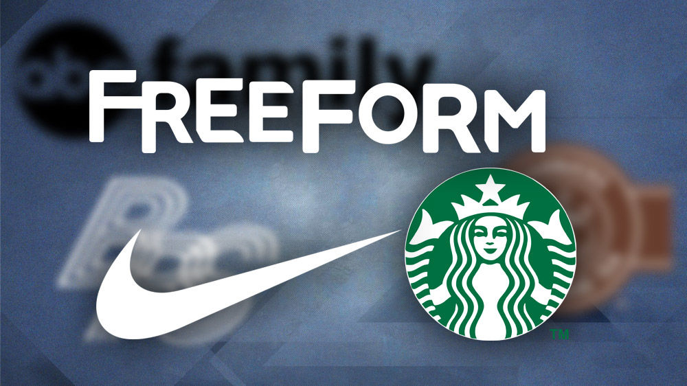

Nike, Yahoo, Subway, Starbucks and Pepsi. What do these companies all have in common? They were once known by different names.

Consumers get comfortable with businesses they shop at and brands they’re loyal to. So, when one decides to change its name, it’s a big deal, and it’s important to be thorough so consumers don’t get confused. You want to be sure current customers still feel comfortable doing business with you, while at the same time attracting new customers.

There are many reasons why a business or brand might go through a name change. Perhaps the name is holding the business back from expanding or maybe it has evolved to be more than originally intended.

The cable channel ABC Family recently changed its name to Freeform in an effort to seek more viewers. They felt the “Family” part of their name didn’t really fit their programming anymore because of their popular young adult dramas such as _Pretty Little Liars_. The channel felt that in order to appeal to more viewers and speak to its target audience, they had to change their name.

Here are a few things to remember when thinking about changing the name of your business:

1. **Be clear.** Make sure your message is clear and consistent. Of course your ads and press releases will cover the name change, but remember the details like letterhead, business cards and the name on your building. (If you can’t afford to do it correctly and thoroughly, maybe it’s not the right time for a change?)

2. **Work ahead.** The name change process can be long, do as much as possible ahead of time, so when it’s time for the big reveal, everyone involved will be ready.

3. **Keep your core customers in the loop.** You don’t want to upset your main customers, so make sure they’re aware of the coming changes.

4. **Communicate the change.** Both internal and external communication is important. Keep employees informed. When communicating to customers, make sure you cover all channels—including digital and social media—especially because this is where young people get their information.
