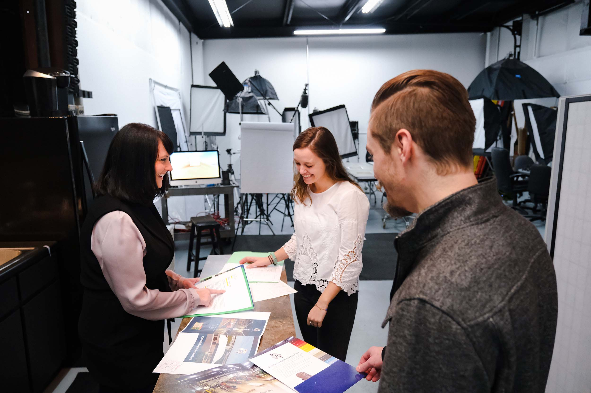

Anyone in a creative role can attest, there are good and bad days. At times, inspiration strikes like lightning and the work circuits seamlessly through you. Conversely, some people experience a “creative block” almost like a wall holding back all your good ideas. Or at times, the task of starting your work can be so daunting, you’ll use any distraction to avoid it. There are many contributing factors to why we occasionally lose our creative oomph, but luckily, there are many remedies to reignite your right brain. Here are my top five ways to fend off creative complacency right out of the gates:

1. **Brainstorm on paper.** It’s easy to just jump into the work, but sometimes the best ideas come from first sitting down with a pencil, paper and some doodles or a word list.
2. **Get outside.** Fresh air, sunshine and sounds of nature can awaken your senses and clear your mind, leaving room for a free flow of creativity.
3. **Research.** Learn everything you can about the topic. The best inspiration can come from the strangest, but true, factoids.
4. **Execute bad ideas.** Sometimes you just need to get the most obvious or ridiculous idea out of your system. Create that, so you can let it go.
5. **Go crazy.** Allow yourself one totally outlandish concept to get your creative juices flowing. You’ll swear it’s just for you, but who knows? You may end up liking it.

Once you’ve finished a piece, it’s the moment to step away, relax and turn it over to the person who asked for it. But before you do, I recommend you STOP and ask yourself … “Could it be better?” A conscious effort to pause and push your ideas could make the difference between good and great execution. With that, here are my go-to tricks for pushing ideas at various points throughout the creative process.

- **Collaborate.** Two heads are better than one. Make your working environment one where multiple ideas are encouraged and accepted.
- **Hold critiques.** Once you think you’ve finished a project, gather a group to evaluate it. Their small tweaks could make a big impact on the final result.
- **Change perspective.** If you’re writing, read it aloud, backwards or in sections. If it’s art, turn it upside down or print it out. This will force your brain to look at the piece in a new way.
- **Role play.** Pretend you’re the client or the target audience. Commit to the character and try to imagine how they’d react to the piece.
- **Sleep on it.** Creativity can crop up when your subconscious has had time to process everything overnight.

It’s important to distinguish between pushing and overthinking. Most creatives get paid by the hour, and efficiency is an ever-present, bothersome—but essential—part of the process to keep projects within budget and clients happy. If you know that you’re prone to overthinking, take the last bullets lightly, and focus more on collaboration. Overall, you simply want to ensure you take your time, allow the best ideas to surface and check your work.
