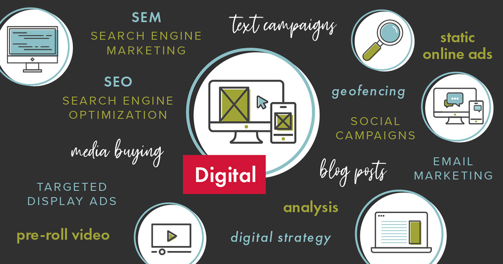

When the internet launched in the ‘90s, marketers knew it was a new and important platform but didn’t know exactly how to incorporate it into their communication strategy. Any tactic related to the internet was often referred to as “digital.”

Now, 30 years later, we are better educated and understand the impact of the web on brick-and-mortar stores and their marketing plans, but we continue to rely on the term “digital” to encompass an ever-growing number of tactics. When a client says they want to advertise using “digital,” what does that really mean? According to Webopedia, digital advertising is, “**the communication made by a company to advertise and promote its brand, product or service using various platforms and digital channels.**” It consists of actions in web browsers, social media pages, blogs, apps or any other form of contact through the internet.

In other words, “digital” can encompass the following …

- Email marketing
- Search Engine Marketing (SEM)
- Search Engine Optimization (SEO)
- Pre-roll ads
- Static online ads
- Geofencing
- Blog posts
- Social media
- Text campaigns
- And more!

I recently had a client tell me they wanted to spend their entire budget on digital. I thought they wanted a paid static digital media campaign in the communities they serve. Imagine my surprise when—after I did all my research and pulled together my direction—I found out “digital” to them meant “social media strategy.”

It’s important we understand “digital” is not a one-size-fits-all tactic. When deciding what direction to take, ask yourself the following …

### What am I trying to accomplish?

Brand awareness may drive you to static online ads whereas a specific sales goal may need geofencing (if you want to target a specific geographic area) or a multi-message approach might require a longer format, such as email.

### Who am I trying to reach?

Social media will allow you to target customers with a specific hobby or interest, search engine optimization will hit people who use your keywords.

### What types of ads can I create?

Pre-roll ads can be highly engaging and successful, but if you do not have the budget to create a video, it may not be an option.

### What is the budget?

The average consumer needs to hear about a product 12 times before they react. If your budget does not allow a high frequency, check another option to see if the budget will work better on that platform.

So, the next time you use or hear the word “digital,” stop and clarify. The digital world is expanding and the more specific you are, the better you’ll be able to target your efforts and achieve results. Visit our [Digital](/services/digital-marketing-services/) page to learn how to take a more precise and strategic approach to online marketing.
