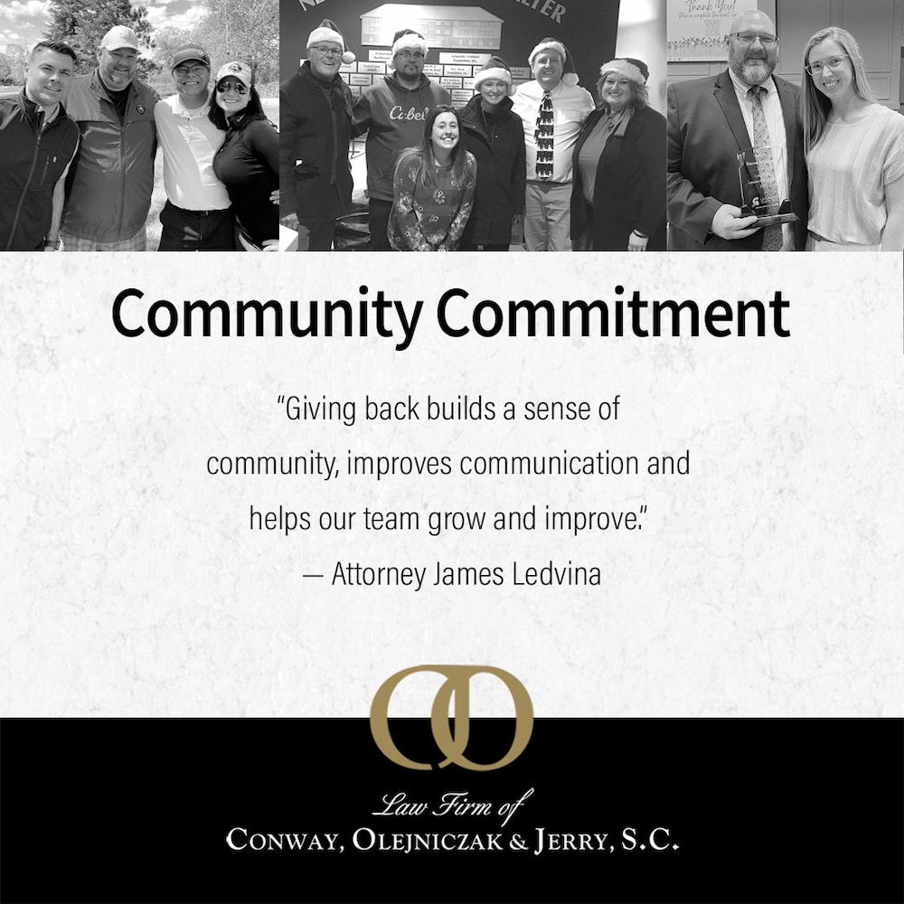

  
  

    <picture class="fade-up">
        
    </picture>
    <picture class="fade-up">
        
    </picture>

<iframe style="height:100%;" src="https://fast.wistia.net/embed/iframe/qclv2rnm7w?seo=true&videoFoam=true" title="LCOJ Thank You Video" allow="autoplay; fullscreen" allowtransparency="true" frameborder="0" scrolling="no" class="wistia_embed" name="wistia_embed" msallowfullscreen width="100%" height="100%"></iframe>

<iframe style="height:100%;" src="https://fast.wistia.net/embed/iframe/vyi43k7bgp?seo=true&videoFoam=true" title="Why work at LCOJ 2 Video" allow="autoplay; fullscreen" allowtransparency="true" frameborder="0" scrolling="no" class="wistia_embed" name="wistia_embed" msallowfullscreen width="100%" height="100%"></iframe>

