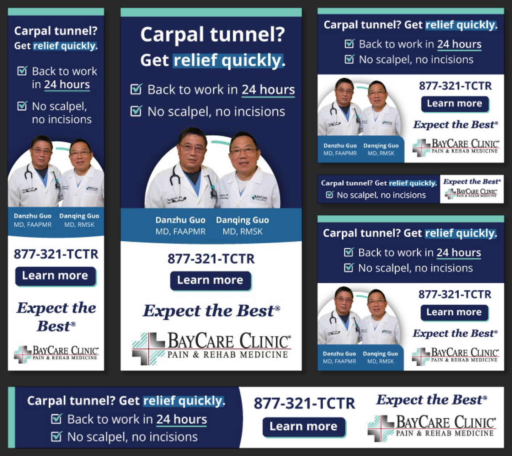

  

  ## Setting BayCare Clinic's orthopedic services apart in a competitive market

  For over 15 years, Insight Creative, Inc. has been a trusted partner of BayCare Clinic, initially aiding in media buying. When BayCare's business development and marketing departments merged in 2023, they turned to our team to expand their marketing efforts. Specifically, Orthopedics & Sports Medicine BayCare Clinic recognized the need for strategic marketing due to its growth in an extremely competitive landscape. BayCare expanded into Manitowoc with six new providers, all of whom needed to reach their desired audience. In Green Bay, BayCare built Horizon Square, a new facility designed to offer comprehensive orthopedic services under one roof. 

  First, our media department researched the average audience for orthopedics, using that information to pinpoint the most effective ways to reach them. Once we knew how to reach their audience, our content team turned its attention to creating messaging for the campaign. We led with BayCare Clinic’s overarching theme of “Expect the Best.” We wanted to communicate that even if someone had an injury or pain, they could still expect to enjoy their life. BayCare providers would help them get back to the activities that fulfilled them.  

  Implementing this strategy involved our design team producing ten message variations into digital ads, social media posts, videos, TV spots and billboards, each targeting specific audience segments. 

  The results have been phenomenal. Within the first month alone, our client experienced a 30% increase in phone call volume, achieved a remarkable 10% click through rate in search engine marketing, surpassed expected impressions by 15% and garnered thousands of clicks to their website. This success not only impressed our client but also provided tangible evidence that their investment in marketing was yielding substantial returns.
  

  

    
    
  

  

<iframe style="height:100%;" src="https://fast.wistia.net/embed/iframe/grry22kce9?seo=true&videoFoam=true" title="Why work at LCOJ 2 Video" allow="autoplay; fullscreen" allowtransparency="true" frameborder="0" scrolling="no" class="wistia_embed" name="wistia_embed" msallowfullscreen width="100%" height="100%"></iframe>

  
  

    
  

  

    
  

